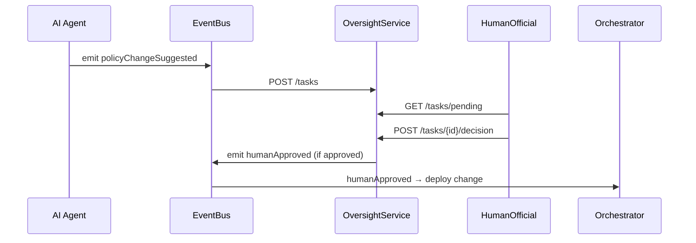

# Chapter 11: Human-In-The-Loop Oversight

Building on our [Governance Layer (Transparency & Compliance)](10_governance_layer__transparency___compliance__.md), we now introduce a final safety net: **Human-In-The-Loop (HITL) Oversight**. This ensures that any AI-driven proposal—like a new environmental permit rule—gets reviewed, tweaked, and signed off by a real person before it goes live.

## Why HITL Oversight?

Imagine the Environmental Protection Agency (EPA) has an AI Agent suggesting:  
“Auto-approve any permit application under 5 pages.”  
Before changing federal procedures, a human official must:

1. **Review** the suggestion.  
2. **Adjust** parameters (e.g., reduce to 3 pages).  
3. **Sign off** or **halt** deployment.  
4. If suggestions pile up unreviewed, the system flags a performance issue.

This process is like a supervisory board that ratifies any new regulation before it takes effect.

## Central Use Case: Expedited Permit Routing

1. AI Agent emits `policyChangeSuggested` with a proposed rule.  
2. Our **Oversight Service** creates a review task.  
3. An EPA official opens the **Oversight Dashboard**.  
4. They approve, tweak, or reject the rule.  
5. If approved → system emits `humanApproved` and the Management Layer deploys it.  
6. If many tasks stay pending → a “delay” alert fires.

## Key Concepts

- **Oversight Queue**  
  A list of AI proposals waiting for human review.

- **Review Interface**  
  A simple dashboard where officials inspect and decide.

- **Decision Parameters**  
  Editable fields on each proposal (e.g., threshold values).

- **Sign-Off Gate**  
  The rule only advances when an official clicks “Approve.”

- **Performance Flags**  
  Automatic alerts if tasks remain unreviewed too long.

## How to Use HITL Oversight

### 1. Capture AI Suggestions

In your orchestration code, listen for AI proposals and create tasks:

```js
// src/oversight/capture.js
bus.on('policyChangeSuggested', suggestion => {
  fetch('/api/oversight/tasks', {
    method: 'POST',
    headers: {'Content-Type':'application/json'},
    body: JSON.stringify(suggestion)
  });
});
```
This sends each suggestion to the Oversight Service for review.

### 2. Review Dashboard

Officials open a React component to see pending tasks:

```jsx
// src/oversight/OversightDashboard.js
import React, {useEffect, useState} from 'react';

export default function OversightDashboard() {
  const [tasks, setTasks] = useState([]);
  useEffect(() => {
    fetch('/api/oversight/tasks/pending')
      .then(r=>r.json())
      .then(setTasks);
  }, []);

  function decide(id, decision) {
    fetch(`/api/oversight/tasks/${id}/decision`, {
      method: 'POST',
      headers: {'Content-Type':'application/json'},
      body: JSON.stringify({ decision })
    }).then(() => {/* refresh list */});
  }

  return (
    <div>
      <h1>Pending Reviews</h1>
      {tasks.map(t => (
        <div key={t.id}>
          <p>Proposed Rule: {t.suggestion.rule}</p>
          <button onClick={()=>decide(t.id,'approve')}>Approve</button>
          <button onClick={()=>decide(t.id,'reject')}>Reject</button>
        </div>
      ))}
    </div>
  );
}
```
Officials click **Approve** or **Reject**, and the system updates each task.

## Step-By-Step Sequence



1. **AI Agent** proposes a change.  
2. **OversightService** stores a review task.  
3. **HumanOfficial** loads tasks and decides.  
4. On approval, **OversightService** emits `humanApproved`.  
5. **Management Layer** picks it up and applies the change.

## Under the Hood: Service Implementation

### `src/oversight/service.js`

```js
const express = require('express');
const bus     = require('../eventBus');
const router  = express.Router();

let tasks = [], nextId = 1;

// Create a new task
router.post('/tasks', (req, res) => {
  const task = { id: nextId++, suggestion: req.body, status:'pending', created: Date.now() };
  tasks.push(task);
  res.status(201).json(task);
});

// List pending tasks
router.get('/tasks/pending', (req, res) => {
  res.json(tasks.filter(t => t.status==='pending'));
});

// Record a decision
router.post('/tasks/:id/decision', (req, res) => {
  const t = tasks.find(x=>x.id==req.params.id);
  t.status = req.body.decision;
  if (t.status==='approve') bus.emit('humanApproved', t.suggestion);
  res.sendStatus(204);
});

module.exports = router;
```
This simple Express service holds tasks in memory (for demo). In production, you’d use a database.

### `src/oversight/monitor.js`

```js
// Flags unreviewed tasks older than 72 hours
setInterval(() => {
  const now = Date.now();
  const stale = tasks.filter(t =>
    t.status==='pending' && now - t.created > 72*3600_000
  );
  if (stale.length) bus.emit('oversightDelay', { count: stale.length });
}, 60*60_000);
```
Every hour, this checks for tasks pending over 3 days and emits an `oversightDelay` event.

## Conclusion

In this chapter you learned how **Human-In-The-Loop Oversight** adds a human review step for AI proposals—like a supervisory board ratifying new rules. We covered:

- Capturing AI suggestions  
- Building a simple review dashboard  
- A step-by-step approval sequence  
- Under-the-hood code for creating tasks, recording decisions, and flagging delays  

Next up is our final module, the [Administrative Portal (HMS-GOV)](12_administrative_portal__hms_gov__.md), where officials manage users, permissions, and high-level reports.

---

Generated by [AI Codebase Knowledge Builder](https://github.com/The-Pocket/Tutorial-Codebase-Knowledge)