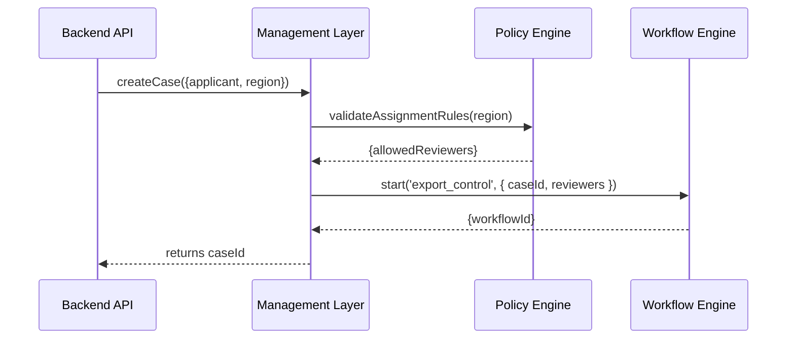

# Chapter 11: Management Layer

Building on our real‐time view from [Chapter 10: Metrics & Monitoring](10_metrics___monitoring_.md), we now dive into the **Management Layer**—the “operations office” that assigns work, allocates resources, and keeps everything moving according to policy. In government terms, this is like a department’s daily dispatch desk that hands cases to regional teams, monitors progress, and ensures rules from the [Governance Layer](12_governance_layer_.md) are enforced.

---

## 11.1 Motivation: The Bureau of Industry and Security Use Case

Imagine a company applies for an **export-control license** with the Bureau of Industry and Security (BIS):

1. A **new request** lands in the system.  
2. The dispatch office assigns a **preliminary review** to the appropriate regional office.  
3. As reviews complete, it tracks progress and triggers **risk checks** per policy.  
4. If any step lags, it escalates or reassigns.  

Without a Management Layer, cases pile up unassigned, deadlines slip, and oversight is impossible. Our Management Layer automates:

- Role assignments (who reviews).  
- Resource allocation (which office or agent).  
- Progress tracking (status updates, escalations).  
- Policy enforcement (invoke governance checks).

---

## 11.2 Key Concepts

1. **Case Registration**  
   Storing a new application or request with metadata (applicant, region).

2. **Role Assignment**  
   Mapping each case to reviewers or teams based on rules (e.g., region, risk level).

3. **Resource Allocation**  
   Reserving staff or compute quotas for each task.

4. **Progress Tracking**  
   Updating case status (new → in-review → approved) and time spent.

5. **Governance Enforcement**  
   Calling the [Policy/Process Module](07_policy_process_module_.md) or [Governance Layer](12_governance_layer_.md) to validate decisions at each step.

---

## 11.3 How to Use the Management Layer

### 11.3.1 Bootstrap the Service

Create a minimal `index.js` that wires in our engines:

```js
// src/management_layer/index.js
const { ManagementService } = require('./ManagementService');
const workflow = require('../workflow_engine/index');      // From Chapter 6
const policy   = require('../policy_process_module/PolicyEngine'); // From Chapter 7

const mgmt = new ManagementService({ workflowEngine: workflow, policyEngine: policy });
module.exports = mgmt;
```

This gives us a `ManagementService` instance ready to handle cases.

### 11.3.2 Register a New Case

```js
// In your API handler:
const mgmt = require('./management_layer/index');

app.post('/api/case/create', (req, res) => {
  // req.body: { applicant, region, details }
  const caseId = mgmt.createCase(req.body);
  res.json({ caseId, status: 'assigned' });
});
```

- `createCase()` does three things:
  1. Stores the raw request.
  2. Assigns roles based on `region`.
  3. Starts the defined workflow (e.g., `export_control`).

---

## 11.4 Under the Hood

When `createCase` is called, here’s the flow:



1. **API** calls **Management Layer**.  
2. **ML** invokes **Policy Engine** for assignment rules.  
3. **ML** kicks off the **Workflow Engine** with assigned roles.  
4. The `workflowId` ties back to this case for tracking.

---

## 11.5 Internal Implementation

### File: src/management_layer/ManagementService.js

```js
class ManagementService {
  constructor({ workflowEngine, policyEngine }) {
    this.workflow = workflowEngine;
    this.policy   = policyEngine;
    this.cases    = {}; // simple in-memory store
  }

  createCase(req) {
    const id = `case-${Date.now()}`;
    this.cases[id] = { ...req, status: 'new' };
    const reviewers = this.assignRoles(id, req.region);
    const wf       = this.startWorkflow(id, reviewers);
    this.cases[id].workflowId = wf.id;
    this.cases[id].status     = 'in-progress';
    return id;
  }

  assignRoles(caseId, region) {
    // Ask policy engine who can review this region
    const result = this.policy.evaluate('assign_reviewers', { region });
    this.cases[caseId].reviewers = result.pass; // e.g. ['us-office']
    return result.pass;
  }

  startWorkflow(caseId, reviewers) {
    return this.workflow.start('export_control', { caseId, reviewers });
  }
}

module.exports = { ManagementService };
```

- `assignRoles` uses the **Policy Engine** to pick teams.  
- `startWorkflow` fires the **Workflow Engine** with case data.

---

## 11.6 What We Learned

- The **Management Layer** ties incoming requests to workflows, roles, and resources, ensuring each case is handled promptly.  
- We saw how to **register** cases, **assign** reviewers via policy checks, and **start** workflows—all in a few lines of code.  
- Under the hood, it coordinates between the [Policy/Process Module](07_policy_process_module_.md) and the [Workflow Engine](06_workflow_engine_.md).

Next up, we’ll see the big picture of **checks and balances** in the [Governance Layer](12_governance_layer_.md).

---

Generated by [AI Codebase Knowledge Builder](https://github.com/The-Pocket/Tutorial-Codebase-Knowledge)