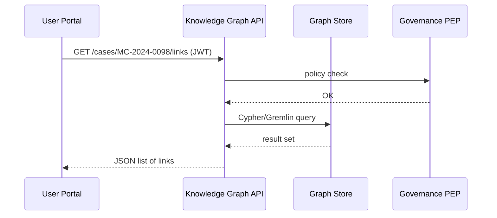

# Chapter 12: Data Management & Knowledge Graph  
*(part of the HMS-CUR tutorial series)*  

[⬅ Back to Chapter 11: External System Sync Adapter](11_external_system_sync_adapter_.md)

---

## 0. Why Bother With a Giant “Filing Cabinet”?

Meet **Ruth** again, our state conciliator.  
She opens a new *Mediation‐Case* for couple `MC-2024-0098`.  
Before ruling, she must know:

* Do either spouse have **open bankruptcy filings**?  
* Was **domestic violence** reported in related custody cases?  
* Did another agency already mandate a **financial-literacy course** for them?

Traditionally Ruth would phone three agencies and sift through PDFs.  
With HMS-CUR the answers pop up instantly because every record—citizen, permit, court order—lives in **one connected graph**:

```
MC-2024-0098 ── linked_to ──> BK-2023-4411
                         └──> DV-2022-8765
                         └──> Course-FIN-001 (completed?)
```

This chapter shows how to **store**, **link**, and **query** that graph so humans *and* AI agents can prevent contradictory decisions.

---

## 1. Five Core Concepts (Family-Tree Analogy)

| Family-Tree Analogy | Knowledge-Graph Term | Beginner Explanation |
|---------------------|----------------------|----------------------|
| Person card         | **Entity**           | A “thing” (citizen, permit, agency). |
| Line between cards  | **Relationship**     | “owns”, “filed_for”, “linked_to”. |
| Shoe-box of photos  | **Data Lake**        | Raw PDFs, CSVs before we tag them. |
| Index notebook      | **Linker**           | Small service that finds & creates relationships. |
| Family historian    | **Query API**        | Answers “Who is related to whom?” in milliseconds. |

Keep these five in mind; everything else is plumbing.

---

## 2. A 10-Line “Hello, Graph” Example

Below we create three entities and two relationships using *very* tiny Python.

```python
# hello_graph.py  (10 lines)
from collections import defaultdict

g = defaultdict(set)                      # adjacency list

def add_edge(a, rel, b):
    g[a].add((rel, b))
    g[b].add((rel, a))                    # make it bidirectional

add_edge("MC-2024-0098", "linked_to", "BK-2023-4411")
add_edge("MC-2024-0098", "linked_to", "DV-2022-8765")

print(g["MC-2024-0098"])
# ➜ {('linked_to', 'BK-2023-4411'), ('linked_to', 'DV-2022-8765')}
```

Explanation  
1. `g` is a plain `dict` where each key points to a set of `(relationship, target)` tuples.  
2. `add_edge()` stores both directions so later searches are easy.  
3. A real system swaps this dict for a graph database, but the idea stays the same.

---

## 3. Typical Queries & How to Run Them

### 3.1 “Show All Open Filings Connected to My Case”

```python
def related(case_id, rel):
    return [b for r, b in g[case_id] if r == rel]

print(related("MC-2024-0098", "linked_to"))
# ➜ ['BK-2023-4411', 'DV-2022-8765']
```

### 3.2 “Does Any Relation Contradict My Draft Ruling?”

```python
def has_conflict(case_id, forbidden):
    for _, linked in g[case_id]:
        if linked in forbidden:
            return True
    return False

if has_conflict("MC-2024-0098", {"BK-2023-4411"}):
    print("⚠ Block: linked bankruptcy case found")
```

Ruth’s UI simply blocks the approval button and cites the conflict.

---

## 4. What Happens When the UI Asks a Question?



Five steps—fast and auditable.

---

## 5. Under-the-Hood Code Peeks (≤20 Lines Each)

Folder map  
```
kg/
 ├─ api.py          # REST endpoints
 ├─ linker.py       # auto-creates edges
 ├─ store.py        # tiny wrapper around graph db
 └─ schemas.py      # valid entity/relationship types
```

### 5.1 Store Layer (`store.py` – 14 lines)

```python
import networkx as nx
G = nx.MultiDiGraph()

def upsert_entity(eid, **attrs):
    G.add_node(eid, **attrs)

def link(a, rel, b):
    G.add_edge(a, b, rel=rel)

def neighbors(eid, rel=None):
    for n, data in G[eid].items():
        if rel is None or any(e['rel']==rel for e in data.values()):
            yield n
```

Explanation  
• Uses NetworkX; swap for Neo4j or AWS Neptune later—API stays identical.

### 5.2 Linker Service (`linker.py` – 18 lines)

```python
import re, store  # simple rule-based linker

RULES = [
  (r"MC-(\d+)", r"BK-\1", "linked_to"),   # mediation ↔ bankruptcy id pattern
]

def run(new_id):
    for src_pat, tgt_fmt, rel in RULES:
        m = re.match(src_pat, new_id)
        if m:
            target = tgt_fmt.replace(r"\1", m.group(1))
            if store.G.has_node(target):
                store.link(new_id, rel, target)
```

Whenever ESSA (Chapter 11) imports a new record, it calls `run()` to auto-link it.

### 5.3 API Endpoint (`api.py` – 15 lines)

```python
from flask import Flask, jsonify, request
import store, governance   # governance = Chapter 8 client

app = Flask(__name__)

@app.get("/cases/<cid>/links")
def links(cid):
    governance.guard({"action":"graph_read","entity":cid})
    data = list(store.neighbors(cid, "linked_to"))
    return jsonify(data)

if __name__ == "__main__":
    app.run(port=4300)
```

Explanation  
• Checks policy via Governance Layer, then returns a simple JSON list.

---

## 6. Feeding Data Into the Graph

Three common entry points:

1. **Microservices** add nodes as they create records.  
   ```python
   store.upsert_entity("Permit-2024-812", status="pending")
   ```
2. **External System Sync Adapter** (see [Chapter 11](11_external_system_sync_adapter_.md)) imports legacy IDs nightly, then calls `linker.run(id)`.  
3. **AI Representative Agent** (see [Chapter 5](05_ai_representative_agent_.md)) enriches nodes with extra tags like *risk_score* or *policy_suggestions*.

All flows WRITE through the same `store` API, so the graph stays consistent.

---

## 7. Keeping the Graph Clean

Problem | Simple Fix
------- | ----------
Duplicate citizens (same SSN) | Nightly job merges nodes with identical `ssn` attribute.  
Stale links (permit withdrawn) | Microservice emits `event: "permit_cancelled"`; a listener prunes related edges.  
Unauthorized data | Governance Layer denies `graph_write` action; audit trail shows who tried.  

All cleaning scripts are **< 30 lines** and run as cron jobs.

---

## 8. Real-World Query Cheat-Sheet

Use Case | Example Cypher (for Neo4j)
---------|--------------------------
All permits linked to a bankruptcy filed **after 2023** | `MATCH (p:Permit)-->(b:Bankruptcy) WHERE b.year > 2023 RETURN p.id`
Find agencies that issued **conflicting rulings** | `MATCH (c1:Case)-->(r:Rule)<--(c2:Case) WHERE c1.agency <> c2.agency RETURN r, c1, c2`
Suggest related documents to clerk | `MATCH (d:Document)-->(e)<--(current) RETURN d LIMIT 5`

Even if you don’t know Cypher yet, notice the structure: **MATCH → WHERE → RETURN**—like SQL, but walking the graph.

---

## 9. Frequently Asked Questions

**Q: Do I need a fancy graph database right away?**  
Start with NetworkX or SQLite—swap later. The store layer hides the backend.

**Q: Will this leak sensitive links?**  
Every read/write goes through Governance’s Policy Enforcement Point (Chapter 8). Unauthorized queries return `403`.

**Q: How big can the graph grow?**  
Neo4j Community handles ~34 B relationships; AWS Neptune scales further. Index important properties (`id`, `ssn`) and you’re fine.

**Q: Can I visualize the graph?**  
Yes. A 20-line Flask view serves JSON to [d3-force](https://github.com/d3/d3-force) for an interactive web graph.

---

## 10. Recap

You now know that the **Data Management & Knowledge Graph**:

✓ Stores every record as an **entity** and every cross-reference as a **relationship**.  
✓ Lets humans and AI agents query context in milliseconds, preventing contradictory rulings.  
✓ Relies on tiny, beginner-friendly components—`store`, `linker`, `api`—each under 20 lines in this demo.  
✓ Integrates with Governance (for security), ESSA (for legacy data), and the AI Agent (for insights).

The graph is our collective memory—but memories can also teach us.  
Next we’ll see how HMS-CUR mines this graph to **streamline processes and predict bottlenecks** in the [Process Optimization Engine](13_process_optimization_engine_.md) 🔍

[Next: Process Optimization Engine ➡](13_process_optimization_engine_.md)

---

Generated by [AI Codebase Knowledge Builder](https://github.com/The-Pocket/Tutorial-Codebase-Knowledge)