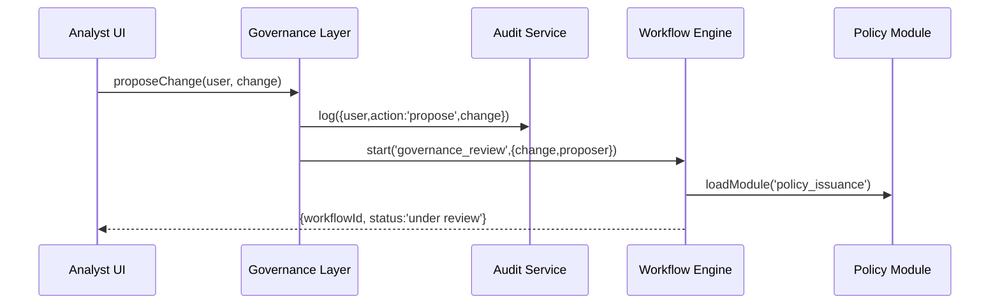

# Chapter 12: Governance Layer

Building on [Chapter 11: Management Layer](11_management_layer_.md), we now introduce the **Governance Layer**—the “constitution” of our HMS ecosystem. It defines who can change policies, how those changes flow through review, and what compliance checks must run before anything goes live.

---

## 12.1 Motivation: A Digital Constitution for Federal Agencies

Imagine the Department of Homeland Security (DHS) runs automated visa-screening workflows. They need a central framework to ensure:

- **Who** can propose new screening rules  
- **How** each AI decision is audited  
- **Which** privacy reviews are mandatory  
- **When** changes take effect  

The **Governance Layer** is that framework. It’s like a constitution and legislative process rolled into code:

1. A policy analyst **proposes** an update to screening criteria.  
2. The change goes through **review** and **privacy audit**.  
3. A director **approves** it.  
4. The updated rules are **versioned** and applied across all workflows.

Without this guardrail, ad hoc edits could bypass security standards or slip past compliance teams.

---

## 12.2 Key Concepts

1. **Roles & Permissions**  
   Define **who** may propose, review, approve, or simply view changes.

2. **Change Proposal Workflow**  
   A sequenced process (e.g., _propose_ → _review_ → _approve_) every policy edit follows.

3. **Policy Versioning**  
   Each approved change becomes a new “chapter” with an effective date and version number.

4. **Compliance Hooks**  
   Mandatory checks (e.g., security, privacy) that run before approval.

5. **Audit Logging**  
   Every proposal, review decision, and approval is recorded for traceability.

---

## 12.3 Using the Governance Layer

Let’s see how you’d **define** governance rules and **enforce** them in code.

### 12.3.1 Define Governance Rules  

File: governance_layer/config/governance.json  
```json
{
  "roles": {
    "policy_analyst": ["propose", "comment"],
    "director":       ["review", "approve"],
    "auditor":        ["view"]
  },
  "workflow": ["propose", "review", "approve"],
  "complianceChecks": ["securityAudit", "privacyAudit"]
}
```
This JSON lists:
- Which **actions** each role can perform  
- The **steps** every change moves through  
- What **audits** must complete before approval  

### 12.3.2 Enforce Proposals in Code  

File: src/governance_layer/governor.js  
```js
const govConfig    = require('./config/governance.json');
const auditService = require('../audit_compliance/auditService');
const workflow     = require('../workflow_engine/index');

function proposeChange(user, change) {
  if (!govConfig.roles[user.role].includes('propose')) {
    throw new Error('🔒 Unauthorized to propose policy changes');
  }
  // 1. Log who proposed what
  auditService.log({ user: user.name, action: 'propose', change });
  // 2. Kick off the review step
  workflow.start('governance_review', { change, proposer: user.name });
}

module.exports = { proposeChange };
```
Here we:
1. **Check** the user’s role  
2. **Record** the proposal in our audit log ([Chapter 9](09_audit___compliance_framework_.md))  
3. **Start** a “governance_review” workflow ([Chapter 6](06_workflow_engine_.md))

---

## 12.4 Under the Hood

When an analyst clicks “Propose Change,” this is what happens:



1. **Governance Layer** checks permissions.  
2. It logs the event via **Audit Service**.  
3. It starts a review workflow.  
4. The **Workflow Engine** may fetch current policies ([Chapter 7](07_policy_process_module_.md)).  
5. The UI shows a “Under Review” status.

### 12.4.1 Core Governor Class  

File: src/governance_layer/PolicyGovernor.js  
```js
class PolicyGovernor {
  constructor(engine, audit, config) {
    this.engine = engine;
    this.audit  = audit;
    this.cfg    = config;
  }

  propose(user, change) {
    if (!this.cfg.roles[user.role]?.includes('propose')) {
      throw new Error('🔒 Not allowed');
    }
    this.audit.log({ user: user.name, action: 'propose', change });
    this.engine.start('governance_review', { change, proposer: user.name });
  }

  approve(user, proposalId) {
    if (!this.cfg.roles[user.role]?.includes('approve')) {
      throw new Error('🔒 Not allowed');
    }
    this.audit.log({ user: user.name, action: 'approve', proposalId });
    // Here you'd apply the change to the Policy Module
  }
}

module.exports = PolicyGovernor;
```
- **propose()**: enforces “propose” permission, logs, and paths into review.  
- **approve()**: enforces “approve” permission, logs, and would push the update live.

---

## 12.5 What We Learned

- The **Governance Layer** acts as a constitutional framework—defining **roles**, **workflows**, **compliance checks**, and **audit logs** for all policy changes.  
- We saw how to **declare** governance rules in JSON, **enforce** them in code, and **trace** proposals through a simple sequence.  
- This layer ties together the [Workflow Engine](06_workflow_engine_.md), [Policy/Process Module](07_policy_process_module_.md), and [Audit & Compliance Framework](09_audit___compliance_framework_.md) to ensure every change is authorized, reviewed, and recorded—just like laws passed by Congress.

Congratulations—you’ve completed the Governance Layer! This is the final piece ensuring HMS-CUR stays secure, compliant, and transparent for all federal workflows.

---

Generated by [AI Codebase Knowledge Builder](https://github.com/The-Pocket/Tutorial-Codebase-Knowledge)