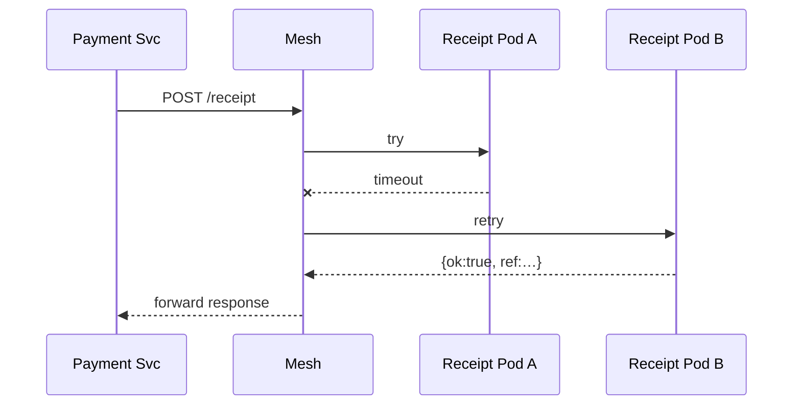

# Chapter 12: Microservices Infrastructure (HMS-SYS & Friends)

*(Keeping every federal “power station” on, even when one lightbulb pops)*  

[← Back to Chapter&nbsp;11: AI Governance Values Enforcement](11_ai_governance_values_enforcement_.md)

---

## 1&nbsp;• Why Do We Need HMS-SYS?

April 15<sup>th</sup>, 8 p.m. – Millions of citizens are rushing to pay last-minute taxes on **MyGov**.  
Suddenly the **“Send Email Receipt”** feature crashes.  

Old-school monolith result  
• Whole site goes dark → angry tweets → congressional hearing.  

HMS-SYS result  
• Only the tiny “Receipt Service” stops; the **“Pay Tax”** button still works.  
• Auto-scaler spins up a fresh Receipt pod in seconds; no news headline.

That resilience, isolation, and self-healing come from running the platform as **hundreds of bite-size microservices** connected by a **service mesh**.  
HMS-SYS is the toolbox that makes it trivial—even for a junior developer—to:

1. Package a microservice.  
2. Register it on the mesh.  
3. Roll it out *without* taking MyGov offline.

---

## 2&nbsp;• Key Concepts (City-Utility Analogy)

| HMS-SYS Term        | City Utility Equivalent         | One-Sentence Meaning |
|---------------------|---------------------------------|----------------------|
| Microservice        | Small neighborhood power plant  | Single-purpose container (e.g., “Receipt”). |
| Service Mesh        | Underground wiring              | Auto-secure network so plants can talk. |
| Registry            | Power-station phone book        | Knows *where* every service lives. |
| Gateway             | City transformer                | Safe entry point for the outside world. |
| Auto-Scaler         | Backup generator                | Adds or removes replicas on demand. |
| Canary / Blue-Green | Test bulb on new circuit        | Deploy new code to 1% of traffic first. |

Keep these six nouns handy; the rest is just cables.

---

## 3&nbsp;• 3-Minute Hands-On — Deploy “Receipt Service”

We’ll:

1. Package the service.  
2. Register it with HMS-SYS.  
3. Call it from **Payment Service** over the mesh.  

### 3.1 Write the Service (≤ 15 Lines)

```js
// receipt-service/index.js
import fastify from 'fastify';
const app = fastify();

app.post('/receipt', (req, res) => {
  /* pretend to email PDF */
  console.log('Sent receipt to', req.body.email);
  res.send({ ok:true, ref:'R-' + Date.now() });
});

app.listen(process.env.PORT || 3000);
```

**Explanation**  
Just a tiny HTTP endpoint—no auth, no scaling logic. HMS-SYS handles those later.

---

### 3.2 Describe & Register It (≤ 18 Lines)

```yaml
# receipt.hms.yml
name: receipt-svc
version: 1.0.0
image: ghcr.io/gov/receipt:1.0
port: 3000
routes:
  - path: /receipt
    methods: [POST]
scaling:
  min: 2        # keep two pods alive
  max: 10
```

```bash
$ hms-sys deploy receipt.hms.yml
✓ Image pulled
✓ Registered in service mesh
✓ Auto-scaler set (2-10)
Service URL: http://receipt-svc.mesh/receipt
```

**Explanation**  
`hms-sys deploy` turns the YAML into Kubernetes objects + mesh rules, then registers the URL in the **Registry**.

---

### 3.3 Call It From Payment Service (≤ 12 Lines)

```js
// payment-service/charge.js
import fetch from 'node-fetch';

export async function charge(user, amt){
  /* …stripe, treasury, etc.… */
  const rec = await fetch(
     'http://receipt-svc.mesh/receipt', {
       method:'POST',
       headers:{'Content-Type':'application/json'},
       body: JSON.stringify({ email:user.email, amount:amt })
  }).then(r=>r.json());
  return rec.ref;          // e.g., "R-1713408984"
}
```

**Explanation**  
We call `receipt-svc.mesh` like any URL—no port hunting or TLS setup; the mesh injects mTLS automatically.

---

## 4&nbsp;• What Happens Under the Hood?

### 4.1 Step-By-Step (Plain English)

1. **Deploy** – `hms-sys` stores metadata in the **Registry**, builds a container, and schedules two pods.  
2. **Mesh Sidecar** – Each pod gets a tiny proxy that encrypts traffic and enforces retries.  
3. **Discovery** – Payment Service asks DNS `receipt-svc.mesh` → mesh returns two healthy pods.  
4. **Call** – Proxy load-balances the POST request; if pod A fails, it retries on pod B.  
5. **Auto-Scaler** – CPU hits 70% → HMS-SYS spins up more Receipt pods until load drops.

### 4.2 Micro Diagram (≤ 5 Participants)



---

## 5&nbsp;• Peek Inside HMS-SYS

### 5.1 Service Registration (≤ 12 Lines)

```js
// sys/registry.js
const table = new Map();       // name → {version, endpoints}

export function register(meta){
  table.set(meta.name, {
    ver : meta.version,
    url : `http://${meta.name}.mesh:${meta.port}`
  });
}

export function lookup(name){
  return table.get(name);      // used by mesh DNS
}
```

**Explanation**  
A 12-line in-memory map shows the essence: save metadata, hand out URLs.

---

### 5.2 Auto-Scale Loop (≤ 15 Lines)

```js
// sys/autoscale.js
import { metrics, spawnPod, killPod } from './k8s.js';

setInterval(async () => {
  for (const svc of registry.list()){
    const load = await metrics.cpu(svc.name);         // %
    if (load > 70 && svc.replicas < svc.max) spawnPod(svc);
    if (load < 30 && svc.replicas > svc.min) killPod(svc);
  }
}, 15_000);       // every 15 s
```

**Explanation**  
A dead-simple loop keeps replicas between `min` and `max` based on CPU.

*(Real HMS-SYS uses Kubernetes HPA, but the idea is the same.)*

---

## 6&nbsp;• How HMS-SYS Plays With Other Layers

* **Agents & Workflows** – Agents from [Chapter 5](05_core_agent_framework__hms_agt__.md) run inside pods managed by HMS-SYS.  
* **Service Discovery** – Workflows in [Chapter 4](04_agent_orchestration___workflow__hms_act__.md) query the **Registry** to find the next task’s endpoint.  
* **Security Guardrails** – Mesh proxies emit sensor data for the [Security & Compliance Engine](10_security___compliance_engine__hms_esq___hms_ops__.md).  
* **Values Enforcement** – If a new pod fails a **GVE probe** from [Chapter 11](11_ai_governance_values_enforcement_.md), HMS-SYS auto-rolls back.

---

## 7&nbsp;• Frequently Asked Questions

1. **Do I need to learn Kubernetes?**  
   No. `hms-sys deploy` hides YAML complexity; advanced users can dig deeper later.

2. **Can services run different languages?**  
   Absolutely—anything that fits in a container (Node, Python, Go, .NET…).

3. **How do I debug a single pod?**  
   `hms-sys logs receipt-svc --tail 20` shows recent logs; mesh headers add request IDs.

4. **What about database connections?**  
   Use the same pattern: a tiny “DB Proxy Service” so your app talks to `db.mesh:5432`, not a raw IP.

5. **Blue-Green deploys?**  
   `hms-sys deploy --bg` keeps v1 (blue) serving while v2 (green) warms up; traffic shifts when health checks pass.

---

## 8&nbsp;• Summary & What’s Next

You learned how **HMS-SYS & Friends** turn the platform into a self-healing city grid:

* Each feature is a **micro-power-station** (microservice).  
* The **service mesh** is the indestructible wiring.  
* The **Registry, Auto-Scaler, and Gateway** keep everything discoverable, elastic, and safe.

With infra rock-solid, we can safely **crash-test** new workflows and train staff without harming production.  
That’s exactly the focus of the next chapter:  
[Chapter 13: Simulation & Training Suite (HMS-ESR + HMS-EDU)](13_simulation___training_suite__hms_esr___hms_edu__.md)

---

---

Generated by [AI Codebase Knowledge Builder](https://github.com/The-Pocket/Tutorial-Codebase-Knowledge)