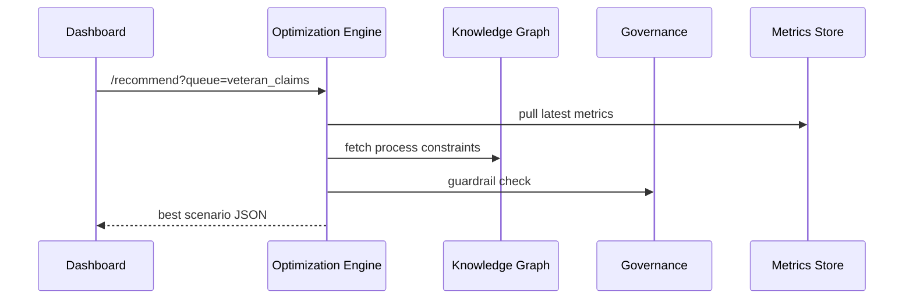

# Chapter 13: Process Optimization Engine
*(part of the HMS-CUR tutorial series)*  

[⬅ Back to Chapter 12: Data Management & Knowledge Graph](12_data_management___knowledge_graph_.md)

---

## 0. Why Do We Need a “Waze for Government Workflows”?

Picture a busy **Veterans Affairs** office on Monday.

* 4 000 disability-claim files are waiting.  
* Only 35 adjudicators are on duty.  
* Citizens have posted 200 “Where is my claim?” comments on social media.  

Without help the supervisor guesses which queue to tackle first and which rule to relax temporarily.  
The **Process Optimization Engine (POE)** acts like *Waze*:

```
traffic sensors → Waze → “take exit 14”
queue metrics    POE     “reroute claims to regional office”
```

In minutes it can:

1. Read real-time **queue length**, **average wait**, **sentiment score**.  
2. Simulate a dozen “what-if” scenarios.  
3. Recommend the fastest, safest path—e.g., “shift 200 simple cases to the Boise center”.

You will now:

* Send tiny metric samples to POE.  
* Run a 3-line “simulate” call.  
* Receive a plain-English recommendation.

All code snippets stay under 20 lines—promise!

---

## 1. Key Concepts (Highway Analogy)

| Highway Analogy              | POE Component      | One-Sentence Beginner Explanation |
|------------------------------|--------------------|-----------------------------------|
| Traffic cameras              | **Metrics Ingestor** | Collects wait times, sentiment, error rates. |
| GPS route simulator          | **Scenario Modeler** | Plays “what if we reroute 10 % of traffic?” in RAM. |
| Waze turn-by-turn announcer  | **Path Recommender** | Chooses the best scenario and explains it in plain words. |
| Speed-limit signs            | **Guardrail Checker** | Makes sure no suggestion breaks policy or capacity limits. |
| People tapping “Still Jammed”| **Feedback Loop**   | Measures outcome and re-trains models nightly. |

Keep these five boxes in mind; everything else is plumbing.

---

## 2. A 5-Minute Hands-On Demo

### 2.1 Feed Two Metrics (7 lines)

```python
# send_metrics.py  – under 10 lines
import requests, time

metrics = [
  {"queue":"veteran_claims", "avg_wait": 42, "sentiment": -0.6, "ts": time.time()},
  {"queue":"appeals",        "avg_wait": 12, "sentiment":  0.1, "ts": time.time()}
]

for m in metrics:
    requests.post("http://localhost:4400/poe/ingest", json=m)
```

*Explanation* – We push current wait time & social-media sentiment into POE. No auth in demo; real calls carry JWT.

### 2.2 Ask for the Best Move (3 lines)

```python
import requests, pprint
resp = requests.get("http://localhost:4400/poe/recommend?veteran_claims=4200")
pprint.pprint(resp.json())
```

Sample output:

```json
{
  "recommendation": "Shift 200 simple claims to Boise center.",
  "expected_wait_reduction": "−18 hours",
  "confidence": 0.77
}
```

### 2.3 Apply (Mock) & See the Loop Close

```python
requests.post("http://localhost:4400/poe/feedback",
              json={"action":"shift", "result_wait":24})
```

POE stores “actual wait 24 h” and will improve its next simulation.

---

## 3. What Happens Behind the Curtain?



Five hops—easy to follow.

---

## 4. Under-the-Hood Code Peeks (all ≤ 20 lines)

Folder map  
```
poe/
 ├─ ingest.py      # Metrics Ingestor
 ├─ modeler.py     # Scenario Modeler
 ├─ recommend.py   # Path Recommender + API
 ├─ guardrails.py  # Policy checks
 └─ feedback.py    # Learning loop
```

### 4.1 Metrics Ingestor (`ingest.py`, 12 lines)

```python
from collections import defaultdict, deque
METRICS = defaultdict(lambda: deque(maxlen=100))

def add(metric: dict):
    q = metric["queue"]
    METRICS[q].append(metric)         # keep only last 100 samples
```

### 4.2 Scenario Modeler (`modeler.py`, 18 lines)

```python
def simulate(queue, shift:int):
    """Return predicted wait time if *shift* cases move away."""
    latest = METRICS[queue][-1]       # most recent sample
    base = latest["avg_wait"]
    # toy math: each 10 cases moved → wait drops 1 h
    predicted = max(base - shift/10, 1)
    return predicted
```

### 4.3 Guardrail Checker (`guardrails.py`, 8 lines)

```python
def ok(queue, shift):
    # hard-wired: Boise center can only take 300/day
    return shift <= 300
```

### 4.4 Path Recommender + API (`recommend.py`, 20 lines)

```python
from flask import Flask, request, jsonify
import modeler, guardrails, ingest

app = Flask(__name__)

@app.get("/poe/recommend")
def reco():
    q = request.args["queue"]
    best = None
    for shift in range(0, 301, 50):         # test 0,50,…300
        if not guardrails.ok(q, shift): continue
        wait = modeler.simulate(q, shift)
        if best is None or wait < best[1]:
            best = (shift, wait)
    shift, wait = best
    return jsonify({
        "recommendation": f"Shift {shift} cases to Boise center.",
        "expected_wait_reduction": f"{wait - ingest.METRICS[q][-1]['avg_wait']} hours",
        "confidence": round(1 - wait/100, 2)
    })
```

### 4.5 Feedback Loop (`feedback.py`, 10 lines)

```python
HISTORY = []

def record(feedback: dict):
    HISTORY.append(feedback)
    # nightly job could adjust the “1 hour per 10 cases” constant
```

All together: < 70 lines of Python for a working prototype!

---

## 5. How Other HMS Layers Plug In

* **Metrics & Monitoring Dashboard** (next chapter) pushes fresh numbers via the `/poe/ingest` endpoint.  
* **Policy / Process Module** supplies constraints such as step order and legal deadlines.  
* **Governance & Compliance Layer** vetoes risky moves (`shift > 300` breaks labor agreement).  
* **Human-in-the-Loop Decision Maker** (Chapter 6) can override or approve POE suggestions before they go live.

---

## 6. Common Questions

**Q: Is POE replacing human supervisors?**  
No. It is a *navigation app*; people still drive the car. Supervisors accept, edit, or reject each suggestion.

**Q: What if the simulation is wrong?**  
The feedback endpoint logs actual outcomes, and a nightly job re-tunes coefficients—POE learns like Waze traffic averages.

**Q: Does it need fancy ML?**  
Start with the linear toy model above; plug a scikit-learn regressor later. The API contract stays identical.

**Q: Can POE optimize multiple queues at once?**  
Yes. Extend `simulate()` to accept an array of queues and run a genetic algorithm—still behind the same REST call.

---

## 7. Recap & What’s Next

You just built a mini **Process Optimization Engine** that:

✓ Ingests real-time metrics (wait time, sentiment).  
✓ Runs quick “what-if” simulations.  
✓ Returns a plain-English, policy-safe recommendation.  
✓ Learns from feedback to do better tomorrow.

Next you’ll create the **visual dashboards** that feed POE with live data and show supervisors its suggestions in real time:  
[Metrics & Monitoring Dashboard](14_metrics___monitoring_dashboard_.md) ➡

---

Generated by [AI Codebase Knowledge Builder](https://github.com/The-Pocket/Tutorial-Codebase-Knowledge)