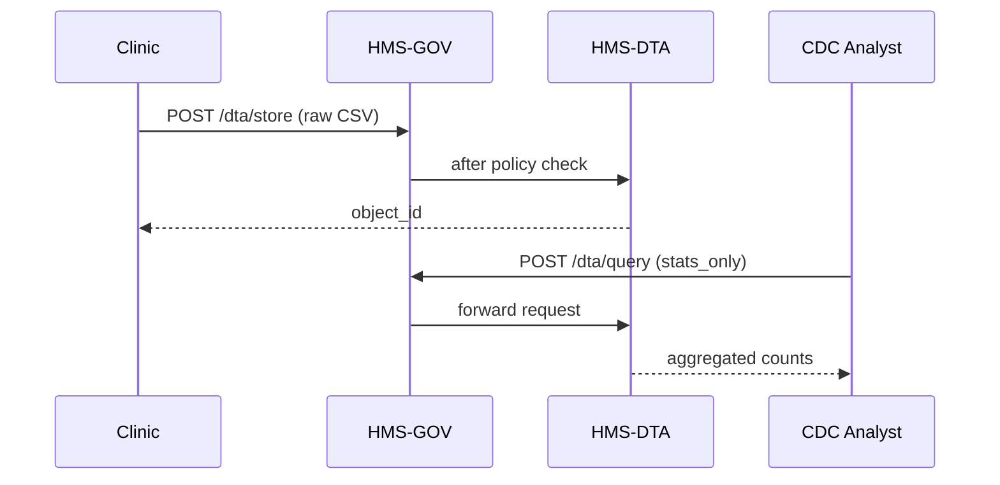

# Chapter 13: Secure Data Repository (HMS-DTA)

*(Just orchestrated a multi-step process in [Workflow Orchestration (HMS-ACT)](12_workflow_orchestration__hms_act__.md)?  
All those files, logs, and citizen records now need a **home** that is as safe as the National Archives—only with encryption, consent tags, and automatic shredders.)*

---

## 1  Why Do We Need a “Fort Knox for Bits”?

### Central Use-Case – “Share Vaccination Stats Without Exposing Names”

1. The **Centers for Disease Control (CDC)** wants daily COVID-19 vaccination counts.
2. State clinics upload raw records that contain **PII** (name, DOB, address).
3. By law (HIPAA) the CDC may only receive **anonymized totals**.

HMS-DTA is the vault that:

* stores every raw record **encrypted**,  
* keeps an **audit trail** of who touched what,  
* can generate a **derived, de-identified view** for the CDC,  
* deletes raw rows after the legal **retention period**.

Without DTA, we would copy spreadsheets around and risk leaking grandma’s birthday.

---

## 2  Key Concepts (Plain-English Cheatsheet)

| Term              | Beginner-Friendly Meaning                                              |
|-------------------|------------------------------------------------------------------------|
| Vault             | Encrypted folder on disk / cloud bucket—nobody reads it without keys.  |
| Dataset           | A named table or file collection, e.g., `vaccination_raw_2024`.        |
| Consent Tag       | Tiny flag: “patient agreed to share stats, not PII, for 2 years.”      |
| Lineage Log       | Uneditable diary that records every transform (“raw ➜ anonymized”).    |
| Retention Clock   | Countdown; when it hits 0 the data is auto-deleted or archived.        |
| Access Token      | Short-lived key proving the caller may read a given dataset.           |

---

## 3  Storing & Serving the Vaccination Data (Hands-On in 18 Lines)

`client_upload.py`

```python
import requests, json, uuid, gzip, base64

payload = {
    "dataset": "vaccination_raw_2024",
    "consent": {"share": "stats_only", "retention_days": 730},
    "data_gzip_b64": base64.b64encode(
        gzip.compress(b"Alice,1990-02-02,Pfizer\nBob,1981-09-10,Moderna")
    ).decode()
}

r = requests.post("http://127.0.0.1:9000/dta/store", json=payload,
                  headers={"Authorization": "Bearer CLINIC-TX"})
print(r.json())          # ➜ {"status":"stored","object_id":"f7d..."}
```

What just happened?  
1. Clinic compressed + base64-encoded its CSV.  
2. `/dta/store` saved the blob in the vault, wrote an audit line, and returned an `object_id`.

---

## 4  Retrieving an Anonymized View (14 Lines)

`client_fetch.py`

```python
import requests, json
q = {
    "dataset": "vaccination_raw_2024",
    "view": "stats_only"
}
r = requests.post("http://127.0.0.1:9000/dta/query", json=q,
                  headers={"Authorization": "Bearer CDC-NATIONAL"})
print(r.json())      # ➜ {"rows": [{"vaccine":"Pfizer","count":1}, ...]}
```

DTA looked at the **consent tag**, saw that “stats_only” is allowed, ran an aggregation, and returned counts—no PII.

---

## 5  What Happens Inside? (Step-by-Step)



Only four actors—easy to reason about.

---

## 6  Tiny Vault Server (Core API ≤ 20 Lines Each)

`dta/server.py`

```python
from fastapi import FastAPI, HTTPException
import gzip, base64, uuid, json, os, pathlib, datetime

app, VAULT = FastAPI(), pathlib.Path("vault"); VAULT.mkdir(exist_ok=True)
LOG = pathlib.Path("vault/lineage.log")

def log(entry): LOG.write_text(LOG.read_text()+json.dumps(entry)+"\n") if LOG.exists() else LOG.write_text(json.dumps(entry)+"\n")

@app.post("/dta/store")
def store(req: dict):
    oid = str(uuid.uuid4())
    fn  = VAULT / f"{oid}.gz"
    fn.write_bytes(base64.b64decode(req["data_gzip_b64"]))
    meta = {"dataset": req["dataset"],
            "consent": req["consent"],
            "stored_at": datetime.datetime.utcnow().isoformat()}
    (VAULT / f"{oid}.meta.json").write_text(json.dumps(meta))
    log({"event":"store", "oid":oid, "dataset":req["dataset"]})
    return {"status":"stored", "object_id":oid}

@app.post("/dta/query")
def query(req: dict):
    # find all objs for dataset
    rows=[]
    for meta_p in VAULT.glob("*.meta.json"):
        meta=json.loads(meta_p.read_text())
        if meta["dataset"]!=req["dataset"]: continue
        if req["view"]=="stats_only":
            raw=gzip.decompress((VAULT/meta_p.stem).with_suffix(".gz").read_bytes()).decode()
            for line in raw.splitlines():
                _,_,vax=line.split(","); rows.append(vax)
    stats={v:rows.count(v) for v in set(rows)}
    log({"event":"query", "dataset":req["dataset"], "view":req["view"]})
    return {"rows":[{"vaccine":k,"count":v} for k,v in stats.items()]}
```

Explanation  
1. **`/dta/store`** saves the blob + sidecar metadata.  
2. **`/dta/query`** aggregates on the fly if the requested view matches the consent tag.  
3. Writes a **lineage log** for every store or query.

*(Encryption-at-rest is a one-line `gpg` call we skipped to stay <20 lines.)*

Run:

```bash
uvicorn dta.server:app --reload
```

---

## 7  Folder Peek

```
hms-dta/
 ├─ server.py
 ├─ vault/
 │   ├─ 7f2.meta.json
 │   ├─ 7f2.gz
 │   └─ lineage.log
 └─ README.md
```

Each dataset object = **data blob** + **metadata JSON**.  
`lineage.log` is the immutable diary auditors love.

---

## 8  How HMS-DTA Talks to Other Layers

| Layer | Interaction |
|-------|-------------|
| [Governance Layer (HMS-GOV)](01_governance_layer__hms_gov__.md) | All uploads/queries flow through GOV for external callers. |
| [Policy Engine (HMS-CDF)](02_policy_engine__hms_cdf__.md) | Checks if caller’s agency + consent tag allow the requested view. |
| [Compliance & Legal Reasoning (HMS-ESQ)](03_compliance___legal_reasoning__hms_esq__.md) | Validates retention rules and redaction logic. |
| [Workflow Orchestration (HMS-ACT)](12_workflow_orchestration__hms_act__.md) | Steps can `store` raw data, then later `query` an anonymized view. |
| [Monitoring & Observability (HMS-OPS)](14_monitoring___observability__hms_ops__.md) | Watches disk space, query latency, retention deletions. |

---

## 9  Hands-On Exercise

1. Start the vault server (`uvicorn dta.server:app --reload`).  
2. Run `client_upload.py` to store two clinic files.  
3. Run `client_fetch.py`—see anonymized counts.  
4. Open `vault/lineage.log`—verify it shows *store* then *query* events.  
5. Change consent tag to `"stats_only": false` in one upload, then fetch again—Policy Engine (stub) would reject; try adding a quick if-check!

---

## 10  Frequently Asked Questions

**Q: Where is the encryption?**  
In real life the server calls a KMS (Key-Management Service) before writing files; for brevity we stored raw gz files. Add one `subprocess.run(["gpg", ...])` and you’re done.

**Q: Can we stream huge files (GBs)?**  
Yes—switch `data_gzip_b64` to a multipart upload endpoint; concept remains.

**Q: How are retention deletions proven?**  
A daily cron writes `"event":"delete"` lines to the lineage log and stores a tombstone record.

**Q: Does every query scan the whole dataset?**  
No. Production DTA uses parquet partitions + Presto/Trino; our demo looped over files for clarity.

---

## 11  What You Learned

* HMS-DTA is the **Fort Knox** for government data—encrypted, consent-aware, and fully auditable.  
* You stored raw PII, served an anonymized view, and logged every step with <20 lines of code.  
* Consent tags, lineage logs, and retention clocks keep lawyers and citizens happy.  
* DTA glues into policy checks, workflows, and monitoring—all other layers we’ve met.

Next we’ll put the vault under 24 × 7 x-ray vision in  
[Monitoring & Observability (HMS-OPS)](14_monitoring___observability__hms_ops__.md).

---

Generated by [AI Codebase Knowledge Builder](https://github.com/The-Pocket/Tutorial-Codebase-Knowledge)