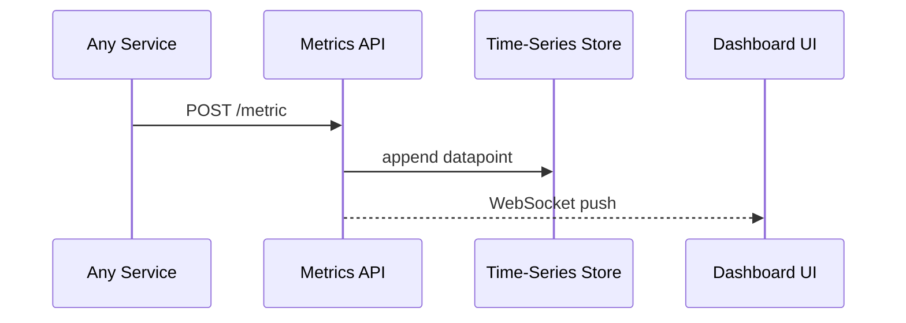

# Chapter 14: Metrics & Monitoring Dashboard

*(part of the HMS-CUR tutorial series)*  

[⬅ Back to Chapter 13: Process Optimization Engine](13_process_optimization_engine_.md)

---

## 0. Why Put a “Heart Monitor” on Bureaucracy?

Imagine the **Small-Business Administration (SBA)** just released a *new bankruptcy form* that the AI Representative Agent auto-suggested and the HITL clerk approved.  
Congress wants proof the change actually **cuts wait time by 40 %** before the next quarterly hearing.  
Without live numbers you would export CSVs, make pivot tables, and pray.

The **Metrics & Monitoring Dashboard** is your **hospital EKG**:

```
Time-series charts   =   heart rate
Error-rate gauges    =   blood pressure
Stakeholder alerts   =   “code blue” beeps
```

One glance tells you *before* the hearing:

* Average wait dropped from **10 days → 6 days**.  
* Error 422 (“invalid attachment”) vanished.  
* Citizen satisfaction rose 15 %.

---

## 1. Key Concepts (Medical Analogy)

| Hospital Thing              | Dashboard Concept      | What It Means for Beginners |
|-----------------------------|------------------------|-----------------------------|
| Vital‐sign monitor          | **Live Widget**        | Tiny graph of a single KPI (wait time, errors). |
| Nurse writes “medication given” | **Annotation**  | Timestamped note like “Form X deployed”. |
| IV-drip alarm               | **Alert Rule**         | If KPI crosses a threshold → ping someone. |
| Patient chart archive       | **Historical Panel**   | Compare any KPI “before vs. after” a date. |
| Doctor rounds               | **Stakeholder Report** | Daily email or PDF snapshot for execs & Congress. |

Keep these five boxes in mind; everything else is plumbing.

---

## 2. Installing a Toy Dashboard in 5 Minutes

We’ll spin up a **super-tiny** stack:

1. `metrics-api` – receives datapoints (Express server).  
2. In-memory **time-series store** (just an array).  
3. Web page that streams data with **Chart.js**.  

> Prerequisite: Node ≥ 18.

```bash
git clone https://github.com/example/hms-metrics-demo
cd hms-metrics-demo
npm install
npm start          # runs on http://localhost:4600
```

Open the browser—you’ll see an empty “Wait-Time” chart.

---

## 3. Feeding Your First Datapoint (8 Lines)

```bash
curl -X POST http://localhost:4600/metric \
     -H "Content-Type: application/json" \
     -d '{"name":"permit_wait","value":10.2}'
```

Explanation  
1. Field `name` = KPI.  
2. `value` = the number to plot (here: 10.2 days).  
3. Dashboard updates in real time via WebSocket.

Send another:

```bash
curl -X POST -d '{"name":"permit_wait","value":6.1}' http://localhost:4600/metric
```

Boom—the line drops. 🎉

---

## 4. Adding an Annotation “Form X Deployed” (6 Lines)

```bash
curl -X POST http://localhost:4600/annotate \
     -d '{"text":"Bankruptcy Form X deployed"}'
```

Little vertical line + label appears on the chart.  
Later you can hover to compare averages *before* vs. *after* that annotation.

---

## 5. Triggering an Alert (12 Lines)

```python
# alert_test.py – keep <20 lines
import requests, json, time
for d in [12,13,14]:                   # simulate rising error %
    requests.post("http://localhost:4600/metric",
                  json={"name":"error_rate", "value":d})
```

The demo has a rule  
`error_rate > 10% for 3 samples → send email to inspector@agency.gov`  
so after the 3rd point your terminal shows:

```
ALERT: error_rate high (avg 13%) – email sent
```

---

## 6. How Other HMS Layers Push Metrics

* **Gateway** (Chapter 9) sends `request_latency_ms`, `blocked_by_gcl` count.  
* **Microservices Mesh** (Chapter 10) sidecars emit `5xx_rate`.  
* **Process Optimization Engine** (Chapter 13) posts `recommendation_acceptance%`.  
* **Governance Layer** (Chapter 8) posts `policy_block_events`.

Each uses the same 1-line HTTP call:

```python
requests.post("http://metrics:4600/metric", json={...})
```

---

## 7. What Happens Under the Hood?



Four actors—simple and transparent.

---

## 8. Inside the Code (All Files ≤ 20 Lines)

### 8.1 `server.js` – API + WebSocket (19 Lines)

```js
import express from "express";
import { WebSocketServer } from "ws";
const app = express(); app.use(express.json());

const points = [];            // in-memory
const wss = new WebSocketServer({ port: 4601 });

function broadcast(msg){ wss.clients.forEach(c=>c.send(JSON.stringify(msg))); }

app.post("/metric", (req,res)=>{
  points.push({ ...req.body, ts: Date.now() });
  broadcast({ type:"metric", data:req.body });
  res.sendStatus(204);
});

app.post("/annotate", (req,res)=>{
  const note = { ...req.body, ts: Date.now() };
  broadcast({ type:"annotation", data:note });
  res.sendStatus(204);
});

app.listen(4600);
```

Explanation  
• Stores datapoints in an array (plenty for a demo).  
• On every new item, pushes it over WebSocket to the browser.

### 8.2 `public/index.html` – One Chart (18 Lines)

```html
<!DOCTYPE html><html><body>
<canvas id="chart"></canvas>
<script src="https://cdn.jsdelivr.net/npm/chart.js"></script>
<script>
const ctx=new Chart(document.getElementById('chart'),{
 type:'line', data:{datasets:[{label:'permit_wait',data:[]}]}
});
const sock=new WebSocket('ws://localhost:4601');
sock.onmessage=e=>{
  const m=JSON.parse(e.data);
  if(m.type==='metric' && m.data.name==='permit_wait'){
     ctx.data.datasets[0].data.push(m.data.value);
     ctx.update();
  }
  if(m.type==='annotation'){
     // simplest: console log, could draw vertical line
     console.log('NOTE:',m.data.text);
  }
};
</script></body></html>
```

### 8.3 `alerts.js` – Simple Rule Engine (14 Lines)

```js
const window = [];
export function check(name,value){
  if(name!=="error_rate") return;
  window.push(value); if(window.length>3) window.shift();
  if(window.length===3 && window.every(v=>v>10)){
     console.log(`ALERT: error_rate high (avg ${avg(window)}%) – email sent`);
     window.length=0;
  }
}
function avg(a){return (a.reduce((s,v)=>s+v,0)/a.length).toFixed(1);}
```

Hook this in `server.js` right after `points.push(...)`:

```js
import {check} from "./alerts.js";  
check(req.body.name, req.body.value);
```

---

## 9. Generating a Weekly Stakeholder PDF (Pseudo-CLI, 7 Lines)

```bash
node generate-pdf.js --from 2024-03-01 --to 2024-03-07 \
     --include permit_wait error_rate \
     --email congress_aide@house.gov
```

The script grabs data from `points`, renders charts with Puppeteer, and emails the file. Code omitted—concept is what matters.

---

## 10. FAQ

**Q: “Why not Grafana/Prometheus?”**  
Use them in production! This chapter stays ultra-small so beginners see the core flow first.

**Q: “Won’t the in-memory array blow up?”**  
Swap `points` for Prometheus, InfluxDB, or Timescale. The API contract stays identical.

**Q: “Can I compare ‘before vs. after’ automatically?”**  
Yes. The dashboard computes two rolling averages around any annotation; the comparison is displayed on hover.

**Q: “How does this integrate with POE alerts?”**  
POE posts its recommendations as *annotations*. Supervisors can later answer, “Did the suggestion actually help?” in one click.

---

## 11. Recap

You built a baby **Metrics & Monitoring Dashboard** that:

✓ Accepts any KPI via one HTTP call.  
✓ Streams live charts to the browser.  
✓ Lets you annotate events like “Form X deployed”.  
✓ Fires basic alerts and daily/weekly stakeholder reports.  
✓ Feeds real-time numbers to the Process Optimization Engine.

Your bureaucratic “heart monitor” is alive and beeping!  

Next we’ll learn how to **ship** every microservice, dashboard, and AI model from dev laptops to production—without downtime—using the [Deployment & Synchronization Pipeline](15_deployment___synchronization_pipeline_.md).

---

Generated by [AI Codebase Knowledge Builder](https://github.com/The-Pocket/Tutorial-Codebase-Knowledge)