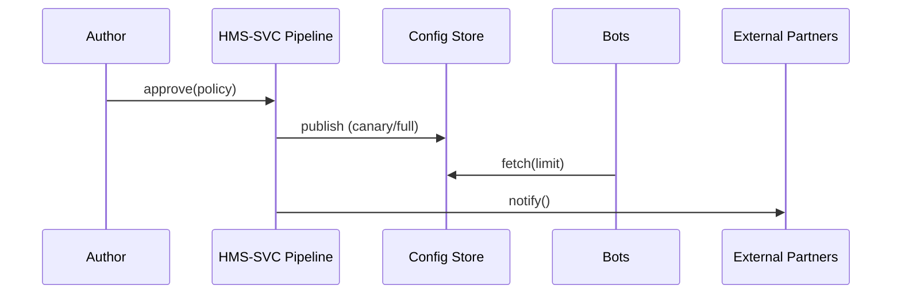

# Chapter 14: Policy Deployment Pipeline (Backend API / HMS-SVC)  

[← Back to Chapter 13: Simulation & Training Suite (HMS-ESR + HMS-EDU)](13_simulation___training_suite__hms_esr___hms_edu__.md)

---

## 1 • Why Do We Need Yet *Another* Pipeline?

Imagine the Environmental Protection Agency (EPA) just tightened the daily **Particulate-Matter (PM 2.5) emission limit** from **35 µg/m³ → 25 µg/m³**.

Within **30 minutes**:

1. Every *inspection bot* must use the new threshold.  
2. The **“Air-Quality Dashboard”** pane must show *red* sooner.  
3. State partners must receive a heads-up to update their own sensors.

If one team emails a PDF and another pastes numbers into a spreadsheet, citizens will still breathe unhealthy air tomorrow.

**HMS-SVC** is the **printing press** that publishes a freshly-signed policy across the whole government portal—databases, schedules, external partners—**in seconds**, with audit trails and zero downtime.

---

## 2 • Key Concepts (Newspaper-Printing Analogy)

| Pipeline Term | Printing-Press Picture | Plain-English Meaning |
|---------------|-----------------------|-----------------------|
| Policy Artifact | Final newspaper page | The JSON or YAML that encodes the new rule. |
| Stage | Conveyor belt segment | One automatic checkpoint (test, approve, publish). |
| Canary Rollout | Early-morning 1-city edition | Small % of traffic gets the rule first. |
| Config Store | Warehouse of printed papers | Central DB where services fetch live configs. |
| Notifier | Delivery truck | Push update to external partners via [A2A](09_external_integration_layer__hms_a2a__.md). |

Keep these five nouns in mind; all code glues them together.

---

## 3 • Running Example – “Publish the New PM 2.5 Limit”

We will:

1. Draft the policy artifact.  
2. Approve & merge it.  
3. Watch the pipeline push it to bots, panes, and partners.

*(No code block exceeds 20 lines.)*

### 3.1 Draft the Policy Artifact

```yaml
# policies/pm25.yaml
id        : epa-pm25-limit
version   : 2.0.0
effective : 2024-09-01T00:00:00Z
limit     : 25          # µg/m³
units     : ug_per_m3
tags      : [health, air, epa]
```

**Explanation** – A tiny, self-describing file. Version bump from **1.5.0 → 2.0.0** clearly signals a breaking change.

---

### 3.2 Approve & Merge (One Line in CLI)

```bash
$ hms-svc approve policies/pm25.yaml --sign "EPA Chief"
✓ Signature added
✓ Policy queued for deployment (run #184)
```

**Explanation** – `hms-svc approve` stores a cryptographic signature and triggers the **Pipeline**.

---

### 3.3 Pipeline Stages in Action (Auto-Run)

```text
RUN #184  epa-pm25-limit@2.0.0
• Lint & Schema ............... PASS
• Simulation Replay ........... PASS (98.4% bots adapted)
• Canary 5% traffic (National Capital Region) .... PASS
• Full Rollout ................ PASS
• Partner Notifications ....... 6 sent
DEPLOYMENT SUCCESSFUL  —  11 min 42 sec
```

No buttons clicked; HMS-SVC did the heavy lifting.

---

### 3.4 Services Pick Up the New Limit

```js
// inspection-bot.js   (HMS-AGT, 12 lines)
import { getPolicy } from 'hms-svc';

const PM_LIMIT = await getPolicy('epa-pm25-limit').limit;

if (sensor.pm25 > PM_LIMIT)
    emitAlert('Violation', sensor.pm25);
```

**Explanation** – Bots fetch live values from the **Config Store** instead of hard-coding numbers.

---

## 4 • What Happens Behind the Curtain?

### 4.1 Step-by-Step Flow

1. **Approve** inserts the artifact into the **Staging Queue**.  
2. **Stage 1 – Lint/Test**: JSON schema, mandatory fields.  
3. **Stage 2 – Simulation Replay**: Runs training scenarios from [Chapter 13](13_simulation___training_suite__hms_esr___hms_edu__.md) to ensure bots survive.  
4. **Stage 3 – Canary**: Publishes to Config Store with scope =`region:NCR`.  
5. **Stage 4 – Full Rollout**: Expands scope to `global`.  
6. **Stage 5 – Notify Partners**: Uses [A2A](09_external_integration_layer__hms_a2a__.md) connectors (email, webhook, or SFTP).  
7. **Audit Log Entry** written to [HMS-DTA](06_central_data_repository__hms_dta__.md).

### 4.2 Minimal Sequence Diagram



---

## 5 • Hands-On With the Pipeline API (≤ 20 Lines)

```js
// deploy.js
import { deployPolicy } from 'hms-svc';

await deployPolicy({
  file     : 'policies/pm25.yaml',
  canary   : 0.05,
  partners : ['state-airboards', 'epa-open-data']
});
```

**Explanation** – One helper wraps *approve → run pipeline* so small agencies don’t need separate steps.

---

## 6 • Peek Inside HMS-SVC (Code-Light)

### 6.1 Pipeline Driver (15 Lines)

```js
// svc/pipeline.js
const stages = ['lint', 'simulate', 'canary', 'rollout', 'notify'];

export async function run(policy){
  log('RUN', policy.id);
  for (const s of stages){
    const ok = await require(`./stages/${s}`).exec(policy);
    if (!ok) return fail(policy, s);
  }
  success(policy);
}
```

**Explanation** – A simple **for-loop** loads each stage module. Fail-fast keeps logic easy to reason about.

---

### 6.2 Canary Publish Stage (14 Lines)

```js
// stages/canary.js
import { putConfig } from '../store.js';

export async function exec(policy){
  await putConfig(policy.id, policy.version, policy, { scope:'region:NCR' });
  await sleep(5 * 60 * 1000);          // observe 5 min
  return metrics.ok('alerts') < 2;      // <2 new alerts ⇒ pass
}
```

**Explanation** – Publishes to the Config Store scoped to one region, waits, then checks monitoring dashboards.

---

### 6.3 Partner Notifier Stage (12 Lines)

```js
// stages/notify.js
import { sendPackage } from 'hms-a2a';

export async function exec(policy){
  for (const p of policy.partners || [])
    await sendPackage(p, {
       intent:'policy-update',
       data  : { id:policy.id, version:policy.version }
    });
  return true;
}
```

**Explanation** – Reuses A2A to fan out the news. Zero extra plumbing.

---

## 7 • How HMS-SVC Connects to Other Layers

| Need | Layer Used |
|------|-----------|
| Store artifacts, audit logs | [Central Data Repository](06_central_data_repository__hms_dta__.md) |
| Re-run training scenarios | [Simulation Suite](13_simulation___training_suite__hms_esr___hms_edu__.md) |
| Push config to services | [Microservices Infra](12_microservices_infrastructure__hms_sys___friends__.md) – Config Store side-car. |
| Guard against bad rules | [Security & Compliance Engine](10_security___compliance_engine__hms_esq___hms_ops__.md) validates each stage. |
| Alert humans if canary fails | [HITL](07_human_in_the_loop_oversight__hitl__.md) opens an emergency review ticket. |

---

## 8 • Frequently Asked Questions

1. **Does every service poll the Config Store?**  
   No—HMS-SVC emits a WebSocket *push*; services update instantly.

2. **How do I roll back fast?**  
   `hms-svc rollback epa-pm25-limit@1.5.0` publishes the previous version in under 10 seconds.

3. **Can multiple rules bundle into one release?**  
   Yes—`deployPolicy({ files:['pm25.yaml','ozone.yaml'] })` batches the artifacts.

4. **What if partners are offline?**  
   Notifier stage queues messages in A2A; retries with back-off for 24 hours.

5. **Is citizen-facing UI cached?**  
   The MFE host invalidates only relevant panes via the **bridge** from [Chapter 1](01_micro_frontend_interface__hms_mfe__.md)—no full refresh needed.

---

## 9 • Summary & What’s Next

You just learned how the **Policy Deployment Pipeline**:

* Turns a signed YAML into a government-wide **live rule** in minutes.  
* Uses **stages** (lint, simulation, canary, rollout, notify) to stay safe.  
* Updates bots, dashboards, and external partners simultaneously.  
* Leaves an immutable audit trail for watchdogs.

Now that policies zip around reliably, we can discuss the **democratic oversight** that determines *who* may approve, veto, or amend them in the first place.

Let’s step up to the balcony and look at the **constitutional checks-and-balances layer** in  
[Chapter 15: Governance Layer (HMS-GOV)](15_governance_layer__hms_gov__.md) →

---

---

Generated by [AI Codebase Knowledge Builder](https://github.com/The-Pocket/Tutorial-Codebase-Knowledge)