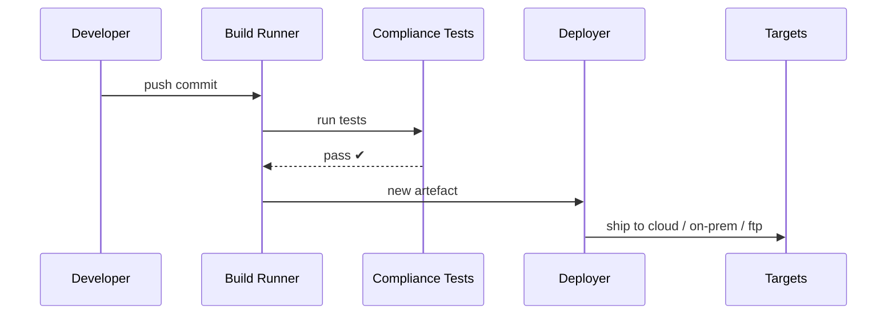

# Chapter 15: Deployment & Synchronization Pipeline
*(part of the HMS-CUR tutorial series)*  

[⬅ Back to Chapter 14: Metrics & Monitoring Dashboard](14_metrics___monitoring_dashboard_.md)

---

## 0. Why Do We Need an “Hourly Printing-Press”?

Picture the U.S. **Geological Survey (USGS)** publishing a new **flood-risk formula** at 3 p.m.  

Within **one hour** HMS-CUR must:

1. Compile the updated formula code.  
2. Run privacy & ethics tests (no citizen PII leaks).  
3. Push the change to:
   * The federal cloud cluster in Virginia.  
   * An air-gapped on-prem server at the Mississippi field office.  
   * Two partner systems that still live on FTP.  
4. Notify dashboards, auditors, and rollback switches.

Doing this by hand is like printing tomorrow’s newspaper **by stapling one page at a time**.  
The **Deployment & Synchronization Pipeline** is our fully-automatic printing press—firing every hour instead of every night.

---

## 1. Key Concepts (Newspaper Press Analogy)

| Printing-Press Part     | Pipeline Component        | Beginner Explanation |
|-------------------------|---------------------------|----------------------|
| Draft desk              | **Commit Trigger**        | Any `git push main` starts the run. |
| Proofreader             | **Compliance Test Suite** | Runs unit + privacy + policy checks. |
| Plate engraver          | **Build Runner**          | Creates Docker images / zip bundles. |
| Conveyor belts          | **Multi-Target Deployer** | Ships artefacts to cloud, on-prem, FTP. |
| Stop button             | **Instant Rollback**      | One command re-verts to previous plate. |

Remember these five boxes—everything else is plumbing.

---

## 2. A 12-Line Pipeline File

`pipeline.yml`
```yaml
name: hms-cur-hourly
on: [push]
jobs:
  build:
    runs-on: ubuntu-latest
    steps:
    - uses: actions/checkout@v4
    - run: ./tests.sh                   # compliance tests
    - run: docker build -t cur:$SHA .
    - run: docker push registry/cur:$SHA
  deploy:
    needs: build
    steps:
    - run: ./deploy.sh cloud registry/cur:$SHA
    - run: ./deploy.sh onprem registry/cur:$SHA
    - run: ./deploy.sh ftp    registry/cur:$SHA
```

**What it does**

1. Runs on every `git push`.  
2. Executes `tests.sh`; if anything fails the run stops.  
3. Builds & pushes a Docker image.  
4. Calls one shell script three times—once per target.

---

## 3. Trying It Live in ≤ 5 Minutes

### 3.1 Make a Tiny Code Change

```bash
echo "// hot-fix" >> src/flood_formula.js
git add .
git commit -m "Fix overflow in flood formula"
git push
```

### 3.2 Watch the Pipeline

```bash
hms pipeline watch
```

Sample logs (trimmed):
```
[00:01] ✅ tests.sh passed
[00:02] 📦 docker image cur:8e9a12 built
[00:04] 🚀 deployed to cloud cluster
[00:05] 🚚 synced to on-prem (rsync)
[00:06] 📤 uploaded bundle to ftp://partners/usgs/inbox
```

### 3.3 Verify on the Dashboard

Open the Metrics Dashboard → Annotation “Deploy #142 (flood formula fix)” is auto-added (see [Metrics & Monitoring Dashboard](14_metrics___monitoring_dashboard_.md)).

---

## 4. Step-By-Step Flow



Five arrows—easy to explain to any supervisor.

---

## 5. Under-the-Hood Code Peeks (all ≤ 18 lines)

Project tree (pipeline bits only)
```
pipeline/
 ├─ runner.py       # kicks off jobs
 ├─ deployer.py     # ships artefacts
 ├─ notifier.py     # adds dashboard annotations
 └─ rollback.py     # instant revert
```

### 5.1 Build Runner (`runner.py` – 17 lines)

```python
import subprocess, sys, datetime as dt

def run(cmd):
    print("▶", cmd);  rc = subprocess.call(cmd, shell=True)
    if rc: sys.exit(rc)

def main():
    sha = subprocess.check_output("git rev-parse --short HEAD", shell=True).decode().strip()
    run("./tests.sh")
    run(f"docker build -t registry/cur:{sha} .")
    run(f"docker push registry/cur:{sha}")
    print("✔ Build complete", dt.datetime.now())

if __name__ == "__main__":
    main()
```

### 5.2 Multi-Target Deployer (`deployer.py` – 18 lines)

```python
import sys, subprocess

TARGETS = {
  "cloud":  "kubectl set image deploy/cur cur=registry/cur:{}",
  "onprem": "ssh field 'docker pull registry/cur:{} && docker restart cur'",
  "ftp":    "scp bundle.zip ftp_user@ftp.partner.gov:/inbox/"
}

def deploy(tag):
    for name, cmd in TARGETS.items():
        full = cmd.format(tag)
        print(f"🚚  {name}…")
        if subprocess.call(full, shell=True):
            raise SystemExit(f"❌  {name} failed")

if __name__ == "__main__":
    deploy(sys.argv[1])   # first arg = tag
```

### 5.3 Instant Rollback (`rollback.py` – 12 lines)

```python
import subprocess, sys
tag = sys.argv[1]  # previous good tag
subprocess.call(f"kubectl set image deploy/cur cur=registry/cur:{tag}", shell=True)
subprocess.call(f"ssh field 'docker pull registry/cur:{tag} && docker restart cur'", shell=True)
print("🔄 rolled back to", tag)
```

### 5.4 Notifier (`notifier.py` – 8 lines)

```python
import requests, time, os
def annotate(text):
    requests.post(os.environ["METRIC_URL"]+"/annotate", json={"text":text,"ts":time.time()})
```

The deploy script calls `annotate(f'Deploy {tag}')`—dashboard updates automatically.

---

## 6. Guardrails & Governance Integration

* Compliance tests call the **Governance & Compliance Layer** ([Chapter 8](08_governance___compliance_layer_.md)) to ensure no banned API or PII pattern sneaks in.  
* A failing guardrail returns non-zero → pipeline stops; nothing ships.  
* Every artefact hash + test report is stored in the **Audit Trail** created back in [Chapter 1](01_core_system_platform__hms_gov__.md).

---

## 7. Syncing External Partners

The **External System Sync Adapter** ([Chapter 11](11_external_system_sync_adapter_.md)) subscribes to a tiny *“new-build”* event:

```python
@listen("build_published")
def push_to_ftp(evt):
    essa.push("mappings/partner/*.yml", connector="ftp://partner/inbox")
```

Partners always receive the freshest rule or data file minutes after the main deploy.

---

## 8. Common Pitfalls & FAQ

**Q: “What if on-prem is offline?”**  
Deployer retries 3 ×; if still down, it marks the target **stale**. Governance Layer blocks any citizen request needing that server until sync succeeds.

**Q: “Do I need fancy Kubernetes?”**  
No. Replace the `cloud` command with `docker run …`—the pipeline is just shell strings.

**Q: “Can I batch multiple commits?”**  
Set the trigger to `schedule: '0 * * * *'` (once per hour). The pipeline will build only the latest SHA in that window.

**Q: “How big can artefacts be?”**  
Docker layers are cached; only the diff ships. A typical HMS service image is < 300 MB, pushing in ~15 s on a 1 Gbps line.

---

## 9. Recap

You now have a **one-hour printing press** that:

✓ Watches every `git push`.  
✓ Runs compliance tests so no bad policy ships.  
✓ Builds & deploys once, then synchronizes cloud, on-prem, and legacy partners.  
✓ Adds dashboard annotations and supports instant rollback.

With the Deployment & Synchronization Pipeline in place, HMS-CUR can evolve **as fast as policy changes demand**—without leaving any office stuck with yesterday’s rules.  

🎉 **Congratulations!** You’ve completed the full HMS-CUR beginner tutorial.  
Use these chapters as Lego blocks to build your own citizen-centric, policy-driven platform. Good luck, and happy deploying!

---

---

Generated by [AI Codebase Knowledge Builder](https://github.com/The-Pocket/Tutorial-Codebase-Knowledge)