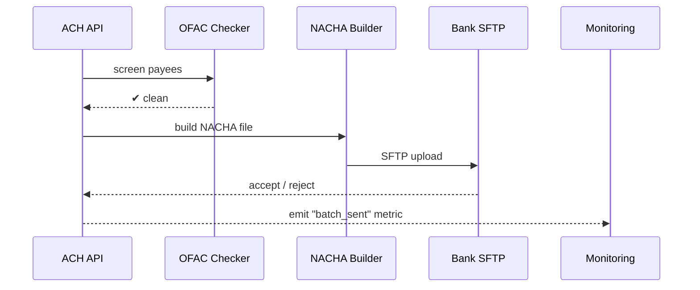

# Chapter 15: Financial Transaction Hub (HMS-ACH)

*(Coming straight from our new radar room in [Monitoring & Observability (HMS-OPS)](14_monitoring___observability__hms_ops__.md).  
Now we finally have to **move real money**—safely, legally, and on-time.)*  

---

## 1. Why Do We Need a “Treasury Clerk in the Cloud”?

### Central Use-Case – “Send $600 Disaster-Relief Payments Tonight”

1. Congress passes an emergency bill.  
2. FEMA must wire \$600 to 50 000 citizens **within 24 h**.  
3. Each payment must:  
   * pass an **OFAC** (anti-terror) screen,  
   * be formatted in **NACHA** (the U.S. ACH spec),  
   * deduct a \$0.12 processing **fee** for program overhead,  
   * show up in the bank by 9 a.m.

HMS-ACH is the platform’s **Financial Transaction Hub**—the tireless Treasury clerk that:

* Builds the NACHA file (or check batch) from raw rows,  
* Scrubs names against OFAC,  
* Calculates program fees + reconciliation ledger entries,  
* Hands the final file to the bank, then posts status events for dashboards and audits.

Without ACH, every agency would reinvent payments and risk multi-million-dollar compliance fines.

---

## 2. Key Concepts (Plain-English Cheat-Sheet)

| Term | Beginner-Friendly Meaning |
|------|---------------------------|
| Settlement Batch | A “folder” of payments to send in one ACH file or check run. |
| OFAC Screen | Quick lookup: “Is this payee on the terror list?” |
| NACHA File | A fixed-width text file banks understand; like the PDF of money. |
| Fee Rule | Math that says, for example, “charge 0.2 % or \$0.12, whichever is higher.” |
| Reconciliation Ledger | Double-entry log: every debit = credit somewhere. |
| Return Code | Reason a bank bounced a payment (e.g., R03: “No Account”). |

---

## 3. Sending the Disaster-Relief Batch in 19 Lines

`client_send_batch.py`

```python
import requests, json, uuid

batch = {
  "program":      "fema_relief_2024",
  "bank_cutoff":  "21:00",            # HH:MM (local)
  "payments": [
      {"id": str(uuid.uuid4()),
       "name": "Alex Doe",
       "routing": "021000021",
       "account": "987654321",
       "amount": 600.00}
  ]
}

r = requests.post("http://127.0.0.1:9000/ach/batch", json=batch,
                  headers={"Authorization": "Bearer FEMA-Finance"})
print(r.json())
```

Expected output:

```json
{
  "batch_id": "ba1f...",
  "status":   "queued",
  "eta":      "2024-06-10T21:00:00Z"
}
```

Beginner notes  
1. One POST = one batch.  
2. HMS-ACH replies with a **batch_id** and an estimated settlement time.

---

## 4. What Happens Inside?



Five actors—easy to follow.

---

## 5. Under the Hood (Tiny Code Peeks)

Folder layout:

```
hms-ach/
 ├─ api.py
 ├─ ofac.py
 ├─ nacha.py
 ├─ ledger.py
 └─ batches/
```

### 5.1 API Endpoint (≤ 20 Lines)

```python
# api.py
from fastapi import FastAPI, HTTPException
import uuid, ofac, nacha, ledger, json, pathlib

app = FastAPI()
PATH = pathlib.Path("batches"); PATH.mkdir(exist_ok=True)

@app.post("/ach/batch")
def new_batch(req: dict):
    if not ofac.clean(req["payments"]):
        raise HTTPException(403, "OFAC hit")
    batch_id = str(uuid.uuid4())
    fn = PATH / f"{batch_id}.ach"
    nacha.build(req, fn)           # create NACHA file
    ledger.record(batch_id, req)   # write debit/credit lines
    return {"batch_id": batch_id,
            "status": "queued",
            "eta": req["bank_cutoff"]}
```

Explanation  
1. Screens payees.  
2. Writes a NACHA file (<— plain text).  
3. Records accounting moves.  
4. Returns a friendly JSON receipt.

### 5.2 OFAC Screen Stub (12 Lines)

```python
# ofac.py
BAD = {"Evil Corp", "Blocked Name"}   # pretend list

def clean(payments):
    for p in payments:
        if p["name"] in BAD:
            return False
    return True
```

Real life calls Treasury’s SDN API; here we use a set.

### 5.3 Building a NACHA File (18 Lines)

```python
# nacha.py
def build(req, path):
    rows = []
    for p in req["payments"]:
        # fixed-width fields (id, routing, account, amount*100)
        row = f"6{p['routing']:<9}{p['account']:<17}"
        row += f"{int(p['amount']*100):010d}"
        row += p["id"][:15].ljust(15)
        rows.append(row)
    rows.append("9000001")          # file control record stub
    path.write_text("\n".join(rows))
```

Each row is **exactly** the width NACHA expects; banks love it.

### 5.4 Ledger Entry (14 Lines)

```python
# ledger.py
import json, pathlib, datetime, uuid
LOG = pathlib.Path("ledger.jsonl")

def record(batch_id, req):
    for p in req["payments"]:
        fee = round(max(0.12, p["amount"]*0.002), 2)
        entries = [
          {"id": uuid.uuid4().hex, "batch": batch_id,
           "type": "debit_program", "amount": p["amount"]+fee},
          {"id": uuid.uuid4().hex, "batch": batch_id,
           "type": "credit_citizen", "amount": p["amount"]},
          {"id": uuid.uuid4().hex, "batch": batch_id,
           "type": "fee_revenue", "amount": fee}
        ]
        for e in entries:
            e["time"] = datetime.datetime.utcnow().isoformat()
            LOG.write_text(LOG.read_text()+json.dumps(e)+"\n") \
                if LOG.exists() else LOG.write_text(json.dumps(e)+"\n")
```

Double-entry style: debits = credits; auditors smile.

---

## 6. Integration With Other HMS Layers

| Layer | Interaction With HMS-ACH |
|-------|--------------------------|
| [Policy Engine (HMS-CDF)](02_policy_engine__hms_cdf__.md) | Checks fee schedules, budget caps before batch creation. |
| [Compliance & Legal Reasoning (HMS-ESQ)](03_compliance___legal_reasoning__hms_esq__.md) | Verifies OFAC & NACHA rules match federal regs. |
| [Workflow Orchestration (HMS-ACT)](12_workflow_orchestration__hms_act__.md) | A workflow step calls `/ach/batch` and later awaits `batch_settled` event. |
| [Secure Data Repository (HMS-DTA)](13_secure_data_repository__hms_dta__.md) | Stores ledger lines + returned-payment CSVs immutably. |
| [Monitoring & Observability (HMS-OPS)](14_monitoring___observability__hms_ops__.md) | Tracks “batches_sent”, “return_rate”, and dollar volumes. |

---

## 7. Hands-On Mini-Lab

1. Install deps:

```bash
pip install fastapi uvicorn
```

2. Run the mini server:

```bash
uvicorn api:app --reload
```

3. Execute `client_send_batch.py` twice.  
4. Inspect `batches/`—you’ll see a `.ach` file. Open it in a text editor; notice fixed-width rows.  
5. Open `ledger.jsonl`—verify each payment logs **three** entries (debit, credit, fee).

---

## 8. Frequently Asked Questions

**Q: How are return codes handled?**  
Banks SFTP a **return file** nightly. HMS-ACH parses it, flips ledger entries (reverse credit), and pushes a `payment_returned` event to [Workflow Orchestration (HMS-ACT)](12_workflow_orchestration__hms_act__.md).

**Q: Can HMS-ACH print physical checks?**  
Yes—swap `nacha.build()` with `check_writer.print()` when `payment_method=="check"` in the request.

**Q: Where do I configure fee rules?**  
In the Policy Engine snapshot (`fee_rules:` YAML). ACH consults it via API each batch.

---

## 9. Recap & What’s Next

You learned:

* HMS-ACH is the **digital Treasury clerk** that screens, builds, and sends payments.  
* A single POST creates a **settlement batch**; under the hood we screen OFAC, craft a **NACHA file**, and write a **double-entry ledger**.  
* The hub plugs into policy, legal, workflows, the vault, and monitoring—no siloed money flows.

Next we’ll plug payments into national health benefit systems in  
[Universal Healthcare Integration (HMS-UHC / HMS-MED)](16_universal_healthcare_integration__hms_uhc___hms_med__.md).

---

Generated by [AI Codebase Knowledge Builder](https://github.com/The-Pocket/Tutorial-Codebase-Knowledge)