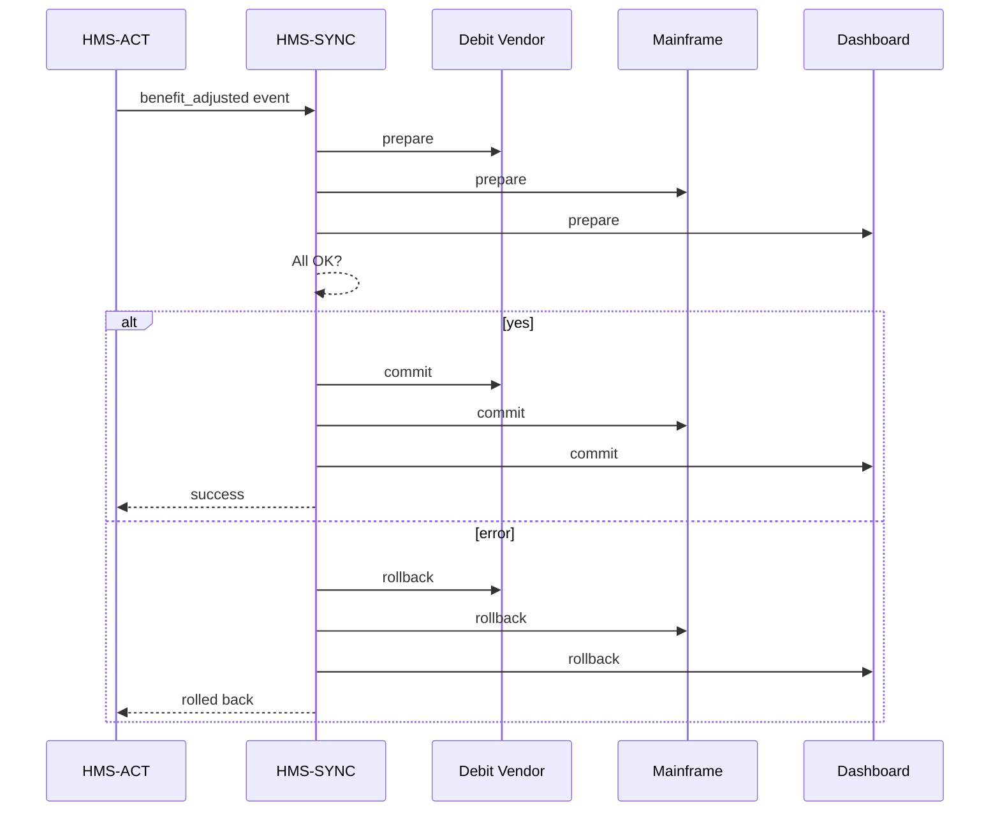

# Chapter 17: External System Synchronization  

*(Fresh from plugging into state health registries in [Universal Healthcare Integration (HMS-UHC / HMS-MED)](16_universal_healthcare_integration__hms_uhc___hms_med__.md).  
Now we must keep dozens of **outside** systems—bank files, COBOL mainframes, SaaS dashboards—in lock-step with the AI decisions we make inside HMS-CUR.)*  

---

## 1. Why Do We Need a “Magic Undo Button”?

### Central Use-Case – “Adjust 30 000 Unemployment Payments—Safely”

1. A policy analyst discovers a formula bug: jobless workers in Ohio should receive **\$25 more** each week.  
2. The fix is deployed through [Workflow Orchestration (HMS-ACT)](12_workflow_orchestration__hms_act__.md).  
3. Three external systems must update **instantly**:  
   • State **Debit-Card Vendor** (push new load),  
   • **Legacy Mainframe** that prints paper checks,  
   • **Public Dashboard** that shows total program cost.  

If any call fails or lags, citizens see mismatched balances and Twitter erupts.  
**External System Synchronization (HMS-SYNC)** is the air-traffic controller that:

* broadcasts every change in real-time,  
* applies it to each outside system through tiny “adapters”,  
* and—if something misfires—rolls back everywhere in one click.

---

## 2. Key Concepts (Plain-English Glossary)

| Term                | Beginner-Friendly Meaning |
|---------------------|---------------------------|
| Sync Event          | A JSON message like `benefit_adjusted` that kicks off the whole process. |
| Adapter            | 10-20 line script that translates our event into the external system’s language. |
| Two-Phase Commit    | “Are you ready?” → “Yes” → “Do it!” protocol so all systems succeed or none do. |
| Rollback Token      | One UUID that can undo the entire batch if a downstream system screams. |
| Dead-Letter Queue   | Parking lot for events that failed even after retries—humans investigate. |
| Sync Ledger         | Immutable log showing every “✓ applied” or “✗ rolled back” per system. |

---

## 3. Using HMS-SYNC to Solve the Ohio Payment Fix

### 3.1  Emitting a Sync Event (7 lines)

```python
# act_emit.py  -- runs inside HMS-ACT step
import uuid, json, requests
event = {
  "id": uuid.uuid4().hex,
  "type": "benefit_adjusted",
  "payload": {"state":"OH", "delta_usd":25}
}
requests.post("http://sync:8000/events", json=event)
```

**What happens?**  
A single POST notifies HMS-SYNC that *all* Ohio payments moved by \$25.

---

### 3.2  Sync Service Processing (17 lines)

```python
# sync/worker.py
import requests, json, time, queue
events = queue.Queue()

def on_event(e): events.put(e)          # HTTP handler calls this

while True:
    ev = events.get()
    token = ev['id']                    # rollback token
    adapters = [debit_vendor, mainframe, dashboard]
    try:
        # phase 1: "ready?"
        assert all(a.prepare(ev) for a in adapters)
        # phase 2: "commit!"
        for a in adapters: a.commit(ev)
        log(ev, "success")
    except Exception as boom:
        for a in adapters: a.rollback(token)
        log(ev, f"rolled back: {boom}")
        dead_letter(ev)
```

**Explain**  
1. Ask every adapter to *prepare*.  
2. If all say “👍”, call *commit*.  
3. Any error → call *rollback* everywhere and park the event for humans.

*(Each adapter is ~10 lines; see below.)*

---

### 3.3  Sample Adapter – Debit-Card Vendor (14 lines)

```python
# adapters/debit_vendor.py
import requests
URL = "https://api.debitco.com/v2/load"

def prepare(ev):
    r = requests.post(URL+"/dry-run", json=ev['payload'], timeout=2)
    return r.status_code == 200

def commit(ev):
    requests.post(URL, json=ev['payload'], timeout=5)

def rollback(token):
    requests.post(URL+"/reversal", json={"event_id":token}, timeout=5)
```

*Swap URLs and field names for any vendor—code stays tiny.*

---

## 4. What’s Happening Under the Hood?



Five participants—no spaghetti.

---

## 5. Peeking Inside the Folder

```
hms-sync/
 ├─ worker.py
 ├─ adapters/
 │   ├─ debit_vendor.py
 │   ├─ mainframe.py
 │   └─ dashboard.py
 ├─ ledger.jsonl
 └─ dlq/
```

### 5.1  Sync Ledger Entry (example 8 lines)

```json
{"time":"2024-06-01T02:14:11Z",
 "event_id":"c9c1...",
 "system":"mainframe",
 "action":"commit",
 "result":"success"}
```

Stored in [Secure Data Repository (HMS-DTA)](13_secure_data_repository__hms_dta__.md).

---

## 6. Where HMS-SYNC Touches Other Layers

| Layer | Why It Matters |
|-------|----------------|
| [Workflow Orchestration (HMS-ACT)](12_workflow_orchestration__hms_act__.md) | Sends events; waits for “success” or “rolled-back”. |
| [Policy Engine (HMS-CDF)](02_policy_engine__hms_cdf__.md) | Checks if a given external system *should* receive the change. |
| [Monitoring & Observability (HMS-OPS)](14_monitoring___observability__hms_ops__.md) | Tracks “sync_latency_ms” and DLQ size. |
| [Human-in-the-Loop (HITL)](07_human_in_the_loop__hitl__oversight_.md) | DLQ items raise tickets for manual fix. |
| [Secure Data Repository (HMS-DTA)](13_secure_data_repository__hms_dta__.md) | Stores the sync ledger and rollback proofs. |

---

## 7. Hands-On Mini Lab (5 Steps)

1. Clone sample:  
   ```bash
   git clone https://github.com/example/hms-sync-demo
   cd hms-sync-demo
   pip install fastapi uvicorn requests
   ```
2. Start the sync worker (includes tiny HTTP server):  
   ```bash
   python sync/worker.py
   ```
3. Emit the Ohio fix event (`python act_emit.py`).  
4. Kill the dashboard adapter (simulate failure) and emit again—watch automatic rollback.  
5. Open `ledger.jsonl` and `dlq/` to inspect entries.

---

## 8. Frequently Asked Questions

**Q: Why not just call each system directly from HMS-ACT?**  
Centralizing sync gives us **atomicity** (all-or-nothing) and a single rollback switch.

**Q: What if an external system is offline for hours?**  
Its adapter keeps retrying with exponential back-off; after N tries the event lands in the DLQ and alerts HITL.

**Q: Do I need fancy message queues?**  
The demo uses an in-process queue; swap in RabbitMQ or Kafka by editing two lines.

**Q: How do I write a new adapter?**  
Copy `debit_vendor.py`, change URLs/field names, and register it in `worker.py#adapters`.

---

## 9. Summary & Next Steps

You learned:

* A **Sync Event → Adapter → Two-Phase Commit** pattern keeps external systems perfectly aligned.  
* One rollback token undoes changes everywhere—your “magic undo” button.  
* A simple worker + tiny adapters + a ledger (< 100 total lines) provide enterprise-grade consistency.

Next, we’ll zoom out to see **how entire agencies talk to each other**, beyond single systems:  
➡️ [Inter-Agency Communication Protocols (HMS-A2A)](18_inter_agency_communication_protocols__hms_a2a__.md)

---

Generated by [AI Codebase Knowledge Builder](https://github.com/The-Pocket/Tutorial-Codebase-Knowledge)