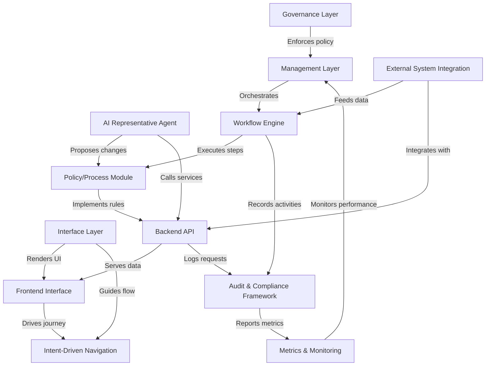

# Tutorial: HMS-CUR

HMS-CUR is a **mobile citizen banking** app that *enables secure, real-time transactions* for government services.
It seamlessly **integrates** with policy-driven workflows, AI agents, and audit frameworks to support citizen payments,
agency operations, and compliance monitoring in a unified ecosystem.

**Source Repository:** [None](None)

## Chapters

1. [Interface Layer
](01_interface_layer_.md)
2. [Frontend Interface
](02_frontend_interface_.md)
3. [Intent-Driven Navigation
](03_intent_driven_navigation_.md)
4. [AI Representative Agent
](04_ai_representative_agent_.md)
5. [Backend API
](05_backend_api_.md)
6. [Workflow Engine
](06_workflow_engine_.md)
7. [Policy/Process Module
](07_policy_process_module_.md)
8. [External System Integration
](08_external_system_integration_.md)
9. [Audit & Compliance Framework
](09_audit___compliance_framework_.md)
10. [Metrics & Monitoring
](10_metrics___monitoring_.md)
11. [Management Layer
](11_management_layer_.md)
12. [Governance Layer
](12_governance_layer_.md)

---

Generated by [AI Codebase Knowledge Builder](https://github.com/The-Pocket/Tutorial-Codebase-Knowledge)