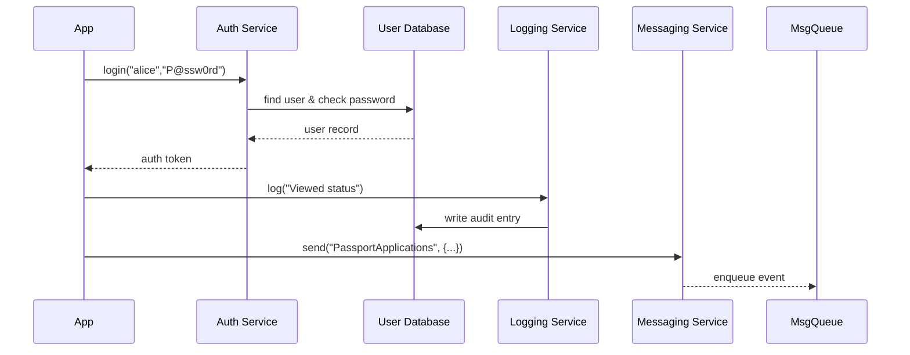
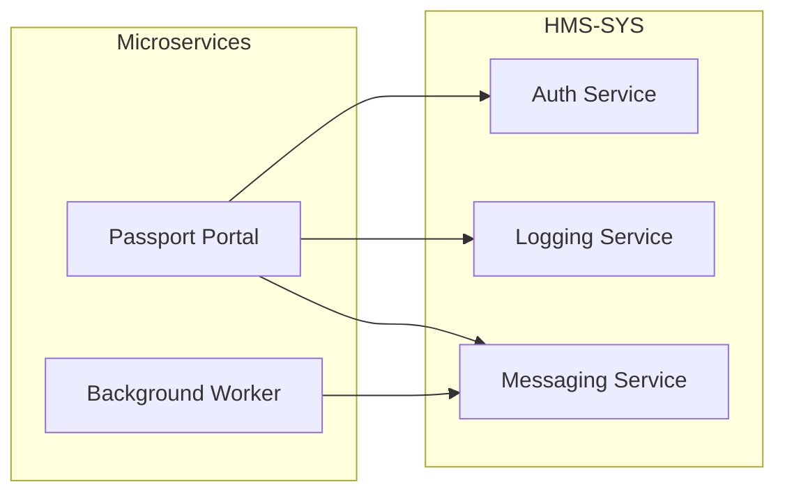

# Chapter 1: Core System Platform (HMS-SYS)

Welcome to HMS-DEV! In this first chapter, we'll explore the Core System Platform—known as **HMS-SYS**—which provides the foundation every module needs: identity, security, messaging, and logging. Think of HMS-SYS as the steel frame and utilities (electric, water, HVAC) of a government office building. Without it, no department can open its doors.

---

## 1. Why We Need HMS-SYS

Imagine the Bureau of Consular Affairs is building an online passport application portal. The portal must:

- **Authenticate** U.S. citizens logging in.
- **Authorize** staff to view or update applications.
- **Log** every action for audits.
- **Send messages** between microservices (e.g., “CaseRecordCreated”).

Without a shared platform, every microservice would rewrite the same code. HMS-SYS solves this by providing:
- A single **Identity Service**  
- Central **Security & Access Control**  
- Shared **Logging & Auditing**  
- Reliable **Messaging**  

---

## 2. Key Concepts

We break HMS-SYS into four beginner-friendly pieces:

1. **Identity Service**  
   - Manages user accounts and tokens.  
   - Example: Alice logs in to check her passport status.

2. **Security & Access Control**  
   - Defines who can call which API.  
   - Example: Only “Consular Officer” role can approve applications.

3. **Logging & Auditing**  
   - Records every action with timestamps.  
   - Example: “Alice viewed application #1234 at 10:05 AM.”

4. **Messaging Service**  
   - Sends/receives events between microservices.  
   - Example: After approval, an “ApplicationApproved” event goes to the notification service.

---

## 3. Using HMS-SYS in a Sample Portal

Here’s how a passport portal might use HMS-SYS:

```python
# app.py
from hms_sys import CorePlatform

# 1. Initialize the platform with configuration
platform = CorePlatform(config_file="hms-sys-config.yml")

# 2. Authenticate a user
token = platform.auth.login(username="alice", password="P@ssw0rd")

# 3. Log that Alice checked her status
platform.log.info(user_id=token.user_id, message="Checked passport status")

# 4. Send a message when a new application is created
platform.message.send(
    topic="PassportApplications",
    payload={"app_id": 1234, "applicant": token.user_id}
)
```

What happens:
- `.login()` returns a token if credentials are valid.
- `.log.info()` writes an entry to the audit log.
- `.message.send()` places a JSON event onto a queue.

---

## 4. Under the Hood: Step-by-Step Flow

Before peeking at code, here’s a simple sequence of calls when `platform.auth.login()` and `platform.message.send()` run:



---

## 5. Internal Code Examples

### 5.1 Authentication Service (hms_sys/auth.py)

```python
# hms_sys/auth.py
import time

class AuthService:
    def __init__(self, user_store):
        self.user_store = user_store

    def login(self, username, password):
        user = self.user_store.get(username)
        if user and user.check_password(password):
            return self._generate_token(user)
        raise Exception("Invalid credentials")

    def _generate_token(self, user):
        # Simplified token: userID + timestamp
        return f"{user.id}-{int(time.time())}"
```

_Explanation:_  
- `login()` fetches a user by name, checks the password, and returns a token.  
- `_generate_token()` builds a simple string token.

### 5.2 Logging Service (hms_sys/logging.py)

```python
# hms_sys/logging.py
class LoggingService:
    def __init__(self, audit_store):
        self.audit_store = audit_store

    def info(self, user_id, message):
        entry = {"user_id": user_id, "msg": message, "level": "INFO"}
        self.audit_store.write(entry)
```

_Explanation:_  
- `.info()` packages user ID, message, and level then writes to an audit store.

### 5.3 Messaging Service (hms_sys/messaging.py)

```python
# hms_sys/messaging.py
class MessagingService:
    def __init__(self, msg_queue):
        self.msg_queue = msg_queue

    def send(self, topic, payload):
        event = {"topic": topic, "payload": payload}
        self.msg_queue.enqueue(event)
```

_Explanation:_  
- `.send()` wraps payload in an event object and enqueues it for other services.

---

## 6. Architecture Overview



_All modules_ (portals, background workers, dashboards) rely on HMS-SYS for core functions.

---

## 7. Summary & Next Steps

You’ve learned how HMS-SYS underpins identity, security, logging, and messaging—just like a building’s foundation and utilities. You saw both the high-level flow and snippet-level code.

Up next, we’ll build on this foundation and create our **Backend API** layer to expose business endpoints:

[Chapter 2: Backend API (HMS-API/HMS-MKT)](02_backend_api__hms_api_hms_mkt__.md)

---

Generated by [AI Codebase Knowledge Builder](https://github.com/The-Pocket/Tutorial-Codebase-Knowledge)