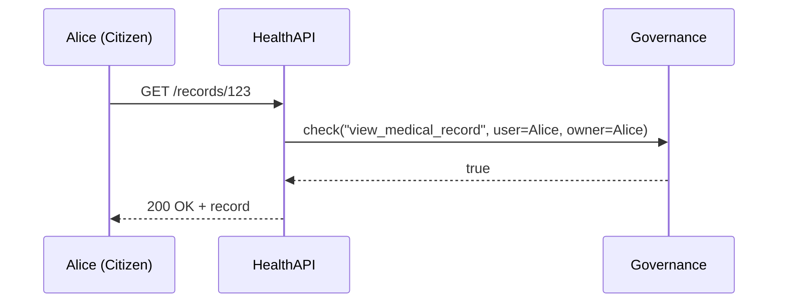

# Chapter 1: Governance Layer

Welcome to the first chapter of HMS-DEV! Here we introduce the **Governance Layer**, the “constitution” of our platform. It defines who can do what, makes sure everything is transparent, ethical, private, and legally compliant.

---

## 1. Why a Governance Layer?

Imagine a citizen, Alice, requests her medical record from the Centers for Medicare & Medicaid Services (CMS). Before that request goes through:

- We must ensure Alice’s record is shared only with people or systems authorized by HIPAA.
- Every action must be logged for audit.
- No hidden backdoors or unauthorized data leaks.

The Governance Layer sits on top of every service (APIs, UIs, AI engines) and checks rules—just like a constitutional court making sure laws are obeyed.

---

## 2. Key Concepts

1. **Policy**  
   A rule or law. e.g. “Only physicians may view patient diagnoses.”

2. **Role**  
   A group of users or services. e.g. `Physician`, `Researcher`, `Citizen`.

3. **Enforcement Point**  
   The gatekeeper. Every request passes through here first.

4. **Audit Log**  
   A tamper-proof history of who did what and when.

---

## 3. Using the Governance Layer

Let’s define a simple policy in code and see how a service invokes it.

### 3.1 Define Roles and Policies

```yaml
# policies.yaml
roles:
  - Physician
  - Citizen

policies:
  view_medical_record:
    description: "Allow viewing patient record"
    roles_allowed: [Physician, Citizen]
    conditions:
      - data_owner == requestor_id
```

*This YAML says that Physicians and Citizens can view a medical record, but only if they own it or have permission.*

### 3.2 Enforcing a Policy in Code

```python
# service.py
from governance import Governance

gov = Governance("policies.yaml")

def get_medical_record(user, record_id):
    # Ask Governance if this is allowed
    allowed = gov.check("view_medical_record",
                        user=user, resource_owner=get_owner(record_id))
    if not allowed:
        raise PermissionError("Access denied")
    return load_record(record_id)
```

After `gov.check()`, either the record is returned or access is denied.  

---

## 4. Under the Hood: Sequence Walkthrough

Here’s what happens when Alice requests her CMS record:



1. **Alice** calls the HealthAPI.  
2. HealthAPI forwards the request to **Governance**.  
3. **Governance** loads the policy, checks roles and conditions.  
4. Decision flows back, and HealthAPI returns data or an error.  
5. Every step is logged in the audit trail.

---

## 5. Inside the Governance Service

Below is a simplified snippet of how `governance.py` might implement `check()`:

```python
# governance.py
import yaml, datetime

class Governance:
    def __init__(self, policy_file):
        self.policies = yaml.safe_load(open(policy_file))
    def check(self, policy_name, **ctx):
        policy = self.policies['policies'][policy_name]
        role_ok = ctx['user'].role in policy['roles_allowed']
        owner_ok = ctx['user'].id == ctx.get('resource_owner')
        self.log(policy_name, ctx, role_ok and owner_ok)
        return role_ok and owner_ok
    def log(self, policy, ctx, result):
        print(f"{datetime.datetime.now()}: {ctx['user'].id} → {policy} = {result}")
```

1. Load policies from YAML.  
2. Verify user role and ownership.  
3. Write an audit entry.  

This simple code illustrates the core idea—real implementations would add encryption, persistence, more conditions, and compliance checks (e.g., data masking, GDPR, HIPAA).

---

## 6. Conclusion

In this chapter we learned:

- What the **Governance Layer** is and why it’s critical for security, privacy, and compliance.
- How to define policies and roles.
- How a service asks Governance for permission before sharing data.
- A peek into the internal implementation and the audit log.

Next up is building the **AI Governance Framework**, where we’ll extend these ideas to control AI model behavior.  
[AI Governance Framework](02_ai_governance_framework_.md)

---

Generated by [AI Codebase Knowledge Builder](https://github.com/The-Pocket/Tutorial-Codebase-Knowledge)