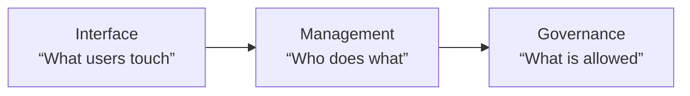
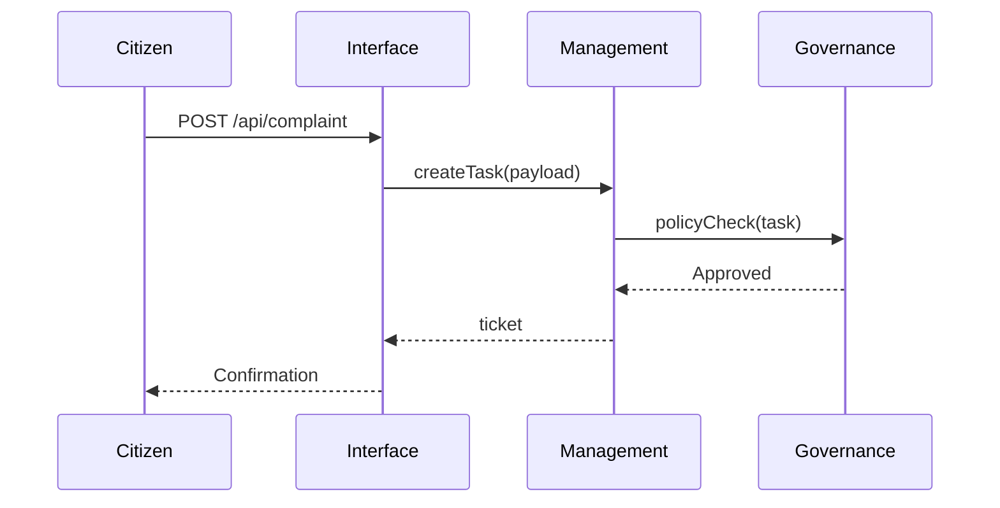

# Chapter 1: Governance-Management-Interface (GMI) Layer Cake  

Welcome to HMS-DEV! Before we touch a single line of code, we need one mental picture that will keep you oriented for the rest of the project: the **GMI Layer Cake**.

---

## 1. Why do we need the GMI “Layer Cake”?

Imagine you are a citizen using a mobile app to file an online discrimination complaint with the **Office of Immigrant and Employee Rights (IER)**.  

You (the public) just want to tap “Submit,” but behind the scenes HMS has to:

1. Make sure the form complies with privacy law.  
2. Route the complaint to the correct internal team.  
3. Show you a friendly progress tracker.

These three concerns—rules, operations, and user experience—are handled by **three distinct but cooperating layers**. Mixing them together quickly turns large government software into spaghetti. The GMI Layer Cake keeps the strands separated and traceable.

---

## 2. Meet the Three Floors



| Floor | Real-world analogy | HMS responsibility |
|-------|-------------------|--------------------|
| Governance | Agency lawyers & ethics officers | Policies, security, audit |
| Management | Program managers & schedulers   | Workflows, task assignment |
| Interface  | Service windows & kiosks        | Web/mobile/front-end APIs |

Every HMS micro-service and API endpoint must **enter on the Interface floor, check in at Management, and finally get rubber-stamped by Governance**—then reverse the trip on the way out.

---

## 3. Key Concepts (Beginner Friendly)

1. Policy Gate  
   • Tiny guardrails that live on the Governance floor.  
2. Workflow Step  
   • A single “todo” orchestrated on the Management floor.  
3. Channel Adapter  
   • A doorbell on the Interface floor (web, CLI, kiosk).

Keep these three nouns in mind; you’ll see them everywhere.

---

## 4. A 10-Line Mini Demo

Below is an ultra-small Python sketch that files the IER complaint through all three layers:

```python
# interface_layer.py
def submit_complaint(payload):
    assert "email" in payload           # Interface validation
    ticket = route_to_management(payload)
    return {"ticket": ticket}
```

```python
# management_layer.py
def route_to_management(payload):
    task_id = create_workflow_task(payload)   # Management logic
    approve_by_governance(task_id)
    return task_id
```

```python
# governance_layer.py
def approve_by_governance(task_id):
    # Pretend we call a policy engine here
    if not task_id.startswith("IER-"):
        raise PermissionError("Invalid task prefix")
    log_audit_event(task_id)
```

Explanation (short & sweet):

1. `submit_complaint` = Interface: checks basic form fields.  
2. `route_to_management` = Management: creates an internal task.  
3. `approve_by_governance` = Governance: ensures policy & logs audit.

All three files are **under 20 lines each**, yet the separation is crystal-clear.

---

## 5. What Happens Under the Hood?

Let’s walk through the same complaint using plain English steps:

1. User taps “Submit” in the mobile app (Interface).  
2. The app hits `/api/complaint`, which:  
   a. Confirms required fields.  
   b. Forwards the payload to the Management service.  
3. Management service opens a new “IER-XXXX” task and asks Governance,  
   “Is this compliant?”  
4. Governance service checks privacy rules, logs an audit entry, and returns “Approved.”  
5. Management replies back to Interface with a ticket number.  
6. App shows: “Your complaint was filed, ticket IER-1234.”

Sequence diagram (≤5 participants):



---

## 6. Where is the Real Code?

The real HMS repository contains richer versions inside:

- `hms_interface/` – React + FastAPI adapters  
- `hms_management/` – Workflow engine  
- `hms_governance/` – Policy engine (links to [Compliance & Legal Reasoning (HMS-ESQ)](04_compliance___legal_reasoning__hms_esq__.md))

For now you only need to remember **which folder maps to which floor**.

---

## 7. Common Pitfalls (and How the Cake Helps)

Pitfall | Without GMI | With GMI
------- | ------------|---------
“Quick fix” that bypasses security | Dev adds a hidden API | Governance gate blocks it
Unclear ownership | Who maintains the form? | Interface team owns; Governance only audits
Blame game after an outage | Finger-pointing | Logs show which layer failed

---

## 8. When the Cake Gets Taller

As HMS grows, each floor can gain new sub-layers (e.g., caching, analytics), but **the top-to-bottom order never changes**. Even expert architects start debugging by asking, “Which floor am I on?”—and so should you.

---

## 9. What’s Next?

You now know the basic anatomy of HMS. In the next chapter we’ll zoom into the language that the layers use to talk to each other: the **Model Context Protocol (HMS-MCP)**.

[Next: Model Context Protocol (HMS-MCP)](02_model_context_protocol__hms_mcp__.md)

---

*Great job reaching the end of Chapter 1! Feel free to revisit the diagrams anytime you feel lost in higher floors.*

---

Generated by [AI Codebase Knowledge Builder](https://github.com/The-Pocket/Tutorial-Codebase-Knowledge)