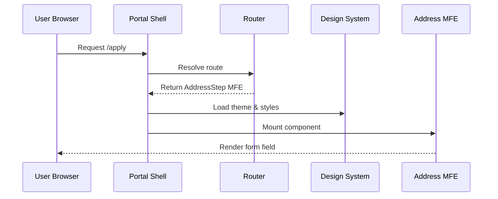

# Chapter 1: Interface Layer (HMS-MFE / Portals)

Welcome to HMS-DEV!  
We begin our journey at the place every user sees first—the Interface Layer. Think of it as the lobby of a government building: citizens file forms at self-service kiosks, while staff swipe badges to reach secure dashboards.  
HMS-MFE (Housing-Management-System Micro-Front Ends) provides that “lobby” for any agency portal.

---

## 1. Why Does This Layer Exist?

Government teams often need to launch new digital services quickly:

* Today: The Rural Housing Service opens an online grant form.  
* Tomorrow: USCIRF wants a public survey with the same look & feel.  
* Next month: The FDIC needs a bilingual Q&A widget.

Traditionally, each project spins up its own site. That’s slow, expensive, and inconsistent in terms of accessibility & design. HMS-MFE solves this by hosting **modular front-end components** that can be:

* Re-skinned by swapping a theme file.  
* Assembled like LEGO® bricks.  
* Published behind secure or public portals with built-in accessibility hooks.

---

## 2. Key Concepts (Plain-English)

| Term | What It Means in Everyday Words |
|------|--------------------------------|
| **Micro-Front End (MFE)** | A self-contained UI piece (e.g., “Upload Document” widget) that you can drop into any page. |
| **Portal** | A collection of MFEs served under one domain for a specific audience (citizens, staff, auditors, etc.). |
| **Design System** | A shared toolbox of colors, fonts, buttons, and patterns that ensure every agency page looks and behaves consistently—like the U.S. Web Design System. |
| **Theme** | A small JSON file that changes colors, logos, and wording without touching the core code—much like switching flags on a podium for a new press conference. |
| **Router** | The traffic cop that decides which MFE shows up at `/apply`, `/review`, or `/help`. |

---

## 3. A Mini Walk-Through: Building a Rural Housing Form

We’ll create a single-page public form and later re-skin it for a USCIRF survey.

### 3.1 Installing the Starter Portal

```bash
# 1) Clone the portal starter
git clone https://github.com/gov/hms-mfe-portal-starter rural-housing-portal
cd rural-housing-portal

# 2) Install dependencies
npm install
```

*Explanation*: The starter already bundles the HMS design system, router, and build script.

### 3.2 Dropping in an “Address” MFE

```jsx
// src/pages/Apply.jsx
import { AddressStep } from '@hms/mfe-address';   // <-- micro-front end

export default function ApplyPage() {
  return <AddressStep next="/income" />;
}
```

The `AddressStep` is a ready-made component. When the user clicks **Next**, the router moves to `/income`.

### 3.3 Theming for Rural Housing Service

```json
// theme.json  (excerpt)
{
  "agencyName": "USDA Rural Housing Service",
  "primaryColor": "#005e35",
  "logoUrl": "/assets/rhs-logo.svg"
}
```

```bash
npm run theme -- --file theme.json
```

*Result*: Buttons turn green, headers display the RHS logo, and alt-text updates for screen readers.

### 3.4 Re-Skinning for USCIRF Tomorrow

```bash
# Create a new theme on the fly
cp theme.json uscirf-theme.json
```

Edit only three fields:

```diff
- "agencyName": "USDA Rural Housing Service"
+ "agencyName": "U.S. Commission on International Religious Freedom"
- "primaryColor": "#005e35"
+ "primaryColor": "#173a65"
- "logoUrl": "/assets/rhs-logo.svg"
+ "logoUrl": "/assets/uscirf-logo.svg"
```

Run:

```bash
npm run theme -- --file uscirf-theme.json
```

The same MFEs instantly adopt USCIRF branding—no code changes!

---

## 4. What Happens Under the Hood?

Below is a simplified sequence when a visitor lands on `/apply`:



Step-by-step:

1. The browser hits `/apply`; the **Portal Shell** boots up.
2. The **Router** maps `/apply` to the `AddressStep` MFE.
3. The design system injects correct fonts, colors, and ARIA labels.
4. The MFE renders, fully themed and accessible.

---

## 5. A Peek at the Portal Shell Code

`src/PortalShell.jsx` (simplified, 15 lines)

```jsx
import { BrowserRouter } from 'react-router-dom';
import { HMSThemeProvider } from '@hms/design-system';
import routes from './routes';

export default function PortalShell({ theme }) {
  return (
    <HMSThemeProvider theme={theme}>
      <BrowserRouter>
        {routes}
      </BrowserRouter>
    </HMSThemeProvider>
  );
}
```

Explanation:

1. `HMSThemeProvider` injects colors & fonts.  
2. `BrowserRouter` manages history.  
3. `routes` is an array that lazily loads MFEs (code-split for performance).

---

## 6. Where Does This Fit in the Bigger Picture?

The Interface Layer is just the front door. When an MFE needs data—say, saving the address—it will:

1. Ask the **Intent-Driven Navigation** system for the next step (see [Intent-Driven Navigation](02_intent_driven_navigation_.md)).  
2. Call internal services through the secure **Backend API Gateway** (preview in [Backend API Gateway](07_backend_api_gateway_.md)).  
3. Respect policies enforced by the [Governance Layer](03_governance_layer__hms_gov__.md).

Don’t worry if these terms feel new—we’ll unpack each in later chapters.

---

## 7. Summary

In this chapter you learned:

• HMS-MFE hosts reusable micro-front end components.  
• A **Portal** shells those MFEs, applies a theme, and handles routing.  
• Switching agencies is often as easy as swapping a JSON theme file.  
• Under the hood, the design system, router, and MFEs cooperate to deliver an accessible experience.

Ready to understand how users move from one step to the next?  
Continue to [Intent-Driven Navigation](02_intent_driven_navigation_.md).

---

Generated by [AI Codebase Knowledge Builder](https://github.com/The-Pocket/Tutorial-Codebase-Knowledge)