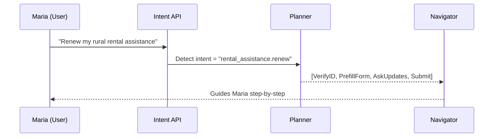

# Chapter 2: Intent-Driven Navigation

*(A friendly sequel to [Interface Layer (HMS-MFE / Portals)](01_interface_layer__hms_mfe___portals__.md))*  

---

## 1. Why Do We Need “Intent-Driven Navigation”?

Picture a citizen, **Maria**, living in rural Vermont.  
Every year she must renew her *Rental Assistance* with USDA Rural Housing. In the old digital world Maria had to:

1. Find the right portal.  
2. Click through menus like “Housing → Rural → Forms → RA-42 Renewal”.  
3. Manually re-enter data already on file.

It felt like wandering the halls of a giant government building, looking for the one clerk who handles her form.

**Intent-Driven Navigation (IDN)** flips this around:

> Maria types or says:  
> “Renew my rural rental assistance.”  
>  
> The system figures out *everything else*—where to send her, which services to call, and which data to pre-fill.

Think of TSA PreCheck at the airport: agents don’t ask you to recite every rule. They see your known-traveler status and wave you through the correct lane. IDN does the same for government digital services.

---

## 2. Key Concepts (Plain-English)

| Term | Beginner Explanation |
|------|----------------------|
| **Intent** | The outcome a user wants, stated in their own words (“renew my rental assistance”). |
| **Planner** | A tiny AI that turns an intent into an ordered list of steps (“Verify identity → Pull last year’s application → Ask for updates → Submit”). |
| **Navigator** | Code that moves the user through those steps, one screen or API call at a time. |
| **Step** | A single action: show a form, fetch data, call an external API, etc. |
| **Context** | Facts already known (user ID, last year’s data, language preference) that make planning smarter. |

---

## 3. A 60-Second Tour: How Maria’s Journey Looks



Five participants or fewer—promise kept!

---

## 4. Hands-On: Calling the Intent API

Below is a **tiny** demo you can run inside any HMS Portal page.

### 4.1 Installing the Helper SDK

```bash
npm install @hms/intent-sdk
```

### 4.2 Triggering Intent Resolution

```js
// File: src/hooks/useIntent.js
import { getPlan } from '@hms/intent-sdk';

export async function useIntent(utterance) {
  // 1) Send the user’s words to the Intent API
  const plan = await getPlan(utterance);
  // 2) Return an ordered list of steps
  return plan.steps;    // e.g., ["VerifyID", "PrefillForm", ...]
}
```

Explanation:  
`getPlan` hides all AI magic. You supply plain English; it returns machine-readable steps.

### 4.3 Dropping It into a Portal Page

```jsx
// File: src/pages/IntentStart.jsx
import { useState } from 'react';
import { useIntent } from '../hooks/useIntent';

export default function IntentStart() {
  const [utterance, setUtterance] = useState('');
  const [steps, setSteps] = useState([]);

  async function handleSubmit(e) {
    e.preventDefault();
    const s = await useIntent(utterance);
    setSteps(s);   // Show for demo; Navigator would handle this in prod
  }

  return (
    <>
      <form onSubmit={handleSubmit}>
        <label>What do you need?</label>
        <input value={utterance} onChange={e=>setUtterance(e.target.value)} />
        <button>Go</button>
      </form>

      <pre>{JSON.stringify(steps, null, 2)}</pre>
    </>
  );
}
```

What happens?  
1. User types “renew my rural rental assistance.”  
2. The step list appears:  
   `[ "VerifyID", "PrefillForm", "AskUpdates", "SubmitRenewal" ]`.

In a real app the **Navigator** would now kick in and render each step using MFEs you met in Chapter 1.

---

## 5. Peeking Under the Hood

### 5.1 How the Planner Works (10-Line Pseudocode)

```js
// File: services/planner.js
export function plan(intent, context) {
  switch (intent) {
    case 'rental_assistance.renew':
      return ['VerifyID', 'PrefillForm', 'AskUpdates', 'SubmitRenewal'];
    case 'address.change':
      return ['VerifyID', 'ShowAddressForm', 'Confirm'];
    default:
      return ['EscalateToHuman'];   // see Chapter 14 HITL
  }
}
```

Explanation:  
For beginners, the planner is just a fancy `switch` statement. In production it might use machine learning, but you can start simple and grow later.

### 5.2 Navigator Mini-Skeleton

```js
// File: services/navigator.js
import { renderStep } from './stepRegistry';

export async function navigate(steps) {
  for (const s of steps) {
    await renderStep(s);   // Mounts the right MFE on screen
  }
}
```

`renderStep` looks up a React component in a registry. If the step is `VerifyID`, it mounts a pre-built identity widget. That registry lives in the [Microservices Mesh](10_microservices_mesh__hms_sys__.md).

---

## 6. How It Connects to Other HMS Layers

* Interface asks Intent layer for a plan (you just saw that).  
* **Governance Layer** will later decide *if Maria is allowed* to perform each step—stay tuned for [Governance Layer (HMS-GOV)](03_governance_layer__hms_gov__.md).  
* Completed steps call secure APIs through the [Backend API Gateway](07_backend_api_gateway_.md).  
* If the AI is unsure, it triggers a [Human-in-the-Loop Workflow](14_human_in_the_loop__hitl__workflow_.md).

---

## 7. Common Beginner Questions

**Q: What if the AI misunderstands the intent?**  
A: The Planner attaches a confidence score. If it’s low, the Navigator shows clarifying questions (“Did you mean apply or renew?”).

**Q: Do I have to write natural-language models?**  
A: No. HMS ships with default models for common government tasks. You can add new ones by editing JSON config—no data science degree required.

**Q: Can multiple intents run at once?**  
A: Yes. The Navigator queues them, similar to browser tabs. Each keeps its own context.

---

## 8. Mini-Checklist to Add IDN to Your Portal

1. Enable the **Intent SDK** in your `package.json`.  
2. Place an “Intent Start” component on your landing page.  
3. Register MFEs for each step name in your Step Registry.  
4. (Optional) Create new planner rules in `planner.js` for your agency’s tasks.  
5. Verify governance rules in Chapter 3.

That’s it—citizens can now talk to your site instead of hunt through menus.

---

## 9. Summary & What’s Next

In this chapter you learned:

• Intent = outcome, not clicks.  
• Planner converts intents into step lists.  
• Navigator walks the user through those steps using MFEs.  
• You wired a tiny demo into a Portal with <20 lines of code.  
• IDN will soon cooperate with policy checks from the next layer.

Ready to see how rules and oversight keep everything safe and fair? Continue to [Governance Layer (HMS-GOV)](03_governance_layer__hms_gov__.md).

---

Generated by [AI Codebase Knowledge Builder](https://github.com/The-Pocket/Tutorial-Codebase-Knowledge)