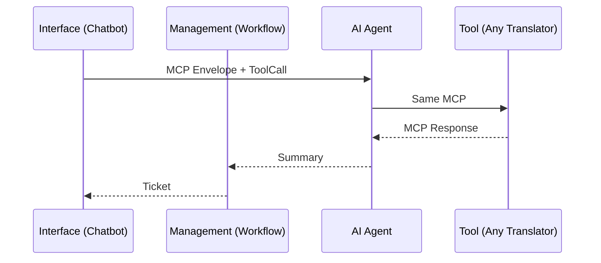
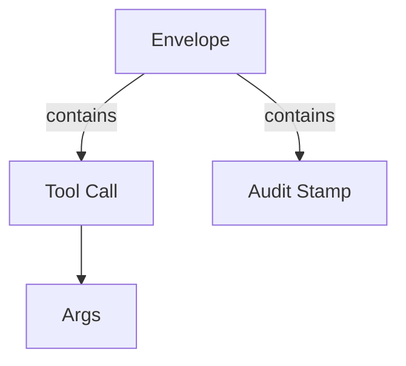

# Chapter 2: Model Context Protocol (HMS-MCP)

*“A shared language so every AI model can order from the same lunch menu.”*

---

## 0. From Cake to Conversation  

In [Governance-Management-Interface (GMI) Layer Cake](01_governance_management_interface__gmi__layer_cake_.md) we learned **where** requests travel inside HMS.  
But *how* do those layers, plus dozens of AI models and tools, talk to each other without shouting different dialects?

Enter the **Model Context Protocol (HMS-MCP)**.

---

## 1. Motivation — The “Language Access” Ticket  

Imagine a citizen visits the **Fair Housing and Equal Opportunity** website and types:

> “Quiero reportar discriminación de vivienda.”

Our front-end chatbot must:

1. Translate Spanish → English.  
2. Summarize the complaint.  
3. File it as a case task.

Today HUD might use an OpenAI model, tomorrow an on-prem BERT.  
Without MCP, every swap means rewriting translation calls, verifying auth headers, and re-plumbing logs.  
**With MCP, we change *one* config line and nothing else.** 🎉

---

## 2. The Three MCP Building Blocks  

| # | Name | Everyday Analogy | One-Line Purpose |
|---|------|------------------|------------------|
| 1 | Envelope | Manila folder | Wraps content + metadata |
| 2 | Tool Call | Sticky note | Tells a tool what to do |
| 3 | Audit Stamp | Rubber stamp | Attaches who/when/why |

### 2.1 Envelope
```json
{
  "envelope": {
    "id": "REQ-001",
    "sender": "chatbot.v1",
    "timestamp": "2024-05-05T14:03:00Z"
  }
}
```
*Beginner note:* Think of it as the outer folder. Every message—request **or** response—must have one.

### 2.2 Tool Call
```json
"tool": {
  "name": "translate.v1",
  "args": { "text": "Quiero reportar...", "target_lang": "en" }
}
```
It’s model-agnostic. The call reads the same whether the back-end is OpenAI, AWS, or your laptop.

### 2.3 Audit Stamp
```json
"audit": {
  "user": "citizen_456",
  "policy": "HUD.GOV.LANG_ACCESS",
  "signature": "sha256:ab12..."
}
```
Recorded automatically by an HMS middleware so compliance officers sleep at night.

---

## 3. A First Look: “Hello MCP”  

Below is the **full** request we’ll send to a translation model:

```json
{
  "envelope": { "id": "REQ-001", "sender": "chatbot.v1", "timestamp": "2024-05-05T14:03:00Z" },
  "tool": { "name": "translate.v1", "args": { "text": "Quiero reportar...", "target_lang": "en" } },
  "audit": { "user": "citizen_456", "policy": "HUD.GOV.LANG_ACCESS" }
}
```

And the corresponding response:

```json
{
  "envelope": { "id": "RES-001", "in_reply_to": "REQ-001" },
  "data": { "translated_text": "I want to report housing discrimination." },
  "audit": { "model": "gpt-4o", "latency_ms": 153 }
}
```

No vendor-specific quirks, no SDK gymnastics.

---

## 4. Plugging MCP into the Layer Cake  



The protocol flows *inside* every arrow above.

---

## 5. Mini Demo (<20 Lines)

```python
# mcp_demo.py
import json, uuid, time
def mcp_call(tool_name, args, user):
    req = {
        "envelope": {"id": str(uuid.uuid4()), "sender": "chatbot.v1",
                     "timestamp": time.strftime("%Y-%m-%dT%H:%M:%SZ")},
        "tool": {"name": tool_name, "args": args},
        "audit": {"user": user, "policy": "HUD.GOV.LANG_ACCESS"}
    }
    # ---> normally send over HTTP; we mock it
    res = mock_tool(req)           # <---  pretend vendor model
    return res["data"]

def mock_tool(req):
    text = req["tool"]["args"]["text"]
    return {
        "envelope": {"id": "RES-1", "in_reply_to": req["envelope"]["id"]},
        "data": {"translated_text": text.upper()},  # fake "translation"
        "audit": {"model": "mock.v0", "latency_ms": 5}
    }

print(mcp_call("translate.v1",
               {"text": "hola", "target_lang": "en"},
               user="citizen_1"))
```

Output to console:

```
{'translated_text': 'HOLA'}
```

*Explanation:*  
1. We wrap the user request in an MCP envelope.  
2. `mock_tool` echoes back a capitalized string to mimic translation.  
3. The caller doesn’t care which vendor ran it.

---

## 6. Under the Hood – Step-by-Step

1. **Envelope created** in the Interface layer.  
2. **Policy check** (Governance) inspects `audit.policy`.  
3. **Router** reads `tool.name` and picks the correct back-end.  
4. **Execution** happens. Result is wrapped in a *new* envelope.  
5. **Log writer** appends both envelopes to an immutable store (for [HMS-OPS](11_operational_nerve_center__hms_ops__.md)).

---

## 7. Protocol Cheat-Sheet  



Field | Type | Required | Notes
----- | ---- | -------- | -----
envelope.id | string | ✅ | UUID or any unique ID
tool.name | string | ✅ | `namespace.action.version`
tool.args | object | ✅ | Arbitrary per action
audit.user | string | 🟡 | `system` if unattended
audit.signature | string | 🟡 | Hash for tamper-proofing

---

## 8. Common Pitfalls (And MCP Fixes)

Problem | Legacy Approach | MCP Way
------- | --------------- | ---------
Vendor change breaks JSON | Hard-coded field names | Stable envelope schema
Inconsistent logs | Each team logs differently | Audit stamp = one format
Tool chaining mess | Manual parsing | Responses are already unified

---

## 9. What You Learned

• MCP is the **Esperanto** of HMS—one schema, many models.  
• An **Envelope + Tool Call + Audit Stamp** is the golden trio.  
• Swapping vendors or adding tools is mostly a config flip.

Ready to see how rules and policy engines tap into these audit stamps? Continue to [HMS-CDF Legislative Engine](03_hms_cdf_legislative_engine_.md).

---

Generated by [AI Codebase Knowledge Builder](https://github.com/The-Pocket/Tutorial-Codebase-Knowledge)