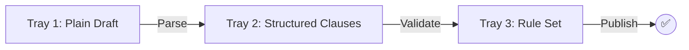
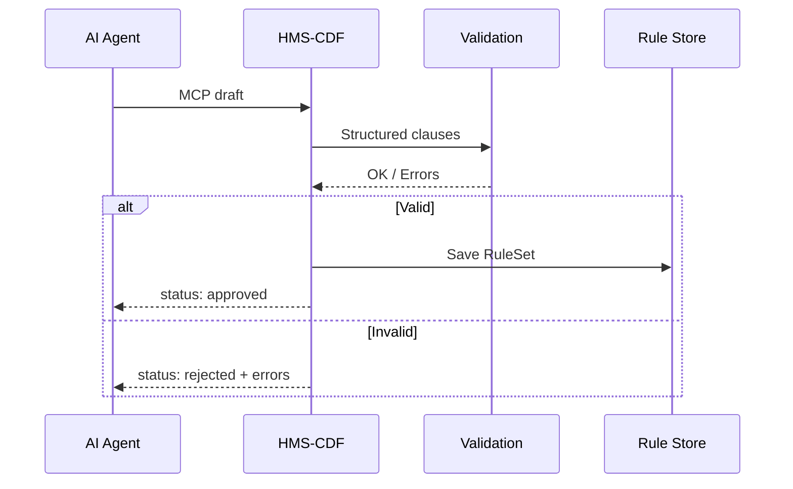

# Chapter 3: HMS-CDF Legislative Engine


*(“The robotic parliament clerk that never sleeps.”)*  

[← Back to Chapter 2: Model Context Protocol (HMS-MCP)](02_model_context_protocol__hms_mcp__.md)

---

## 0. Why Do We Need a Legislative Engine?  

Imagine the **Office of the Comptroller of the Currency (OCC)** wants to tighten rules on how banks report suspicious transactions.

1. A policy analyst writes a plain-language draft:  
   > “All reports must be filed within 24 hours of detection.”  

2. An AI agent submits that draft through HMS.  
3. We must instantly answer two questions:  
   • Does this contradict any existing OCC regulation?  
   • If it passes, can downstream systems enforce it automatically?  

Doing that by hand takes days. **HMS-CDF** does it in **seconds**, guaranteeing:

* No conflicting clauses.  
* Every approved sentence becomes machine-readable code.  
* A full audit trail for lawyers and auditors.

---

## 1. The Three-Step Mental Model  

Think of HMS-CDF as a **copy machine** with three trays:



1. **Parse** – break free-text into atomic clauses.  
2. **Validate** – run logic checks for gaps or contradictions.  
3. **Publish** – output JSON rules that other HMS services can enforce.

If any step fails, the engine rejects the draft with human-readable error messages.

---

## 2. Key Concepts (Beginner Friendly)

| Term | One-Line Definition | Everyday Analogy |
|------|--------------------|------------------|
| Draft | A plain-language proposal (“the bill”) | Google Doc |
| Clause | Single actionable sentence | Bullet point |
| Amendment | Change to an existing clause | Track-changes in Word |
| RuleSet | Final, machine-enforceable JSON | Config file |
| Contradiction Detector | Logic checker that spots conflicts | Spell-check for laws |

---

## 3. A 10-Line “Hello CDF” Demo  

Below we send a mini draft to HMS-CDF using the [HMS-MCP](02_model_context_protocol__hms_mcp__.md) envelope. (Python client; Rust runs server-side.)

```python
# cdf_client_demo.py
import uuid, json
from httpx import post

draft = """
1. Reports must be filed within 24 hours of detection.
2. Reports may be filed weekly if volume exceeds 100.
"""

req = {
  "envelope": {"id": str(uuid.uuid4()), "sender": "occ.policy.bot"},
  "tool": {"name": "cdf.compile.v1", "args": {"draft": draft}},
  "audit": {"user": "analyst_77", "policy": "OCC.INTERNAL.DRAFT"}
}

resp = post("https://hms.local/tools/cdf", json=req).json()
print(json.dumps(resp, indent=2))
```

Expected output (trimmed):

```json
{
  "data": {
    "status": "rejected",
    "errors": [
      "Clause 1 requires daily filing; Clause 2 allows weekly. Conflicts detected."
    ]
  }
}
```

Explanation:  
• HMS-CDF parsed both clauses, spotted mutually exclusive timelines, and politely declined.  
• The analyst edits the draft and resubmits—iterations take seconds, not committee meetings.

---

## 4. Under the Hood – A Peek Inside  



Step-by-step in plain English:

1. **Agent** sends a draft via MCP.  
2. **Parser** (inside CDF) converts it to clause objects.  
3. **Validation module** checks for duplicates, timeline clashes, missing refs.  
4. If clean, **Rule Store** writes an immutable JSON RuleSet.  
5. CDF answers with either “approved” or detailed error messages.

---

## 5. Tiny Rust Snippet — The Heartbeat  

CDF is written in Rust, but you only need to grasp the flavor:

```rust
// src/lib.rs  (simplified <20 lines)
pub fn validate(clauses: &[Clause]) -> Result<(), Vec<String>> {
    let mut errs = Vec::new();
    for c in clauses {
        if c.text.contains("24 hours") && c.text.contains("weekly") {
            errs.push("Conflicting time frames".into());
        }
    }
    if errs.is_empty() { Ok(()) } else { Err(errs) }
}
```

Explanation:  
• `validate` loops over clauses and pushes human-readable errors.  
• Real code uses a SAT solver, but this toy snippet shows the gist.

---

## 6. Working With Amendments  

Suppose six months later OCC wants **48 hours** instead of **24**.  
An amendment is just a diff:

```json
{
  "amendment": {
    "target_clause_id": "clause-001",
    "replace": "Reports must be filed within 48 hours of detection."
  }
}
```

CDF re-runs validation across the *whole* RuleSet, ensuring the new text does not collide with anything else. No more forgotten ripple effects.

---

## 7. Where Does CDF Live in the Layer Cake?  

```mermaid
graph TD
  IF[Interface] --> MG[Management] --> GV[Governance]
  GV --> CDF[HMS-CDF] 
  CDF -. feeds .-> ESQ[HMS-ESQ (Legal Reasoning)]
```

• CDF sits on the **Governance floor**, right next to policy gates described in [Chapter 1](01_governance_management_interface__gmi__layer_cake_.md).  
• Its approved RuleSets become inputs for the next chapter’s reasoning engine **HMS-ESQ**.

---

## 8. Common Pitfalls (and How CDF Saves the Day)

Problem | Life Without CDF | With CDF
--------|------------------|---------
Conflicting deadlines | Hidden until lawsuits | Detected instantly
Lost amendment history | Spreadsheets & email | Immutable chain of MCP envelopes
Manual code translation | Devs re-type rules | Auto-generated RuleSets

---

## 9. What You Learned

• HMS-CDF parses, validates, and publishes machine-readable policies.  
• Draft → Clause → RuleSet is the core pipeline.  
• MCP envelopes make integration trivial.  
• Rust underpinnings ensure speed and safety.  

Ready to see how those freshly minted rules power deep legal reasoning and compliance checks? Head over to [Compliance & Legal Reasoning (HMS-ESQ)](04_compliance___legal_reasoning__hms_esq__.md).

---

---

Generated by [AI Codebase Knowledge Builder](https://github.com/The-Pocket/Tutorial-Codebase-Knowledge)