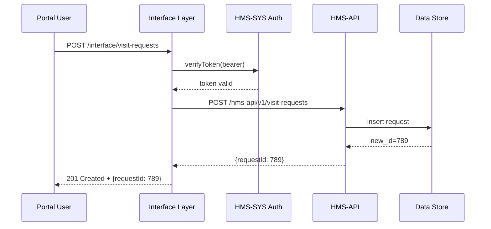

# Chapter 3: Interface Layer

In [Chapter 2: Backend API (HMS-API/HMS-MKT)](02_backend_api__hms_api_hms_mkt__.md) we built our secure, role-checked “reception desk” for business logic. Now it’s time to add every real-world touchpoint—web portals, admin dashboards, and public APIs—that citizens and systems actually use. This is our **Interface Layer**.

---

## 1. Why We Need an Interface Layer

Imagine the Bureau of Prisons wants:

- A citizen portal where families can submit visitation requests  
- An admin console where wardens review and approve them  
- A machine-to-machine API so partner agencies can sync data  

The **Interface Layer** is like the collection of reception desks, public kiosks, and telephones at agency headquarters. It:

- Presents consistent, user-friendly endpoints  
- Enforces authentication (via HMS-SYS)  
- Routes each request to the correct backend service (HMS-API)  

Without it, every front-end or external system would build its own login checks and URL logic.

---

## 2. Key Concepts

We break the Interface Layer into four easy pieces:

1. **Portals**  
   - Web forms for citizens (e.g., complaint or visitation request pages).  
2. **Dashboards**  
   - Admin UIs for staff (e.g., warden console showing new submissions).  
3. **Public APIs**  
   - Machine endpoints for partners (e.g., state corrections systems).  
4. **Authentication & Routing**  
   - All requests pass through a gate: check your token with HMS-SYS, then send you on.

---

## 3. A Simple Example: Submitting a Visitation Request

A family member visits the portal, fills out a form, and clicks Submit. Under the hood:

```python
# interface_layer/server.py
from flask import Flask, request, jsonify
from hms_sys.auth import verify_token
import requests

app = Flask(__name__)

@app.route('/interface/visit-requests', methods=['POST'])
def create_visit_request():
    # 1. Check login badge
    user = verify_token(request.headers)
    # 2. Take the form data
    data = request.json
    # 3. Forward to Backend API
    resp = requests.post(
        'https://api.hms.gov/hms-api/v1/visit-requests',
        json=data,
        headers={'Authorization': request.headers.get('Authorization')}
    )
    # 4. Return whatever the backend replies
    return jsonify(resp.json()), resp.status_code
```

Explanation:
- `verify_token()` calls [HMS-SYS Auth](01_core_system_platform__hms_sys__.md).
- We take `POST /interface/visit-requests` and forward it to `/hms-api/v1/visit-requests`.

---

## 4. Request Flow Diagram

Here’s what happens step-by-step:



---

## 5. Under the Hood: How Routing Works

### 5.1 Route Configuration

We keep a simple map of public paths to backend URLs:

```yaml
# interface_layer/config.yml
routes:
  /interface/visit-requests: https://api.hms.gov/hms-api/v1/visit-requests
  /interface/admin/users:    https://api.hms.gov/hms-api/v1/users
```

### 5.2 Core Router Logic

```python
# interface_layer/router.py
import requests, yaml
from hms_sys.auth import verify_token

class InterfaceRouter:
    def __init__(self, config_path):
        self.config = yaml.safe_load(open(config_path))['routes']

    def handle(self, path, method, headers, data):
        # 1. Authenticate
        verify_token(headers)
        # 2. Find backend URL
        backend = self.config.get(path)
        # 3. Forward request
        resp = requests.request(method, backend,
                                json=data, headers=headers)
        return resp.status_code, resp.json()
```

Explanation:
1. Load paths from `config.yml`.  
2. On each request:  
   - Verify token with HMS-SYS  
   - Look up the matching backend URL  
   - Forward method, headers, and body  

---

## 6. Why This Helps Beginners

- You write one simple server with familiar Flask (or Express).  
- You never re-implement login checks—just call `verify_token()`.  
- Adding a new portal or partner API is as easy as adding a line in `config.yml`.  

Analogy: The config is like a directory of reception desks—when you walk in, you read “Complaints” or “Visitation” on a sign, then you go to the right window.

---

## 7. Summary & Next Steps

You’ve seen how the **Interface Layer** offers consistent, authenticated touchpoints for citizens, staff, and machines. We covered:

- Why we need portals, dashboards, and public APIs  
- How to define simple routes that call [HMS-SYS Auth](01_core_system_platform__hms_sys__.md)  
- A step-by-step sequence diagram  
- Minimal code for routing and configuration  

Next up, we’ll build the **Frontend Interface (HMS-MFE)**—turning these endpoints into a rich, interactive web experience:

[Chapter 4: Frontend Interface (HMS-MFE)](04_frontend_interface__hms_mfe__.md)

---

Generated by [AI Codebase Knowledge Builder](https://github.com/The-Pocket/Tutorial-Codebase-Knowledge)