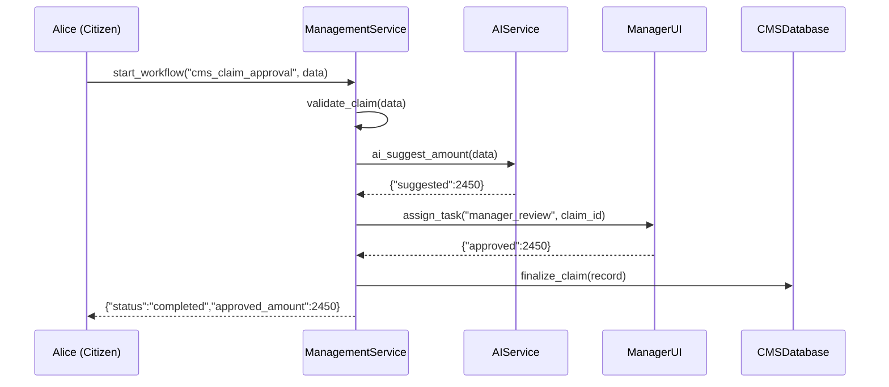

# Chapter 3: Management Layer

_In the last chapter, we saw how the [AI Governance Framework](02_ai_governance_framework_.md) makes AI tasks safe, fair, and transparent. Now we build the **Management Layer**, our “project manager” that orchestrates microservices, workflows, and user roles across the system._

---

## 3.1 Why a Management Layer?

Imagine the Centers for Medicare & Medicaid Services (CMS) receives Alice’s benefit claim. Multiple steps must happen in order:

1. Validate that Alice’s data is complete  
2. Ask an AI agent for a recommended payout  
3. Assign the claim to a CMS officer for manual review  
4. Finalize the payout and notify Alice  

Without a central coordinator, each service would need custom glue code. The **Management Layer** sits in the middle and:

- Defines **workflows** (ordered steps)  
- Knows which **role** performs each step  
- Calls AI agents, APIs, or UIs in sequence  
- Tracks progress, enforces deadlines, and handles retries  

Think of it as a skilled project manager who assigns tasks, checks off completed items, and escalates delays—all under the rules set by the [Governance Layer](01_governance_layer_.md).

---

## 3.2 Key Concepts

1. **Workflow**  
   A named sequence of steps (e.g., `cms_claim_approval`).  

2. **Step**  
   One action in a workflow (validate data, call AI, or ask a human).  

3. **Role Binding**  
   Which user role (e.g., `CMSInspector`) is responsible for a step.  

4. **Task Assignment**  
   How a step is turned into a “to‐do” for a human or service.  

5. **Tracking & Deadlines**  
   Monitoring step status and triggering reminders or retries.  

---

## 3.3 Defining and Running a Workflow

First, we define our claim‐approval workflow in YAML:

```yaml
# workflows.yaml
workflows:
  cms_claim_approval:
    steps:
      - validate_claim       # check input fields
      - ai_suggest_amount    # call AI
      - manager_review       # human decision
      - finalize_claim       # store result & notify
    roles:
      manager: CMSInspector
      user: Citizen
```

This file says:

- Workflow name: `cms_claim_approval`  
- Four steps to run in order  
- The `manager_review` step goes to anyone in role `CMSInspector`

Next, we start the workflow in code:

```python
# app.py
from management import Management

mgmt = Management("workflows.yaml")

# Alice submits a claim
claim_data = {"user_id": "alice123", "amount": 2500}
result = mgmt.start_workflow("cms_claim_approval", claim_data)

print("Workflow result:", result)
```

Explanation:  
1. We load workflows from `workflows.yaml`.  
2. We call `start_workflow(...)` with the claim data.  
3. The management layer returns a final result once all steps complete.

A sample output might look like:

```json
{
  "workflow_id": "cms_claim_approval",
  "status": "completed",
  "approved_amount": 2450,
  "audit_id": "WF-20240702-001"
}
```

---

## 3.4 Under the Hood: Sequence Walkthrough

Here’s a simplified flow when `start_workflow` runs:



1. **validate_claim** checks fields.  
2. **ai_suggest_amount** calls AI.  
3. **manager_review** waits for human approval in a UI.  
4. **finalize_claim** writes to database and notifies Alice.  

---

## 3.5 Inside the Management Layer (Code)

Let’s peek at a simplified `management.py`:

### 3.5.1 Initialization and Workflow Loader

```python
# management.py
import yaml

class Management:
    def __init__(self, workflow_file):
        self.defs = yaml.safe_load(open(workflow_file))["workflows"]
```

Explanation:  
- Load all workflow definitions into `self.defs`.

### 3.5.2 Starting a Workflow

```python
    def start_workflow(self, name, data):
        steps = self.defs[name]["steps"]
        context = {"data": data}
        for step in steps:
            handler = getattr(self, step)
            context = handler(context)
        return context["result"]
```

Explanation:  
- Look up the step list by workflow name.  
- For each step, call the corresponding method on `self`.  
- Pass along a `context` dict that accumulates data.

### 3.5.3 Sample Step Implementations

```python
    def validate_claim(self, ctx):
        # ... check required fields ...
        ctx["validated"] = True
        return ctx

    def ai_suggest_amount(self, ctx):
        # call an AI microservice (details skipped)
        ctx["suggested"] = 2450
        return ctx
```

Explanation:  
- Each step modifies `ctx` to add its output.  
- Later steps can read these values.

### 3.5.4 Manager Review (Task Assignment)

```python
    def manager_review(self, ctx):
        # In a real app, create a task for CMSInspector
        print("Task assigned to CMSInspector:", ctx["suggested"])
        # Simulate human approval
        ctx["approved"] = ctx["suggested"]
        return ctx
```

Explanation:  
- We’d normally enqueue a task and wait for user input.  
- Here, we simulate approval immediately.

### 3.5.5 Finalizing and Auditing

```python
    def finalize_claim(self, ctx):
        # ... save to CMSDatabase and notify user ...
        ctx["result"] = {
            "workflow_id": "cms_claim_approval",
            "status": "completed",
            "approved_amount": ctx["approved"]
        }
        return ctx
```

Explanation:  
- Assemble the final result and return it to the caller.

---

## 3.6 Conclusion

In this chapter we learned:

- The **Management Layer** coordinates workflows, microservices, AI calls, and human tasks.  
- How to define a workflow in YAML and invoke it in code.  
- What happens under the hood, step by step, with a minimal sequence diagram.  
- A peek at how the `Management` class loads workflows, runs steps, assigns tasks, and returns results.  

Next up, we’ll dig into the plumbing of each moving piece in our system: the [Microservices Architecture](04_microservices_architecture_.md).

---

Generated by [AI Codebase Knowledge Builder](https://github.com/The-Pocket/Tutorial-Codebase-Knowledge)