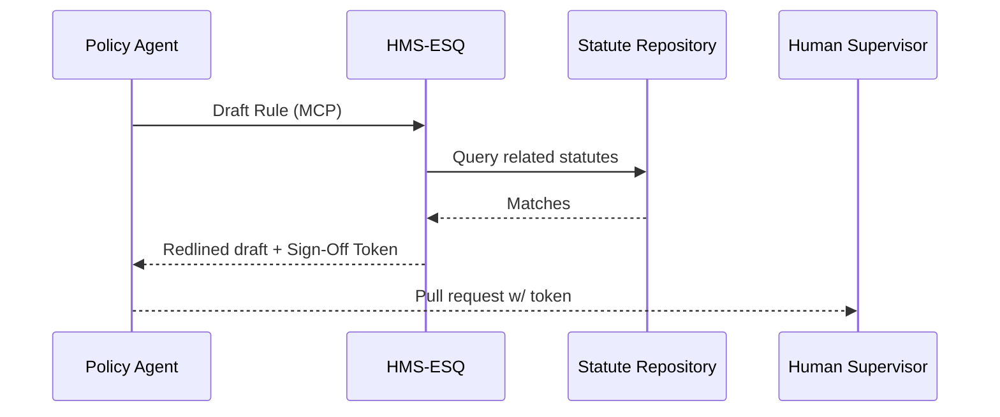
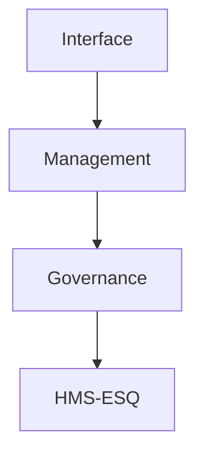

# Chapter 4: Compliance & Legal Reasoning (HMS-ESQ)

*[← Back to Chapter 3: HMS-CDF Legislative Engine](03_hms_cdf_legislative_engine_.md)*  

---

## 0. From “Passing a Bill” to “Checking the Law”

In the last chapter, **HMS-CDF** turned plain-language drafts into clean JSON RuleSets.  
But a RuleSet that *compiles* is not automatically *legal*.  
Enter **HMS-ESQ**—our in-house counsel that never submits a form without double-checking HIPAA, GDPR, executive orders, and anything else hidden in the legal thicket.

**Use-case to keep in mind:**  
The Department of Veterans Affairs (VA) wants to add a new question to its online health-benefits form:

> “Have you visited a non-VA clinic in the past 30 days?”

Seems harmless—until you realize HIPAA restricts collecting certain time-bound health data. HMS-ESQ spots that risk *before* citizens ever see the new form.

---

## 1. Why HMS-ESQ Matters (Beginner Version)

Problem without ESQ | What could go wrong?
--------------------|---------------------
Developers add fields quickly | Accidentally request data barred by GDPR
Policy analysts tweak deadlines | Overlap with an existing executive order
No central “legal memory” | Same mistake repeated across agencies

HMS-ESQ fixes this by acting like an AI paralegal that:

1. Reads your draft rule.  
2. Cross-checks thousands of statutes in milliseconds.  
3. Returns *redlines*—the lawyer’s markup showing conflicts and safe rewrites.  
4. Issues a **Sign-Off Token** that managers attach to the pull request.

---

## 2. Key Concepts—Learn Them Once

| Term | One-Line Definition | Analogy |
|------|--------------------|---------|
| Statute Repository | Read-only database of laws, regs, and orders | Library of Congress bookshelf |
| Redline | Inline diff highlighting risky text | Teacher’s red pen |
| Conflict Flag | Machine-readable marker (`BLOCK`, `WARN`) | Stoplight |
| Suggestion Patch | Auto-generated, compliant alternative | “Rewrite it like this” sticky note |
| Sign-Off Token | Cryptographic proof ESQ approved the draft | Notary stamp |

Keep these in your back pocket; we’ll use all five in the demo.

---

## 3. High-Level Workflow: “Am I Allowed to Ask This Question?”



Plain English:

1. A policy-writing agent submits a draft via the [Model Context Protocol (HMS-MCP)](02_model_context_protocol__hms_mcp__.md).  
2. ESQ looks up every law that might collide.  
3. If conflicts: returns redlined text **and** a `BLOCK` flag.  
4. If clean or auto-fixable: returns a `WARN` or `OK` flag and a Sign-Off Token.  
5. Human manager merges only when token = ✅.

---

## 4. “Hello ESQ” — A 15-Line Demo

Below we ask ESQ to review the new VA form question.

```python
# esq_client_demo.py  (≤15 lines)
import uuid, json, httpx, time

draft = "Form field: 'Have you visited a non-VA clinic in the past 30 days?'"

mcp_req = {
  "envelope": {"id": str(uuid.uuid4()), "sender": "va.form.bot",
               "timestamp": time.strftime("%Y-%m-%dT%H:%M:%SZ")},
  "tool": {"name": "esq.review.v1", "args": {"text": draft}},
  "audit": {"user": "va_analyst_12", "policy": "VA.INTERNAL.FORM"}
}

resp = httpx.post("https://hms.local/tools/esq", json=mcp_req).json()
print(json.dumps(resp["data"], indent=2))
```

Expected output:

```json
{
  "status": "warn",
  "redlines": [
    "- Have you visited a non-VA clinic in the past 30 days?",
    "+ Have you visited any healthcare provider outside the VA system in the past calendar year?"
  ],
  "citations": [
    "HIPAA §164.522(a)(2)(i)",
    "GDPR Art. 5(1)(c)"
  ],
  "sign_off_token": "esq_eyJzaWduYXR1cmU..."
}
```

What just happened?

* ESQ flagged the 30-day window as too granular under HIPAA’s data-minimization rule.  
* Suggested “past calendar year” to stay compliant.  
* Returned a `warn` (not `block`) because a safe rewrite exists.  
* Embedded citations so reviewers can verify.

---

## 5. Under the Hood—Step by Step

1. **Receive MCP Envelope** – Verify user & timestamp.  
2. **Text Chunking** – Split draft into reviewable sentences.  
3. **Legal Retrieval** – Run each chunk through a vector search over the Statute Repository.  
4. **Conflict Scoring** – Simple numeric score: ≥0.8 = `BLOCK`, 0.5-0.8 = `WARN`, else `OK`.  
5. **Redline Generation** – Diff original vs. auto-rewritten text.  
6. **Token Signing** – SHA-256 hash of content + HMS private key → `sign_off_token`.  
7. **Return MCP Response** – Back to caller within one second (avg).

---

## 6. Tiny Peek at ESQ’s Core Logic (Toy Version)

```python
# esq/core.py  (≤18 lines)
import hashlib, difflib
def review(text, statutes):
    hits = [s for s in statutes if overlap(text, s)]
    score = max(hit.score for hit in hits) if hits else 0
    status = "block" if score >= .8 else "warn" if score >= .5 else "ok"

    suggestion = auto_rewrite(text) if status != "ok" else text
    redlines = list(difflib.ndiff([text], [suggestion]))

    token_src = f"{text}|{suggestion}|{status}"
    token = "esq_" + hashlib.sha256(token_src.encode()).hexdigest()

    return {"status": status,
            "redlines": redlines,
            "citations": [h.ref for h in hits],
            "sign_off_token": token}
# helper funcs overlap(), auto_rewrite() omitted for brevity
```

Beginner breakdown:

1. `overlap` checks legal similarity.  
2. `status` decides **block / warn / ok**.  
3. `auto_rewrite` tries a safer wording.  
4. `difflib.ndiff` creates the redline.  
5. A quick SHA-256 builds the Sign-Off Token—no blockchain required!

---

## 7. Where Does ESQ Live in the GMI Cake?



Same **Governance floor** as HMS-CDF, but:

* **CDF** = “Did we phrase the rule right?”  
* **ESQ** = “Are we *allowed* to phrase it at all?”

Together they form the project’s legal immune system.

---

## 8. Common Pitfalls (and How ESQ Prevents Them)

Problem | Legacy World | With HMS-ESQ
--------|--------------|--------------
Hidden GDPR violation | Found months later by auditors | Blocked at pull-request time
Copy-paste from another agency | Overlooks differing statutes | ESQ re-checks entire repository
Managers merge unreviewed code | Hard to prove diligence | PR must carry Sign-Off Token

---

## 9. What You Learned

• HMS-ESQ is the AI lawyer that redlines your drafts in seconds.  
• Key artifacts: **Redline, Conflict Flag, Sign-Off Token**.  
• Powered by the same MCP envelopes you mastered earlier.  
• Sits on the Governance layer, guarding every new rule or form.

Ready to see how agents *use* those tokens and rules to perform real-world tasks? Continue to [HMS-AGT Core Agent Framework](05_hms_agt_core_agent_framework_.md).

---

---

Generated by [AI Codebase Knowledge Builder](https://github.com/The-Pocket/Tutorial-Codebase-Knowledge)