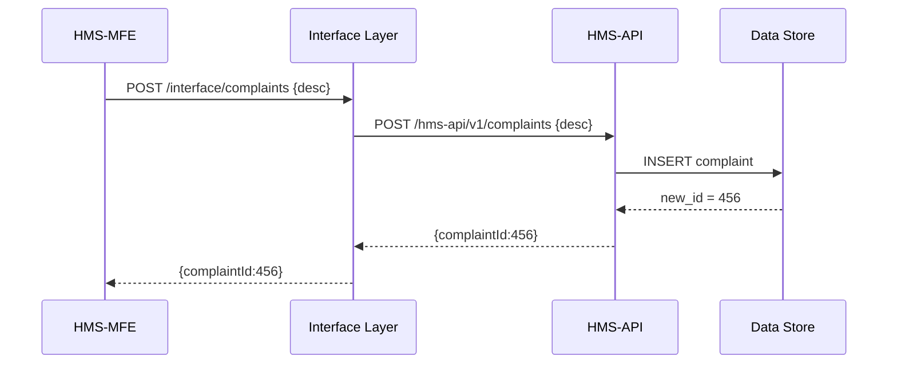
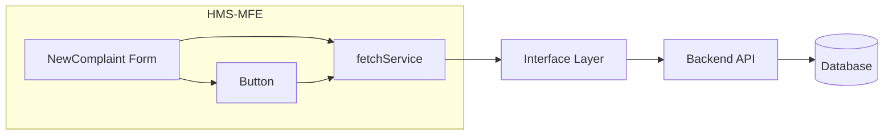

# Chapter 4: Frontend Interface (HMS-MFE)

Welcome back! In [Chapter 3: Interface Layer](03_interface_layer_.md), we learned how requests flow through portals and dashboards into our secure Backend API. Now, we’ll build the **user-facing front door** of HMS-DEV—our **Frontend Interface (HMS-MFE)**—where citizens and officials see pages, forms, and data.

---

## 4.1 Why We Need HMS-MFE

Imagine the Environmental Protection Agency (EPA) wants a web portal where:

- **Citizens** file pollution complaints or Freedom of Information Act (FOIA) requests.
- **Officials** review incoming requests, see AI-drafted responses, then approve or revise.
- **Staff** track status and metrics in a consistent look-and-feel.

The Frontend Interface (HMS-MFE) is like the public lobby and service counters in a government office. It:

- Presents clear forms, tables, and dashboards  
- Reuses UI components (buttons, tables, forms) for consistency across domains—healthcare, finance, education  
- Fetches data from the **Interface Layer** ([Chapter 3](03_interface_layer_.md)) and renders it in the browser  
- Supports mobile and desktop views  

---

## 4.2 Key Concepts

We’ll break HMS-MFE into four beginner-friendly pieces:

1. **Micro-Frontend Structure**  
   - Each domain (e.g., Complaints, Licenses) lives in its own “micro-app.”  
   - They load on demand and share common components.

2. **Reusable UI Components**  
   - Buttons, form fields, tables, and modals built once and styled the same.  
   - Ensures a uniform “government brand.”

3. **Data Fetching & State**  
   - Simple hooks or services that call our Interface Layer endpoints.  
   - Track loading, success, and error states.

4. **Role-Based Views**  
   - Adjust UI based on citizen vs. official roles (via the user token from [HMS-SYS](01_core_system_platform__hms_sys__.md)).  

---

## 4.3 A Concrete Example: Filing a Pollution Complaint

### 4.3.1 What Happens

1. **Citizen** clicks “New Complaint” in a web portal.  
2. They fill out a short form: location, description, attachments.  
3. On submit, HMS-MFE calls the Interface Layer endpoint:  
   `POST /interface/complaints`  
4. The backend responds with a complaint ID.  
5. The UI shows a success message and the complaint status.

---

### 4.3.2 Minimal React Form Component

```jsx
// src/complaints/NewComplaint.js
import { useState } from 'react';
import Button from '../ui/Button';

export default function NewComplaint() {
  const [desc, setDesc] = useState('');
  const [status, setStatus] = useState(null);

  async function submit() {
    const resp = await fetch('/interface/complaints', {
      method: 'POST',
      headers: { 'Content-Type': 'application/json' },
      body: JSON.stringify({ description: desc })
    });
    const data = await resp.json();
    setStatus(data.complaintId ? 'Submitted!' : 'Error');
  }

  return (
    <div>
      <h2>File Pollution Complaint</h2>
      <textarea
        value={desc}
        onChange={e => setDesc(e.target.value)}
        placeholder="Describe the issue..."
      />
      <Button onClick={submit}>Submit</Button>
      {status && <p>{status}</p>}
    </div>
  );
}
```

Explanation:  
- We track `desc` in React state.  
- On button click, we call our Interface Layer.  
- We show “Submitted!” when we get an ID back.

---

## 4.4 Under the Hood: Request Flow

Here’s a simple sequence when the user hits Submit:



1. **HMS-MFE** calls **Interface Layer**.  
2. **Interface Layer** forwards to **Backend API** ([Chapter 2](02_backend_api__hms_api_hms_mkt__.md)).  
3. API writes to the database and returns an ID.  
4. ID bubbles back to the UI for display.

---

## 4.5 Building Reusable UI Components

Reusing buttons, inputs, and tables helps all micro-apps look and behave the same.

#### 4.5.1 Button Component

```jsx
// src/ui/Button.js
export default function Button({ onClick, children }) {
  return (
    <button
      style={{
        backgroundColor: '#005ea2', color: '#fff',
        padding: '8px 12px', border: 'none', borderRadius: '4px'
      }}
      onClick={onClick}
    >
      {children}
    </button>
  );
}
```

Explanation: A single styled `<button>` that every micro-app imports.

#### 4.5.2 Table Component

```jsx
// src/ui/Table.js
export default function Table({ columns, rows }) {
  return (
    <table>
      <thead>
        <tr>{columns.map(c => <th key={c}>{c}</th>)}</tr>
      </thead>
      <tbody>
        {rows.map((r,i) => (
          <tr key={i}>
            {columns.map(c => <td key={c}>{r[c]}</td>)}
          </tr>
        ))}
      </tbody>
    </table>
  );
}
```

Explanation: Pass in column names and row data; the Table renders them consistently.

---

## 4.6 Putting It All Together



- **NewComplaint Form** uses **Button** and **fetchService**.  
- **fetchService** sends HTTP calls to our Interface Layer.  
- Down the line, data lands in the database.

---

## 4.7 Summary & Next Steps

In this chapter, you learned how HMS-MFE provides a friendly web interface:

- A **React**-style micro-frontend structure  
- **Reusable UI components** for consistency  
- The **data flow** from user action to database  
- Beginner-friendly code snippets and diagrams  

Up next, we’ll enhance our system intelligence with the **AI Representative Agent**—helping draft responses and policy suggestions:

[Chapter 5: AI Representative Agent](05_ai_representative_agent_.md)

---

Generated by [AI Codebase Knowledge Builder](https://github.com/The-Pocket/Tutorial-Codebase-Knowledge)