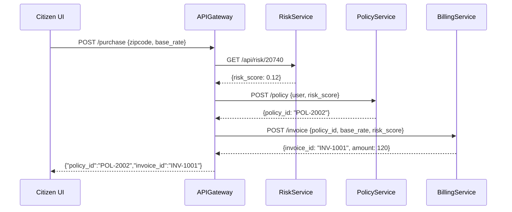

# Chapter 4: Microservices Architecture

In the last chapter, we built the [Management Layer](03_management_layer_.md) to orchestrate workflows and human tasks. Now we’ll explore how to break our system into a **federation of small, independent services**—the **Microservices Architecture**.

---

## 4.1 Motivation: A Government Use Case

Imagine the National Flood Insurance Program (NFIP) needs to:

1. Verify a property’s flood risk.  
2. Generate an insurance policy.  
3. Calculate premiums and billing.  
4. Process payments and send notifications.

If all of this lived in one giant program, any change to billing could risk the flood-risk logic. Instead, we split into microservices:

- **RiskService**: calculates flood risk.  
- **PolicyService**: creates and stores policy details.  
- **BillingService**: handles invoices and payments.  
- **NotificationService**: emails or texts citizens.

Each team can upgrade, scale, or secure their piece without touching the others. That’s the power of microservices!

---

## 4.2 Key Concepts

1. **Service**  
   A single-purpose application (e.g., `PaymentService`).  

2. **API Endpoint**  
   A lightweight HTTP interface each service exposes (e.g., `GET /risk/{zipcode}`).  

3. **Independent Deployment**  
   Each service runs in its own process or container. You can redeploy one without restarting the whole system.  

4. **Loose Coupling**  
   Services communicate via simple requests (HTTP/REST, gRPC) and share no in-memory state.  

5. **Federation of Teams**  
   Each service is owned by a small, expert team—like billing or identity—instead of one big dev team.

---

## 4.3 Using Microservices to Solve NFIP’s Use Case

### 4.3.1 Calling RiskService from PolicyService

When a citizen applies for insurance, `PolicyService` asks `RiskService` for a flood score:

```python
# policy_service.py
import requests

def get_flood_risk(zipcode):
    url = f"http://risk-service/api/risk/{zipcode}"
    resp = requests.get(url)
    return resp.json()["risk_score"]

score = get_flood_risk("20740")
print("Flood risk score:", score)
```
> This simple Python snippet shows `PolicyService` calling `RiskService` over HTTP and printing the returned risk score.

### 4.3.2 Generating the Bill

After the policy is created, `BillingService` issues an invoice:

```python
# billing_service.py
from flask import Flask, request, jsonify

app = Flask(__name__)

@app.route("/invoice", methods=["POST"])
def create_invoice():
    data = request.json
    amount = data["base_rate"] * data["risk_score"]
    return jsonify({"invoice_id": "INV-1001", "amount": amount})

# In real life, this runs in its own container.
```
> A minimal Flask app that multiplies base rate by risk score and returns an invoice.

---

## 4.4 Under the Hood: Sequence Walkthrough

Here’s what happens when a citizen buys flood insurance:



1. **Citizen UI** calls the API Gateway.  
2. Gateway asks **RiskService** for flood score.  
3. Gateway creates a policy via **PolicyService**.  
4. Gateway issues an invoice through **BillingService**.  
5. Gateway returns IDs to the UI.

---

## 4.5 Inside the Gateway (Code)

The API Gateway routes requests to the right service. Here’s a minimal Express example:

```javascript
// gateway.js
const express = require('express');
const fetch = require('node-fetch');
const app = express();
app.use(express.json());

app.post('/purchase', async (req, res) => {
  const { zipcode, base_rate, user } = req.body;
  const risk = await fetch(`http://risk-service/api/risk/${zipcode}`)
                   .then(r => r.json());
  const policy = await fetch('http://policy-service/create', {
    method: 'POST',
    body: JSON.stringify({ user, risk_score: risk.risk_score }),
    headers: {'Content-Type':'application/json'}
  }).then(r => r.json());
  const invoice = await fetch('http://billing-service/invoice', {
    method: 'POST',
    body: JSON.stringify({ policy_id: policy.policy_id, base_rate, risk_score: risk.risk_score }),
    headers: {'Content-Type':'application/json'}
  }).then(r => r.json());
  res.json({ policy_id: policy.policy_id, invoice_id: invoice.invoice_id });
});

app.listen(3000, () => console.log('API Gateway running'));
```
> This gateway forwards the purchase request to three services, awaits each response, and bundles the results.

---

## 4.6 Advantages and Best Practices

- **Scalability**: If billing traffic spikes, only `BillingService` needs more instances.  
- **Resilience**: A bug in `RiskService` won’t crash `NotificationService`.  
- **Autonomy**: Teams can choose the best language or database for their service.  
- **Security**: Each service can enforce its own rules under the [Governance Layer](01_governance_layer_.md).  

---

## 4.7 Conclusion

You’ve learned how to break a monolith into independent microservices:

- What microservices are and why they matter.  
- Key concepts: services, APIs, loose coupling, independent deployment.  
- A full example with RiskService, PolicyService, BillingService, and an API Gateway.  
- Under-the-hood sequence flow and minimal code snippets.

Next up, we’ll dive deeper into the APIs each service exposes in the [Backend API](05_backend_api_.md) chapter.

---

Generated by [AI Codebase Knowledge Builder](https://github.com/The-Pocket/Tutorial-Codebase-Knowledge)