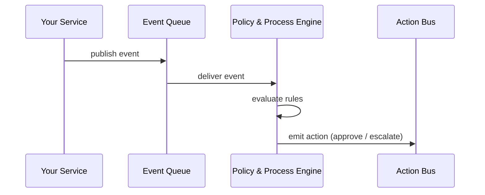

# Chapter 4: Policy & Process Engine

*(A gentle sequel to [Governance Layer (HMS-GOV)](03_governance_layer__hms_gov__.md))*  

---

## 1. Why Do We Need a “Robot CFR”?

Picture a flood-relief program at FEMA.  
Thousands of citizens file claims. For each claim the agency must decide:

1. Is the applicant eligible?  
2. How much can we reimburse?  
3. Who must sign off?  
4. When do we pay out?  

In paper days, staff flipped through binders of the Code of Federal Regulations (CFR) and policy memos. Decisions were slow, error-prone, and hard to audit.

**The Policy & Process Engine (PPE)** automates those binders:

* Every rule (“If damage < \$10 000, auto-approve”) lives in **version-controlled, machine-readable** files.  
* Live events (a new claim, a missing document, a supervisor click) stream in.  
* The engine matches events to rules and instantly triggers approvals, payments, or alerts.  
* If Congress changes the law, you “roll forward” to the new rule set—old decisions stay traceable.

Think of PPE as a robot paralegal that never sleeps.

---

## 2. A 3-Minute Walk-Through: Auto-Approving Small Claims

We’ll implement a tiny policy:

> “Claims under \$10 000 are auto-approved; otherwise, route to a human reviewer.”

### 2.1 Writing the Policy File (YAML, 8 lines)

```yaml
# file: small_claims.yaml
version: 2024-04-14
policy_id: fema.small_claims
rule:
  if: "event.amount_usd <= 10000"
  then: "approve"
  else: "escalate_to_human"
```

Plain English:  
• If the incoming event’s `amount_usd` is ≤ 10 000 → approve.  
• Otherwise → escalate.

### 2.2 Loading the Policy into PPE

```bash
hms ppe load small_claims.yaml
```

Terminal output:

```
✔ Policy fema.small_claims v2024-04-14 activated
```

### 2.3 Sending a Live Event

```json
POST /ppe/event
{
  "policy_id": "fema.small_claims",
  "event": {
    "claim_id": "CLM-42",
    "amount_usd": 8500,
    "applicant": "Maria Gomez"
  }
}
```

Engine response:

```json
{
  "action": "approve",
  "reason": "amount_usd <= 10000",
  "approved_at": "2024-04-14T16:20:33Z"
}
```

Result: Maria’s small claim is green-lit without human delay.

*(Try changing `8500` to `25000` to see `"action": "escalate_to_human"`.)*

---

## 3. Key Concepts (Plain-English)

| Term | Beginner Explanation |
|------|----------------------|
| **Policy** | A rule file (YAML/JSON) that describes when and how to act. |
| **Event** | A fact that happened now: “claim submitted,” “document uploaded,” “timer expired.” |
| **Engine** | The service that watches events, reads policies, and outputs actions. |
| **Process** | A chain of actions: approve → schedule payment → notify citizen. |
| **Version** | A timestamped snapshot of a policy; you can roll back like “Undo.” |
| **Simulation** | Dry-run an event against a policy to see what would happen (great for audits). |

---

## 4. Using PPE in Your Project

### 4.1 Minimal Code Example (Node.js, 18 lines)

```js
// file: submitClaim.js
import { sendEvent } from '@hms/ppe-sdk';

export async function submitClaim(claim) {
  // 1. Save claim to DB … (omitted)
  
  // 2. Tell PPE a new claim exists
  const result = await sendEvent({
    policy_id: 'fema.small_claims',
    event: {
      claim_id: claim.id,
      amount_usd: claim.amount,
      applicant: claim.name
    }
  });

  // 3. Act on the outcome
  if (result.action === 'approve') {
    // trigger payment micro-service
  } else {
    // notify human reviewer
  }
}
```

Explanation:  
* `sendEvent` is a one-liner.  
* PPE replies with an `action`; your code branches accordingly.  
* No custom if/else logic—rules stay in YAML.

### 4.2 Simulating Before You Go Live

```bash
hms ppe simulate \
  --policy fema.small_claims \
  --event '{"amount_usd":9999}'
```

Output:

```
Would approve (reason: amount_usd <= 10000)
```

Safe sandboxing keeps surprises out of production.

---

## 5. What Happens Under the Hood?



Just four actors—easy to picture.

---

## 6. Peeking Inside the Engine (Tiny Snippets)

### 6.1 Evaluating a Rule (8 lines)

```python
# file: engine/eval.py
def eval_rule(rule, event):
    condition = rule['if']
    if eval(condition, {}, {'event': event}):
        return rule['then']
    return rule.get('else')
```

Explanation:  
* `eval` turns the string `"event.amount_usd <= 10000"` into live Python logic.  
* Real engine uses a safe parser, but idea stays simple.

### 6.2 Dispatching an Action (9 lines)

```python
# file: engine/dispatch.py
def dispatch(action, context):
    if action == 'approve':
        bus.publish('claims.approved', context)
    elif action == 'escalate_to_human':
        bus.publish('claims.review', context)
```

Both files together are under 20 lines—small but powerful.

---

## 7. How PPE Plays with Other HMS Layers

* Policies themselves live in the [Versioned Policy Store](05_versioned_policy_store_.md).  
* Governance rules from [HMS-GOV](03_governance_layer__hms_gov__.md) decide **who can edit** a policy.  
* MFEs in the [Interface Layer](01_interface_layer__hms_mfe___portals__.md) publish events (“form submitted”).  
* If PPE is unsure, it can trigger a [Human-in-the-Loop Workflow](14_human_in_the_loop__hitl__workflow_.md).  

Everything talks through lightweight event buses—no tight coupling.

---

## 8. Beginner FAQ

**Q: Is PPE the same as a BPM (Business Process Management) tool?**  
A: Similar goals, but PPE focuses on **code-as-policy**—rules are versioned files, not GUI flowcharts, making audits and rollbacks trivial.

**Q: How fast is it?**  
A: Most evaluations are string comparisons or math; median latency <10 ms.

**Q: Can non-developers edit policies?**  
A: Yes. A low-code web UI writes YAML behind the scenes, guarded by HMS-GOV permissions.

**Q: What about complex timelines (e.g., “auto-close claim after 30 days”)?**  
A: Use a `timer` event emitted by a scheduler micro-service; PPE treats it like any other event.

---

## 9. Quick Start Checklist

1. Install SDK: `npm install @hms/ppe-sdk` or `pip install hms-ppe`.  
2. Write a policy file (see 2.1).  
3. `hms ppe load my_policy.yaml`.  
4. Publish an event via SDK.  
5. Act on the returned action.  
6. Use `hms ppe simulate` before big changes.  

That’s all—you’ve automated your first federal rule!

---

## 10. Summary & What’s Next

In this chapter you:

• Met the **Policy & Process Engine**—a robot CFR that turns events into actions.  
• Wrote and loaded a rule with less than 10 lines of YAML.  
• Sent live events and watched PPE auto-approve or escalate.  
• Peeked inside the engine’s minimal code.  
• Saw how PPE connects to other HMS layers.

Ready to learn where those YAML files live, how they’re versioned, and how you can “time-travel” policies? Jump to [Versioned Policy Store](05_versioned_policy_store_.md).

---

Generated by [AI Codebase Knowledge Builder](https://github.com/The-Pocket/Tutorial-Codebase-Knowledge)