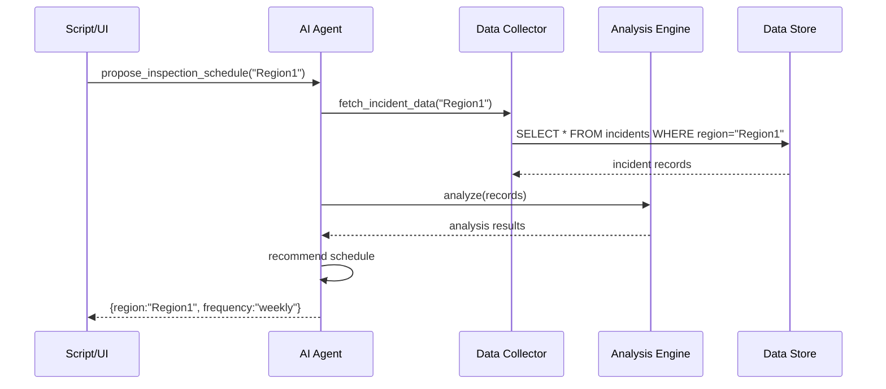

# Chapter 5: AI Representative Agent

As we saw in [Chapter 4: Frontend Interface (HMS-MFE)](04_frontend_interface__hms_mfe__.md), our system offers citizens and officials rich web portals. Now it’s time to add a virtual aide that studies data and drafts smart recommendations—meet the **AI Representative Agent**.

---

## 1. Motivation & Central Use Case

Imagine the Environmental Protection Agency (EPA) needs to schedule site inspections.  
- Today, staff manually review past incidents, then draft a calendar.  
- The AI Representative Agent automates this: it analyzes historical spill data, recommends an optimal inspection cadence, and pushes the schedule into the system—freeing staff from repetitive work.

By the end of this chapter, you’ll see how to:
1. Ask the Agent for a suggested inspection schedule.  
2. Understand its four building blocks.  
3. Peek under the hood at a simple Python implementation.

---

## 2. Key Concepts

We break the AI Representative Agent into four beginner-friendly pieces:

1. **Data Collector**  
   - Gathers historical incident data (e.g., spill reports, complaint logs).  
2. **Analysis Engine**  
   - Processes data: counts incidents, detects trends.  
3. **Policy Recommender**  
   - Translates analysis into a concrete policy or schedule (e.g., “inspect weekly”).  
4. **System Pusher**  
   - Pushes the recommendation into HMS via our API, so it appears in dashboards and alerts staff.

Analogy: Think of this agent as a policy researcher who:
- Reads all past case files (Data Collector),  
- Summarizes patterns (Analysis Engine),  
- Writes a recommendation memo (Policy Recommender),  
- And files it with the clerk’s office (System Pusher).

---

## 3. Using the Agent in Your Code

Here’s how a developer might call the Agent from a script or UI:

```python
# client.py
from hms_agent import AIRepresentativeAgent

agent = AIRepresentativeAgent()
schedule = agent.propose_inspection_schedule(
    agency_id="EPA", region="Region1"
)
print("New schedule:", schedule)
```

Explanation:
1. We create `AIRepresentativeAgent()`.  
2. We ask it to `propose_inspection_schedule(...)`.  
3. The agent returns a schedule dict, e.g.:
   `{ "region": "Region1", "frequency": "weekly" }`.

---

## 4. Step-by-Step Flow

What happens when you call `propose_inspection_schedule`?



1. **Agent** asks **Data Collector** for past incidents.  
2. **Data Collector** queries the **DB**.  
3. **Agent** sends raw data to **Analysis Engine**.  
4. **Analysis Engine** returns trends (e.g., spill count).  
5. **Agent** uses **Policy Recommender** logic to choose a frequency.  
6. The final schedule is returned.

---

## 5. Under the Hood: Simple Python Modules

### 5.1 The Agent Orchestrator

```python
# hms_agent/ai_representative_agent.py
from .data_collector import DataCollector
from .analysis_engine import AnalysisEngine
from .policy_recommender import PolicyRecommender
from .pusher import SystemPusher

class AIRepresentativeAgent:
    def __init__(self):
        self.collector = DataCollector()
        self.engine = AnalysisEngine()
        self.recommender = PolicyRecommender()
        self.pusher = SystemPusher()

    def propose_inspection_schedule(self, region):
        data = self.collector.fetch_incident_data(region)
        analysis = self.engine.analyze(data)
        schedule = self.recommender.create_schedule(analysis)
        self.pusher.push_schedule(schedule)  # pushes via HMS-API
        return schedule
```

Explanation:
- We wire together each component in a simple constructor.
- The main method runs four steps in sequence.

### 5.2 Data Collector

```python
# hms_agent/data_collector.py
class DataCollector:
    def fetch_incident_data(self, region):
        # Imagine this calls a DB client or external API
        return [{"date":"2023-01-10","type":"spill"}, ...]
```

Fetches all relevant records for the given region.

### 5.3 Analysis Engine

```python
# hms_agent/analysis_engine.py
class AnalysisEngine:
    def analyze(self, data):
        # Count spills as a basic metric
        count = sum(1 for d in data if d["type"]=="spill")
        return {"spill_count": count}
```

Turns raw data into simple metrics.

### 5.4 Policy Recommender

```python
# hms_agent/policy_recommender.py
class PolicyRecommender:
    def create_schedule(self, analysis):
        freq = "weekly" if analysis["spill_count"] > 5 else "monthly"
        return {"frequency": freq}
```

Chooses a schedule based on thresholds.

### 5.5 System Pusher

```python
# hms_agent/pusher.py
import requests

class SystemPusher:
    def push_schedule(self, schedule):
        # Push into Backend API (see [Chapter 2](02_backend_api__hms_api_hms_mkt__.md))
        requests.post(
            "https://api.hms.gov/hms-api/v1/inspection-schedules",
            json=schedule,
            headers={"Authorization": "Bearer <token>"}
        )
```

Submits the new schedule so it shows up in dashboards and notifications.

---

## 6. Summary & Next Steps

In this chapter, you learned how the **AI Representative Agent**:
- Collects historical data  
- Analyzes patterns  
- Recommends optimized workflows (e.g., inspection schedules)  
- Pushes results automatically into our system

Up next, we’ll explore how these recommendations become live policies in our system with the **Policy Deployment Workflow**:

[Chapter 6: Policy Deployment Workflow](06_policy_deployment_workflow_.md)

---

Generated by [AI Codebase Knowledge Builder](https://github.com/The-Pocket/Tutorial-Codebase-Knowledge)