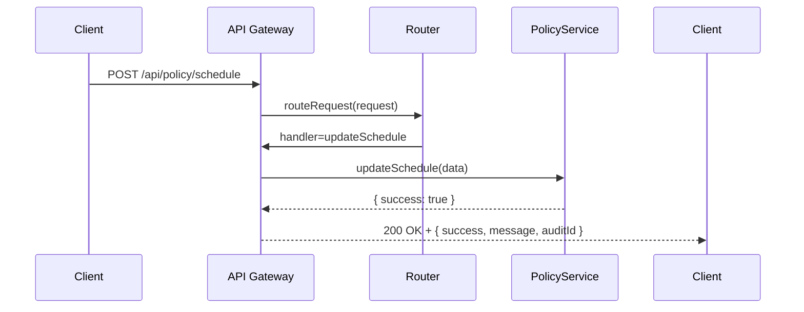

# Chapter 5: Backend API

In the last chapter, we explored the [Microservices Architecture](04_microservices_architecture_.md) and saw how small, independent services talk through HTTP. Now we’ll build the **Backend API**—the “postal service” of HMS-DEV that accepts structured requests, routes them to the right microservice, and returns confirmations or results.

---

## 5.1 Motivation: Why a Backend API?

Imagine the Bureau of Transportation Statistics (BTS) wants to let partner agencies:

- Automatically **update** bus-route scheduling policies  
- **Query** daily traffic counts for a specific highway segment  
- Integrate results into their own dashboards  

Without a Backend API, partners would email spreadsheets or use different systems. It’s slow, error-prone, and hard to automate. The Backend API solves this by:

1. Exposing **endpoints** like `/api/policy/schedule` or `/api/data/traffic`.  
2. Validating and **routing** each request to the correct microservice.  
3. Returning a clear **response** (success/failure, data payload).

Think of it as a post office: you drop off a letter (HTTP request), it’s sorted (routing), delivered to the right department (microservice), and you get a tracking update (HTTP response).

---

## 5.2 Key Concepts

1. **Endpoint**  
   A named URL like `/api/policy/schedule` that clients call.

2. **HTTP Methods**  
   GET for reading data, POST/PUT for creating or updating, DELETE for removing.

3. **Request Body & Parameters**  
   Structured JSON input, e.g.:  
   `{ "routeId": 42, "policy": "peak-off-peak" }`

4. **Routing**  
   The logic that maps an incoming URL + method to a handler function.

5. **Handler (Controller)**  
   A small function that:
   - Validates input  
   - Calls a microservice (e.g., PolicyService)  
   - Returns a response

6. **Authentication & Governance**  
   Every call passes through the [Governance Layer](01_governance_layer_.md) to check permissions before routing.

---

## 5.3 Using the Backend API

Let’s walk through a simple example: updating a scheduling policy.

### 5.3.1 Client-Side Call

Here’s how a partner agency could update policy using Python’s `requests`:

```python
import requests

url = "http://gateway/api/policy/schedule"
payload = {"routeId": 42, "policy": "peak-off-peak"}
headers = {"Authorization": "Bearer <token>"}

resp = requests.post(url, json=payload, headers=headers)
print(resp.status_code, resp.json())
```

Beginner-friendly:  
- We `POST` to `/api/policy/schedule`.  
- We send a JSON body with `routeId` and new `policy`.  
- We include an auth token.  
- The API returns status and confirmation.

### 5.3.2 Sample Response

```json
{
  "success": true,
  "message": "Policy updated for route 42",
  "auditId": "AUD-20240630-123"
}
```

- `success`: operation result  
- `message`: human-readable note  
- `auditId`: reference for auditing (via Governance Layer)

---

## 5.4 Under the Hood: Request Flow

Here’s the sequence when a client calls `/api/policy/schedule`:



1. **Client** sends POST to the **Gateway**.  
2. Gateway asks the **Router** which handler to invoke.  
3. Gateway runs `updateSchedule()` on **PolicyService**.  
4. PolicyService returns the result.  
5. Gateway wraps it in a JSON response.

---

## 5.5 Inside the Backend API Implementation

Let’s peek at a simplified Express.js router (`api.js`):

```javascript
// api.js
const express = require('express');
const { checkAuth } = require('./governance');
const { updateSchedule } = require('./services/policyService');

const router = express.Router();

// Route: Update scheduling policy
router.post('/policy/schedule', checkAuth, async (req, res) => {
  const { routeId, policy } = req.body;
  const result = await updateSchedule(routeId, policy);
  res.json(result);
});

module.exports = router;
```

Explanation:  
- We import `checkAuth()` from our [Governance Layer](01_governance_layer_.md).  
- We map `POST /policy/schedule` to an async handler.  
- We call `updateSchedule()` in `policyService`.  
- We return whatever the service gives us.

### 5.5.1 Service Handler (`policyService.js`)

```javascript
// services/policyService.js
async function updateSchedule(routeId, policy) {
  // Imagine HTTP call or database update here
  // e.g., await db.save({routeId, policy});
  return {
    success: true,
    message: `Policy updated for route ${routeId}`,
    auditId: generateAuditId()
  };
}

function generateAuditId() {
  return 'AUD-' + Date.now();
}

module.exports = { updateSchedule };
```

Explanation:  
- `updateSchedule()` does the core work (DB write or microservice call).  
- It returns a simple JSON result with an `auditId`.

---

## 5.6 Conclusion

In this chapter, you learned:

- Why we need a **Backend API**: central routing, validation, and integration point for microservices.  
- Key concepts: endpoints, HTTP methods, routing, and handlers.  
- How a client calls the API and what a response looks like.  
- The request flow with a simple **sequenceDiagram**.  
- A peek at Express.js code tying together the **Governance Layer** and a microservice.

Next up, we’ll see how HMS-DEV keeps data in sync with outside systems in [External System Synchronization](06_external_system_synchronization_.md).

---

Generated by [AI Codebase Knowledge Builder](https://github.com/The-Pocket/Tutorial-Codebase-Knowledge)