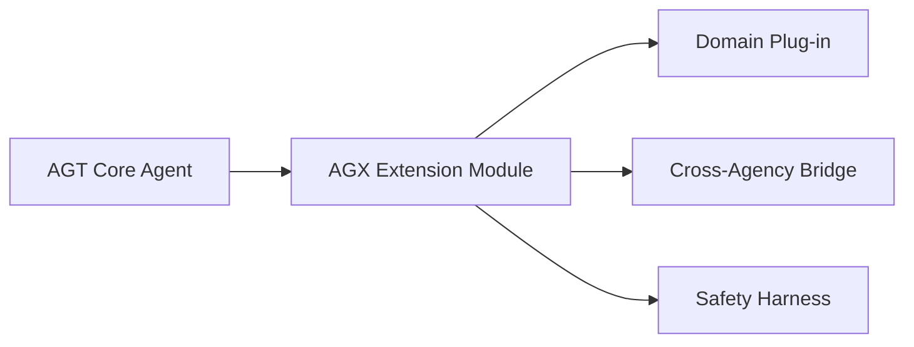
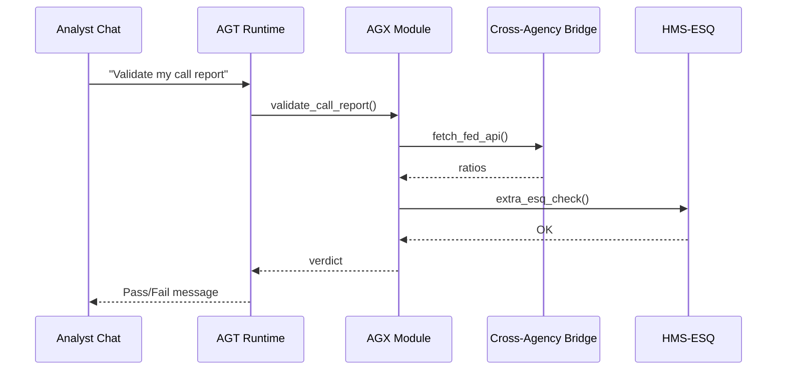

# Chapter 6: HMS-AGX Specialized Agent Extensions  

*[← Back to Chapter&nbsp;5: HMS-AGT Core Agent Framework](05_hms_agt_core_agent_framework_.md)*  

---

## 0. Why Bother With “AGX”? — A Midnight Bank-Exam Horror Story  

Picture a small community bank filing its yearly **FFIEC** call report.  
The form is 80 pages long and sprinkled with legal landmines.  
Our trusty **AGT** clerk can already chat and fill fields, but it **doesn’t know banking law** and cannot pull data from the Federal Reserve’s API.  

Enter **HMS-AGX**. Think of it as the agent’s **grad-school scholarship**:  
• inject deep domain brains (FFIEC rules, IRS tax tables, VA medical codes)  
• wire the agent into outside systems (Fed API, DMV scheduler, CMS Medicare DB)  
• still keep every word inside the HMS compliance bubble  

One YAML line promotes your vanilla clerk into a certified banking examiner. 📈  

---

## 1. Key Concepts — Learn These Five Words First

| Term | Everyday Analogy | One-Line Job |
|------|------------------|--------------|
| Extension Module | College major | Adds a deep specialty (e.g., “Banking.Reg.QA”) |
| Capability Tag | Merit badge | Declares what the agent can now legally do (`read_ffiec`) |
| Cross-Agency Bridge | Car-pool lane | Secure pipe to another agency’s API |
| Domain Plug-in | Pocket reference book | Encodes domain knowledge (schemas, vocab) |
| Safety Harness | Bicycle helmet | Extra ESQ checks that only fire on high-risk tasks |

Keep them handy—we’ll wire them together in a minute.  

---

## 2. A 3-Step Mental Model  



1. **AGT Core** = personality & generic skills.  
2. **AGX Module** = specialist overlay.  
3. **Plug-in + Bridge + Harness** = three support pillars.  

---

## 3. Upgrading “Passport Helper” to “Passport-Plus” (15 Lines Total!)

### 3.1 Add an AGX line to YAML  

```yaml
# passport-plus.yaml
extends: "passport-helper.yaml"
agx:
  - "state_dept.scheduler.v1"    # new Extension Module
```

What changed?  
• The **extends** field copies everything from Chapter 5’s template.  
• The new AGX module gives the agent direct, secure access to the State Department appointment API—without you writing any HTTP code.

### 3.2 Launch Script Stays the Same  

```python
from hms_agt import AgentRuntime
agent = AgentRuntime("passport-plus.yaml")
print(agent.chat("Book me a slot next Thursday").text)
```

Probable answer:

```
✅ Appointment confirmed for Thu 2024-08-22 at 10:15 AM, Washington Passport Agency.
```

Notice: no new Python! The AGX module handled all the scheduling heavy-lifting.

---

## 4. Building Your Own Extension: “FFIEC Compliance AGX”

Suppose the **Office of the Comptroller of the Currency (OCC)** wants a clerk that can **instantly validate FFIEC call-report numbers**.

### 4.1 Skeleton Module (`ffiec_compliance.agx.py` – 18 lines)

```python
# ffiec_compliance.agx.py
from hms_agx import register_extension, Capability

@register_extension(
    name="banking.ffiec.v1",
    capabilities=[Capability("validate_ffiec"), Capability("fetch_fed_api")]
)
class FFIECComplianceAGX:
    def __init__(self, agent_ctx):
        self.ctx = agent_ctx          # access to logs, ESQ, etc.

    def validate_call_report(self, form_json):
        # --- call FFIEC schema check (pseudo) ---
        if "RCFD6331" not in form_json:
            return {"ok": False, "error": "Missing asset size"}
        # --- cross-agency API ---
        fed = self.ctx.bridge("federal_reserve")     # secure bridge
        ratios = fed.get_capital_ratios(form_json["bank_id"])
        # simple rule
        if ratios["tier1"] < 0.06:
            return {"ok": False, "error": "Tier 1 ratio too low"}
        return {"ok": True}
```

What’s happening?  
1. `@register_extension` tells AGT runtime a new module exists.  
2. Two **Capability Tags** announce legal powers.  
3. `self.ctx.bridge("federal_reserve")` spins up a **Cross-Agency Bridge** automatically sandboxed by HMS.  
4. Function returns a tiny JSON verdict—no UI code needed.

### 4.2 Wire It Into an Agent (6 lines YAML)

```yaml
# bank-clerk.yaml
agent_template:
  name: "OCC Bank Clerk"
skills: [ "dialog.basic" ]
agx: [ "banking.ffiec.v1" ]      # ← our new module
supervisory_contract:
  on_task: "esq.review.v1"
```

Run `AgentRuntime("bank-clerk.yaml")` and the clerk can now audit FFIEC reports in chat form.

---

## 5. Safety Harness in Action — Blocking Risky Moves

Imagine a junior analyst types:

> “Override Tier 1 capital error and submit.”

The AGX module flags this as **high-risk**.  
It triggers its built-in Safety Harness, which performs an **extra HMS-ESQ round-trip** plus manager approval via [Human-in-the-Loop Console](13_human_in_the_loop_oversight_console__hms_gov__.md).  
No surprise emails to Congress later. 🎉

---

## 6. Under the Hood — Five Actors, Seven Steps  



Seven messages, all audited and token-signed automatically.

---

## 7. Tiny Peek at the AGX Registry (≤14 lines)

```python
# hms_agx/registry.py
_REG = {}

def register_extension(name, capabilities):
    def wrapper(cls):
        _REG[name] = {"class": cls, "caps": capabilities}
        return cls
    return wrapper

def load_extensions(names, agent_ctx):
    return {n: _REG[n]["class"](agent_ctx) for n in names}
```

Beginner breakdown:  
1. Decorator stores class + capability list in `_REG`.  
2. `load_extensions` instantiates them at runtime using the agent’s context.  
3. AGT now routes specialized calls (`validate_call_report`) to the right object.

---

## 8. Common Pitfalls (and How AGX Rescues You)

Problem | Old Way | With AGX
--------|---------|---------
Deep domain logic baked into core agent | Monster files, hard to test | Isolated Extension Module
Ad-hoc API calls | Scattered secrets | Cross-Agency Bridge auto-handles OAuth & logging
Legal overreach | No one checks special skills | Safety Harness forces extra ESQ review
Can’t tell what powers an agent has | Tribal knowledge | Capability Tags listed in YAML & runtime API

---

## 9. What You Learned

• **AGX** upgrades a generic AGT clerk into a domain specialist, without Frankenstein code.  
• You built a real **FFIEC compliance plug-in** in under 20 lines.  
• Cross-Agency Bridges and Safety Harnesses keep integrations powerful **and** safe.  
• Everything still flows through the same [MCP envelopes](02_model_context_protocol__hms_mcp__.md) and [ESQ guardrails](04_compliance___legal_reasoning__hms_esq__.md).

Ready to let these newly-minted specialists **talk to each other across agencies**? Jump to [HMS-A2A Inter-Agency Messaging Bus](07_hms_a2a_inter_agency_messaging_bus_.md).

---

---

Generated by [AI Codebase Knowledge Builder](https://github.com/The-Pocket/Tutorial-Codebase-Knowledge)