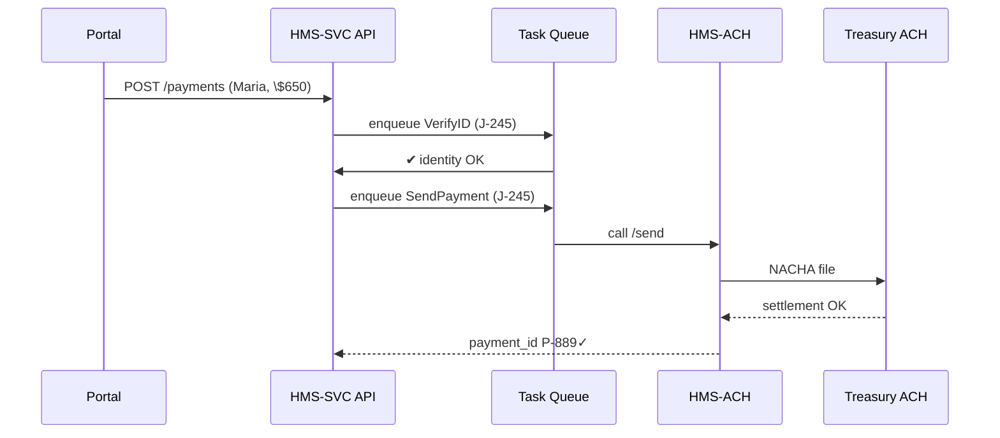

# Chapter 6: Management Layer (HMS-SVC & HMS-ACH)


*A friendly sequel to* [Versioned Policy Store](05_versioned_policy_store_.md)  

---

## 1. Why Does This Layer Exist?

Imagine the Department of Housing & Urban Development (HUD) wants to launch a **Rental-Relief** program:

1. Citizens apply online (you built the form back in Chapter 1).  
2. HUD must:  
   • verify each applicant’s identity,  
   • check they are not on a fraud watch-list,  
   • move money from Treasury to the landlord’s bank,  
   • keep an audit trail for the Inspector General.

If every mission area rewrote those chores, government IT would be a patchwork of one-off scripts.  
**The Management Layer** provides a “factory floor” of **re-usable services (HMS-SVC)** plus a **payment rail (HMS-ACH)** so new programs plug in instead of reinventing wheel after wheel.

---

## 2. Key Concepts (Plain-English Cheat-Sheet)

| Term | Beginner Explanation |
|------|----------------------|
| **HMS-SVC** | A catalog of ready-made micro-services: identity-check, document store, notification, task queue, etc. |
| **HMS-ACH** | A secure payment hub that talks to Treasury’s ACH network—think of it as a shared “send money” button. |
| **Funding Flow** | A YAML recipe that says *who* pays *whom*, *from which* government account, under *which* rules. |
| **Task Queue** | A line of jobs (“Do identity check”, “Send payment”) processed by workers so nothing is dropped. |
| **Mission Plug-In** | A thin wrapper that maps your domain (housing grants, student loans, etc.) onto the shared services. |

---

## 3. Five-Minute Walk-Through: Paying Maria’s Landlord

We’ll pay **\$650** to *ACME Rentals* for citizen **Maria Gomez**.

### 3.1 Describe the Funding Flow (YAML, 14 lines)

```yaml
# file: flows/hud_rental_relief.yaml
id: hud.rental_relief.v1
source_account: TREASURY_GLAS_3002
target_type: landlord
steps:
  - verify_identity           # HMS-SVC.identity
  - fraud_screen              # HMS-SVC.sanctions
  - queue_payment             # HMS-SVC.tasks → HMS-ACH
  - notify_applicant          # HMS-SVC.messages
limits:
  per_payment_usd: 2000
  monthly_cap_usd: 5000000
```

Explanation (in plain words):

* “Take money from **GLAS 3002**, but only up to \$2 000 each time.”  
* Always run identity + fraud checks before queuing a payment.  
* Cap monthly spend at \$5 M—PPE enforces this limit with rules from Chapter 4.

### 3.2 Register the Flow

```bash
hms svc flows:apply flows/hud_rental_relief.yaml
```

Terminal says:

```
✓ Flow hud.rental_relief.v1 active (hash 8b7ac3)
```

### 3.3 Create a Payment Request (Node.js, 15 lines)

```js
import fetch from 'node-fetch';

async function payLandlord() {
  const res = await fetch(
    'https://api.hms.gov/svc/payments', {
      method: 'POST',
      headers: { 'Authorization': 'Bearer <token>' },
      body: JSON.stringify({
        flow_id: 'hud.rental_relief.v1',
        applicant: { ssn: '123-45-6789', name: 'Maria Gomez' },
        landlord: { ein: '98-7654321', bank_rtn: '021000021', bank_acct: '99887766' },
        amount_usd: 650
      })
    });
  console.log(await res.json());
}
payLandlord();
```

Expected JSON reply (simplified):

```json
{ "job_id": "J-245", "status": "queued" }
```

That’s it—no direct ACH code, no custom identity check code.

---

## 4. What Happens Behind the Curtain?



Only five actors—easy to visualize.

---

## 5. A Peek at the Code (Two Tiny Snippets)

### 5.1 The Task Worker (Python, 18 lines)

```python
# file: workers/payment_worker.py
import queuelib, achlib, svc_sdk

q = queuelib.connect('hms-svc-tasks')

for job in q.listen(kind='SendPayment'):
    pay = job.payload
    # 1. Build ACH message
    nacha = achlib.build(
        amount=pay['amount_usd'],
        to_rtn=pay['bank_rtn'],
        to_acct=pay['bank_acct'])
    # 2. Ship to HMS-ACH
    resp = svc_sdk.ach.send(nacha)
    # 3. Mark job done
    q.complete(job.id, meta={'payment_id': resp.id})
```

Explanation:  
The worker stays <20 lines because it delegates heavy lifting to **`svc_sdk.ach.send`** (part of HMS-ACH).

### 5.2 The ACH Adapter (Go, 12 lines)

```go
// file: ach/send.go
func Send(nacha string) (PaymentID, error) {
  req, _ := http.NewRequest("POST",
    "https://ach.hms.gov/v1/files", bytes.NewBufferString(nacha))
  req.Header.Set("X-API-Key", os.Getenv("ACH_KEY"))
  resp, err := http.DefaultClient.Do(req)
  // parse JSON: {"payment_id":"P-889"}
  return parsePaymentID(resp.Body), err
}
```

Beginners can swap this adapter for a sandbox endpoint when coding locally.

---

## 6. How Other HMS Layers Plug In

| Interaction | Example |
|-------------|---------|
| **[Policy & Process Engine](04_policy___process_engine_.md)** | Enforces `monthly_cap_usd` before allowing `queue_payment`. |
| **[RBAC](08_role_based_access_control__rbac__.md)** | Only a *Grant Manager* role can call `POST /svc/payments`. |
| **[Observability Pipeline](13_observability___metrics_pipeline_.md)** | Emits `payments.success` & `payments.failure` metrics. |
| **[Data Privacy Layer](09_data_privacy___compliance_layer_.md)** | Masks SSNs in logs automatically. |
| **[Backend API Gateway](07_backend_api_gateway_.md)** | The secure doorway through which external and portal calls reach HMS-SVC (next chapter!). |

---

## 7. Common Beginner Questions

**Q: Do I need to know bank file formats?**  
No. HMS-ACH hides NACHA and settlement details. You send plain JSON.

**Q: How do I test without moving real money?**  
Set `flow_id: '<name>.sandbox'`. HMS-ACH returns `"payment_id": "TEST-123"` and no funds move.

**Q: Can I add a custom step (e.g., HUD credit-score lookup)?**  
Yes. Append a step in your Flow YAML that points to a Lambda / container you own. HMS-SVC queues it like any other step.

**Q: What if identity check fails?**  
The task worker marks the payment `blocked`; PPE may trigger a [Human-in-the-Loop escalation](14_human_in_the_loop__hitl__workflow_.md).

---

## 8. Quick-Start Checklist

1. Write a **Funding Flow YAML**.  
2. `hms svc flows:apply` to register.  
3. From your service or portal, `POST /svc/payments`.  
4. Watch events in the Observability dashboard.  
5. Use sandbox mode until Treasury signs your IAA.

You just built a government-grade payout with ~15 lines of code!

---

## 9. Summary & What’s Next

In this chapter you:

• Met **HMS-SVC** and **HMS-ACH**, the reusable engine room of HMS-DEV.  
• Registered a Funding Flow, queued a payment, and watched it settle—no bespoke plumbing.  
• Peeked at the worker and adapter code powering the rails.  
• Saw how governance, policy, and observability layers hook into each call.

Curious how all these micro-services stay safely exposed to the outside world?  
Head over to [Backend API Gateway](07_backend_api_gateway_.md).

---

Generated by [AI Codebase Knowledge Builder](https://github.com/The-Pocket/Tutorial-Codebase-Knowledge)