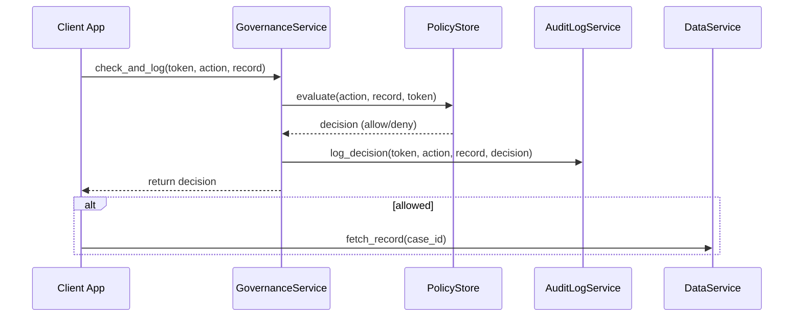

# Chapter 8: Governance Layer

In [Chapter 7: Human-in-the-Loop (HITL) Override](07_human_in_the_loop__hitl__override_.md) we added a final human checkpoint for AI-drafted proposals. Now we introduce the **Governance Layer**—the inspector general’s office of HMS-DEV—ensuring every action, data access, and policy change meets transparency, ethics, and legal requirements.

---

## 1. Why We Need a Governance Layer

Consider a Pretrial Services agency handling sensitive arrest records.  
- Before any agent reads or updates a record, the governance layer must verify that privacy laws (e.g., GDPR or CJIS) allow it.  
- It then logs the decision in a permanent audit trail.  
- If a request violates policy, it’s blocked and the agency is notified.

Without a central overseer, each microservice would implement its own checks—leading to gaps in compliance, inconsistent logs, and audit failures.

---

## 2. Key Concepts

We break the Governance Layer into four beginner-friendly pieces:

1. **Policy Engine**  
   - A ruleset (e.g., YAML or JSON) that defines who may do what, under which conditions.  
2. **Decision Audit Trail**  
   - Every policy decision (allow or deny) is logged with timestamp, user, action, and reason.  
3. **Enforcement Hook**  
   - A simple API call placed at key points (data reads, writes, policy deployments) that consults the Policy Engine.  
4. **Transparency Portal**  
   - A read-only interface (or API) where auditors can view the log of all governance decisions.

Analogy: Think of the policy engine as the law books, the enforcement hook as the judge’s gavel, and the audit trail as the courtroom transcript.

---

## 3. A Simple Usage Example

Below is a minimal Python snippet showing how an application might ask the Governance Layer for permission before accessing a sensitive record:

```python
# app.py
from hms_gov.governance import GovernanceService

gov = GovernanceService(policy_file="gov-policies.yml")
user_token = "eyJhbGciOi..."
action = "read_pretrial_record"
record = {"case_id": 123, "sensitivity": "high"}

# Check policy and log the decision in one call
allowed = gov.check_and_log(user_token, action, record)

if allowed:
    # proceed to fetch the record from data service
    data = fetch_record(record["case_id"])
else:
    raise PermissionError("Access denied by Governance Layer")
```

Explanation:  
1. `check_and_log()` loads relevant policies from `gov-policies.yml`.  
2. It evaluates whether the user (via token) may perform `action` on `record`.  
3. It writes an audit entry describing the outcome.  
4. Returns `True` if allowed, `False` otherwise.

---

## 4. Step-by-Step Flow



1. **App** calls **GovernanceService** at enforcement point.  
2. **GovernanceService** asks **PolicyStore** to evaluate rules.  
3. Decision flows back and is recorded via **AuditLogService**.  
4. If allowed, the App proceeds to **DataService**.

---

## 5. Under the Hood: Implementation

Here’s a high-level view of the main components:

### 5.1 GovernanceService (hms_gov/governance.py)

```python
# hms_gov/governance.py
from .policy_store import PolicyStore
from hms_sys.logging import LoggingService

class GovernanceService:
    def __init__(self, policy_file):
        self.policies = PolicyStore(policy_file)
        self.logger = LoggingService(audit_store="governance_logs")

    def check_and_log(self, user_token, action, context):
        allowed, reason = self.policies.evaluate(user_token, action, context)
        # Log who asked, what happened, and why
        self.logger.info(
            user_id=user_token, 
            message=f"{action} -> {allowed} ({reason})"
        )
        return allowed
```

Explanation:  
- Loads policies via **PolicyStore**.  
- Uses **HMS-SYS Logging** (see [Chapter 1](01_core_system_platform__hms_sys__.md)) for audit.  
- Returns a boolean plus logs the decision.

### 5.2 PolicyStore (hms_gov/policy_store.py)

```python
# hms_gov/policy_store.py
import yaml

class PolicyStore:
    def __init__(self, path):
        self.rules = yaml.safe_load(open(path))

    def evaluate(self, token, action, context):
        # Simplified: look up rules[action],
        # check token roles vs. context sensitivity
        rule = self.rules.get(action, {})
        if context.get("sensitivity") in rule.get("denied_sensitivities", []):
            return False, "High sensitivity"
        return True, "Allowed by default"
```

Explanation:  
- Loads a YAML file of policies.  
- For each action, defines allowed or denied contexts.

### 5.3 Example Policy File (gov-policies.yml)

```yaml
read_pretrial_record:
  denied_sensitivities:
    - high
update_environment_report:
  denied_sensitivities: []
```

Explanation:  
- No one may read records marked “high” sensitivity without extra clearance.

---

## 6. Summary & Next Steps

In this chapter you learned how the **Governance Layer**:

- Centralizes high-level policy enforcement (ethics, privacy, compliance)  
- Logs every decision to an audit trail for transparency  
- Restricts actions based on sensitivity and legal rules  

Next up, we’ll see how senior administrators configure and monitor the system in the **[Management Layer](09_management_layer_.md)**.

---

Generated by [AI Codebase Knowledge Builder](https://github.com/The-Pocket/Tutorial-Codebase-Knowledge)