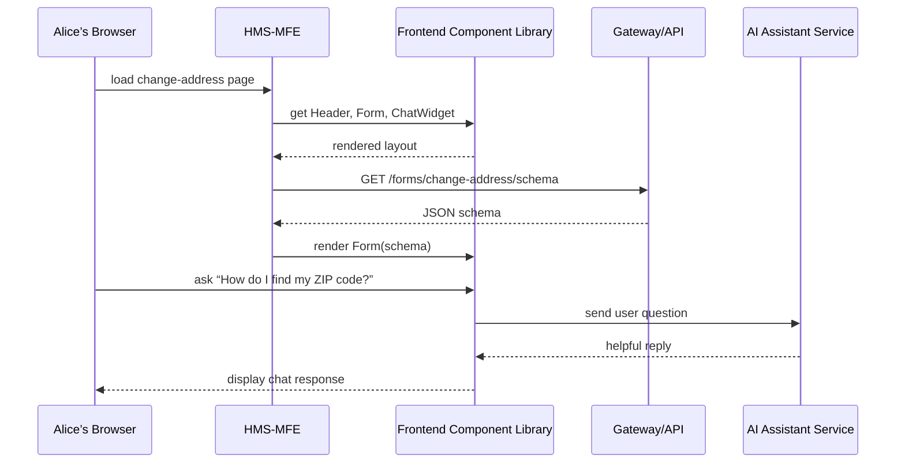

# Chapter 8: Interface Layer

In the last chapter we built a shared [Frontend Component Library](07_frontend_component_library_.md) of buttons, inputs, and banners. Now it’s time to see how those pieces come together into the **Interface Layer**—our “receptionist and help desk” that citizens and administrators actually see and use.

---

## 8.1 Why an Interface Layer?

Imagine Alice, a citizen, wants to update her mailing address for Medicaid benefits. She visits a web portal, fills out a form, and even asks an AI assistant for help with confusing questions. Meanwhile, Bob, a state administrator, logs into a separate dashboard to review and approve that request.

Without a consistent Interface Layer:

- Alice and Bob would jostle through different UIs that look nothing alike.
- Forms could be hard to navigate or inaccessible on mobile.
- Branding, help text, and AI chatbots would feel disjointed.

The **Interface Layer** solves this by:

1. Hosting **HMS-MFE** for citizen-facing apps.  
2. Hosting **HMS-GOV** for administrator dashboards.  
3. Enforcing consistent headers, footers, colors, and accessibility.  
4. Wiring in forms, dashboards, and AI assistants so everyone sees the same “face” of HMS-DEV.

---

## 8.2 Key Concepts

1. **HMS-MFE**  
   A _Micro Frontend_ bundle for citizens (e.g., benefit applications).

2. **HMS-GOV**  
   The admin portal where government staff review, audit, and approve.

3. **UI Shell**  
   Shared header, navigation menu, and footer applied to every page.

4. **Forms & Dashboards**  
   Dynamic views that load schemas or data from the backend.

5. **AI-Driven Assistants**  
   Chat widgets that let users ask questions in plain English.

6. **Accessibility & Branding**  
   Ensuring WCAG compliance, keyboard support, and consistent theme.

---

## 8.3 Using the Interface Layer

Below is a minimal example showing how to mount the citizen app (HMS-MFE) and the admin app (HMS-GOV).

1. In your HTML page:
```html
<!–– index.html ––>
<div id="citizen-root"></div>
<div id="admin-root"></div>
<script src="hms-mfe.bundle.js"></script>
<script src="hms-gov.bundle.js"></script>
```
_This sets up two “mount points” in the page._

2. In a simple initializer (main.js):
```javascript
// main.js
import { startCitizenApp } from 'hms-mfe'
import { startAdminApp   } from 'hms-gov'

// Render the citizen portal into #citizen-root
startCitizenApp({ mountId: 'citizen-root' })

// Render the admin dashboard into #admin-root
startAdminApp({ mountId: 'admin-root' })
```
_After loading, users see a branded portal with forms, menus, and chat help._

---

## 8.4 Under the Hood: What Happens Step-by-Step

When Alice opens the citizen portal to change her address:



1. **HMS-MFE** loads and calls UI components.  
2. It fetches a form schema from the **Backend API**.  
3. The form appears with all styling and accessibility baked in.  
4. If Alice uses the chat helper, the UI talks to an **AI service**.  
5. Replies show up right in her portal window.

---

## 8.5 Inside the Interface Layer Code

Let’s peek at a simplified React setup for HMS-MFE.

1. src/index.js
```javascript
import ReactDOM from 'react-dom'
import { UIProvider } from 'hms-ui-library'
import { Form, ChatWidget } from 'hms-ui-library'
import './styles.css'      // shared theming

function App() {
  return (
    <UIProvider>
      <h1>Change Address</h1>
      <Form schemaUrl="/api/forms/change-address" />
      <ChatWidget />
    </UIProvider>
  )
}

ReactDOM.render(<App />, document.getElementById('citizen-root'))
```
_We wrap everything in a `UIProvider` so colors, fonts, and accessibility settings apply everywhere._

2. Form component (simplified)
```javascript
// components/Form.jsx
import React, { useEffect, useState } from 'react'

export function Form({ schemaUrl }) {
  const [schema, setSchema] = useState(null)
  useEffect(() => {
    fetch(schemaUrl).then(r => r.json()).then(setSchema)
  }, [schemaUrl])
  if (!schema) return <p>Loading form…</p>
  // Imagine this maps schema.fields to inputs
  return <form>{schema.fields.map(f => <div key={f.name}>{f.label}</div>)}</form>
}
```
_This tiny component fetches a form definition and turns it into HTML inputs._

3. ChatWidget (simplified)
```javascript
// components/ChatWidget.jsx
import React, { useState } from 'react'

export function ChatWidget() {
  const [msgs, setMsgs] = useState([])
  const ask = question => {
    fetch('/api/ai-chat', {method:'POST',body:question})
      .then(r => r.text()).then(reply => setMsgs([...msgs, reply]))
  }
  return (
    <div>
      {msgs.map((m,i) => <p key={i}>{m}</p>)}
      <button onClick={()=>ask('Help me')}>Ask Help</button>
    </div>
  )
}
```
_Users click a button, the widget sends their question, and displays the reply._

---

## 8.6 Conclusion

In this chapter you learned:

- What the **Interface Layer** is and why it’s like the “front desk” of HMS-DEV.  
- How **HMS-MFE** and **HMS-GOV** mount into a page and share a **UI Shell**.  
- Key concepts: dynamic forms, dashboards, AI chat helpers, and consistent theming.  
- A step-by-step sequence of loading a form and chatting with an AI assistant.  
- Minimal React examples showing how forms and chat widgets tie into the API.

Next up, we’ll make navigation even smarter with [Intent-Driven Navigation](09_intent_driven_navigation_.md), letting users jump right to the tasks they care about.

---

Generated by [AI Codebase Knowledge Builder](https://github.com/The-Pocket/Tutorial-Codebase-Knowledge)