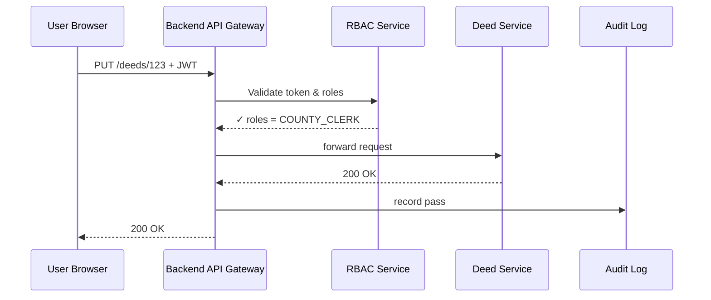

# Chapter 8: Role-Based Access Control (RBAC)

*A friendly sequel to* [Backend API Gateway](07_backend_api_gateway_.md)

---

## 1. Why Do We Need Digital “Clearance Badges”?

Picture a **Property-Record Portal** run by a state housing agency:

* **Citizens** may see their own deeds.  
* A **County Clerk** can correct typos on any deed within their county.  
* A **Federal Auditor** reviews *all* changes, but cannot edit.

If every micro-service had to re-invent those rules, mistakes would be inevitable.  
**Role-Based Access Control (RBAC)** solves this once and for all:

1. Each user receives a **least-privilege token**—a digital badge that lists their roles.  
2. Every request passes through a gate (the Gateway from Chapter 7) that checks the badge against the route’s allowed roles.  
3. All passes or denials land in an **audit log** for OIG and FISMA reviewers.

Think of RBAC as the colored lanyards you get at a federal building: green = visitor, blue = staff, red = top-secret. Software works the same way!

---

## 2. Key Concepts (Plain-English)

| Term | What It Means in Everyday Words |
|------|---------------------------------|
| **Role** | A named clearance badge like `CITIZEN`, `COUNTY_CLERK`, `AUDITOR`. |
| **Policy Pack** | A bundle of roles + rules that map to a regulation (e.g., FISMA Moderate). |
| **Token** | A signed JSON Web Token (JWT) that lists the user’s roles. |
| **Least-Privilege** | The token contains *only* what the user needs—nothing more. |
| **Audit Log** | An automatic diary that records role checks and outcomes. |

---

## 3. Three-Step Walk-Through: Guarding the “Update Deed” Endpoint

### 3.1 Define Roles & Policy Pack (YAML, 16 lines)

```yaml
# file: roles/property_records.yaml
roles:
  CITIZEN:
    description: View own deeds
  COUNTY_CLERK:
    description: Edit deeds in assigned county
  FEDERAL_AUDITOR:
    description: View all deeds & change history

policy_pack: property_records.fisma_moderate.v1
default_role: CITIZEN
```

Explanation  
• We list three simple roles.  
• `policy_pack` groups them for easier reuse later.  
• New portal users start as `CITIZEN`.

Apply:

```bash
hms rbac apply roles/property_records.yaml
```

---

### 3.2 Issue a Least-Privilege Token

```bash
hms rbac token:create \
  --user  alice.clerk@county.gov \
  --roles COUNTY_CLERK \
  --ttl   8h
```

Sample JWT payload (shortened):

```json
{
  "sub": "alice.clerk@county.gov",
  "roles": ["COUNTY_CLERK"],
  "exp": 1715000000
}
```

Alice now holds a badge valid for 8 hours.

---

### 3.3 Protect the Endpoint in the Gateway

```yaml
# file: routes/deed_update.yaml
id: deeds.update.v1
path: /deeds/{id}
methods: [PUT]
upstream_url: http://deed-svc.internal/update
auth: token
rbac_roles: [COUNTY_CLERK]   # only clerks may pass
audit: true
```

```bash
hms gw apply routes/deed_update.yaml
```

What happens?

1. Alice sends `PUT /deeds/123` with her JWT.  
2. Gateway verifies the signature, sees role `COUNTY_CLERK`, and forwards the call.  
3. A citizen trying the same call receives **403 FORBIDDEN**.  
4. Both outcomes are stamped into the audit log.

---

## 4. Under the Hood: A 5-Actor Story



If roles mismatch, GW returns **403** and still logs the attempt.

---

## 5. Tiny Taste of Implementation

### 5.1 Token Validator (Node.js, 12 lines)

```js
import jwt from 'jsonwebtoken';
import fs from 'fs';

export function checkRoles(token, allowed) {
  const pubKey = fs.readFileSync('/keys/rbac.pub');
  const { roles } = jwt.verify(token, pubKey);

  const ok = roles.some(r => allowed.includes(r));
  if (!ok) throw { status: 403, msg: 'Forbidden by RBAC' };

  return roles; // for downstream logging
}
```

Attached as a plugin inside Gateway.  
*If* you alter `allowed`, no service code changes—just edit the route YAML.

---

### 5.2 Audit Writer (Go, 15 lines)

```go
func WriteAudit(user, route, result string) {
  entry := map[string]string{
     "user":   user,
     "route":  route,
     "result": result,
     "ts":     time.Now().UTC().Format(time.RFC3339),
  }
  jsonData, _ := json.Marshal(entry)
  http.Post("https://obs.hms.gov/audit", "application/json", bytes.NewReader(jsonData))
}
```

Every allow/deny call is immutable once written—perfect for FISMA auditors.

---

## 6. How RBAC Touches Other HMS Layers

| Layer | Interaction Example |
|-------|---------------------|
| [Governance Layer](03_governance_layer__hms_gov__.md) | Policies may say “Only **AUDITOR** role can export >10 000 records.” |
| [Policy & Process Engine](04_policy___process_engine_.md) | A rule can check `event.actor.role == 'COUNTY_CLERK'`. |
| [Backend API Gateway](07_backend_api_gateway_.md) | Reads `rbac_roles` field on every route config. |
| [Observability & Metrics Pipeline](13_observability___metrics_pipeline_.md) | Stores `rbac.denied` counters for dashboards. |
| [Data Privacy & Compliance Layer](09_data_privacy___compliance_layer_.md) | Masks user emails in audit logs when required. |

---

## 7. Beginner FAQ

**Q: Can one user have multiple roles?**  
Yes. Tokens can list many roles (`["CITIZEN","VETERAN"]`). Gateway allows the request if *any* role matches the route’s list.

**Q: How long should tokens live?**  
Follow least-privilege: minutes to hours for humans, seconds for machine-to-machine. The `--ttl` flag sets it.

**Q: What if I need row-level or field-level rules?**  
Pair RBAC with the [Policy & Process Engine](04_policy___process_engine_.md) for fine-grained checks (“Clerk can edit deeds *only in county 42*”).

**Q: Do I need to rotate keys?**  
HMS rotates signing keys every 30 days automatically; services fetch the new public key via well-known URL.

---

## 8. Quick-Start Checklist

1. Write a **roles YAML** and `hms rbac apply`.  
2. Issue tokens (`hms rbac token:create …`).  
3. Add `rbac_roles` to your Gateway route YAML.  
4. Watch allow/deny counts in the Observability dashboard.  
5. Rotate keys or revoke tokens from the RBAC console when staff change jobs.

You now have military-grade access control with *three* short files!

---

## 9. Summary & What’s Next

In this chapter you learned:

• RBAC hands out least-privilege tokens (digital badges).  
• Gateway checks those badges before any service runs.  
• All decisions flow into immutable audit logs for compliance.  
• Roles tie neatly into other HMS layers like Policy Engine and Observability.

Up next: ensuring **what data** those roles can see remains private and compliant. Continue to [Data Privacy & Compliance Layer](09_data_privacy___compliance_layer_.md).

---

Generated by [AI Codebase Knowledge Builder](https://github.com/The-Pocket/Tutorial-Codebase-Knowledge)