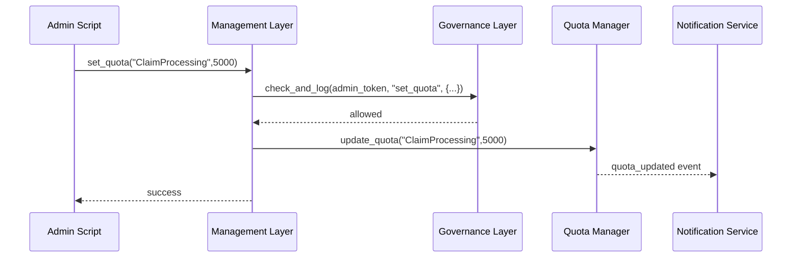

# Chapter 9: Management Layer

In [Chapter 8: Governance Layer](08_governance_layer_.md), we built our “inspector general” that enforces policies on every action. Now it’s time to connect those rules to real operational concerns—service orchestration, quotas, and performance SLAs—through the **Management Layer**. Think of it as the executive meeting room where department heads decide who gets what resources, when workflows run, and how fast they must respond.

---

## 1. Why We Need a Management Layer

Central to any federal IT system is balancing citizen demand, system capacity, and security rules.  
**Use Case**: Imagine the Unemployment Insurance Agency sees a sudden surge in applications after an economic downturn. The Management Layer must:

1. Allocate extra compute and messaging quotas to the “ClaimProcessing” service.
2. Orchestrate a batch job that cleans up stale requests overnight.
3. Ensure key endpoints meet a 200 ms maximum response time (SLA).

Without a central coordinator, each service would scramble independently—possibly violating security policies ([Chapter 8](08_governance_layer_.md)) or overloading databases.

---

## 2. Key Concepts

We break the Management Layer into three beginner-friendly pieces:

1. **Service Orchestration**  
   - Defines workflows across multiple services (e.g., nightly claim cleanup).  
2. **Quota Manager**  
   - Sets and enforces resource limits (CPU, memory, message rates) per department or service.  
3. **SLA Monitor**  
   - Tracks response times against Service Level Agreements and triggers alerts or auto-scaling.

Together, they tie governance rules to actual system behavior and user demand.

---

## 3. Using the Management Layer

Here’s a minimal Python example showing how an administrator script might use the Management Layer APIs:

```python
# admin_script.py
from hms_mgt.management import ManagementService

mgr = ManagementService(api_token="ADMIN_TOKEN")

# 1. Increase quota for claim processing
mgr.set_quota(service="ClaimProcessing", max_messages_per_minute=5000)

# 2. Schedule nightly cleanup workflow at 2 AM
mgr.schedule_workflow(
    name="stale_claim_cleanup",
    cron="0 2 * * *",
    steps=["ValidateClaims", "ArchiveOld", "NotifyTeams"]
)

# 3. Define SLA for critical API
mgr.define_sla(
    endpoint="/interface/claims/submit",
    max_latency_ms=200
)
```

Explanation:
- `set_quota()` adjusts messaging rates.
- `schedule_workflow()` orchestrates a multi-step job on a cron schedule.
- `define_sla()` tells the system to monitor latency and react if it’s violated.

---

## 4. Step-by-Step Flow

Below is what happens when `set_quota()` runs:



1. **Management Layer** asks **Governance Layer** for permission.  
2. If allowed, it calls the **Quota Manager**.  
3. The Quota Manager emits an event so other services can pick up new limits.

---

## 5. Under the Hood: Implementation

### 5.1 ManagementService Orchestrator

File: `hms_mgt/management.py`

```python
# hms_mgt/management.py
from hms_gov.governance import GovernanceService
from .quota import QuotaManager
from .orchestrator import WorkflowOrchestrator
from .sla import SLAMonitor

class ManagementService:
    def __init__(self, api_token):
        self.gov = GovernanceService(policy_file="gov-policies.yml")
        self.quota = QuotaManager()
        self.orch = WorkflowOrchestrator()
        self.sla = SLAMonitor()

    def set_quota(self, service, max_messages_per_minute):
        self.gov.check_and_log(api_token, "set_quota", {"service":service})
        self.quota.update(service, max_messages_per_minute)

    # schedule_workflow and define_sla follow a similar pattern...
```

Explanation:
- We inject the **GovernanceService** to enforce policy.
- We forward calls to the specialized subcomponents.

### 5.2 QuotaManager

File: `hms_mgt/quota.py`

```python
# hms_mgt/quota.py
class QuotaManager:
    def update(self, service, rate_limit):
        # Imagine this writes to a shared config store
        ConfigStore.set(f"quota:{service}", rate_limit)
        EventBus.publish("QuotaUpdated", {"service":service, "rate":rate_limit})
```

Explanation:
- Stores new quota in a config database.
- Publishes an event so services reload their limits.

### 5.3 WorkflowOrchestrator

File: `hms_mgt/orchestrator.py`

```python
# hms_mgt/orchestrator.py
class WorkflowOrchestrator:
    def schedule(self, name, cron, steps):
        ScheduleDB.insert({"name":name, "cron":cron, "steps":steps})
```

Explanation:
- Saves workflow definitions for the scheduler to run at specified times.

### 5.4 SLAMonitor

File: `hms_mgt/sla.py`

```python
# hms_mgt/sla.py
class SLAMonitor:
    def define(self, endpoint, max_latency_ms):
        ConfigStore.set(f"sla:{endpoint}", max_latency_ms)
        MonitoringService.register(endpoint, max_latency_ms)
```

Explanation:
- Records SLA targets and tells the real-time monitor to watch that endpoint.

---

## 6. Summary & Next Steps

In this chapter, you learned how the **Management Layer**:

- Coordinates mid-level concerns: **orchestration**, **quotas**, and **SLAs**  
- Relies on the [Governance Layer](08_governance_layer_.md) for policy checks  
- Uses simple subcomponents (QuotaManager, WorkflowOrchestrator, SLAMonitor) under the hood  

Next up, we’ll dive into live observations with **[Chapter 10: Real-Time Metrics & Monitoring](10_real_time_metrics___monitoring_.md)** to see how SLAs and quotas perform in action!

---

Generated by [AI Codebase Knowledge Builder](https://github.com/The-Pocket/Tutorial-Codebase-Knowledge)