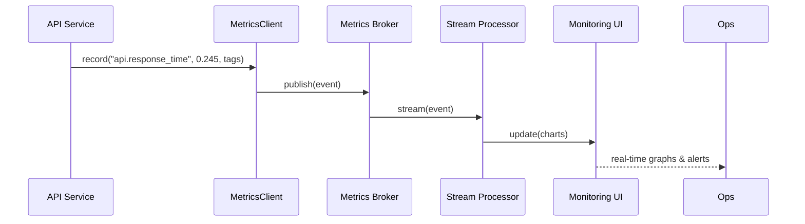
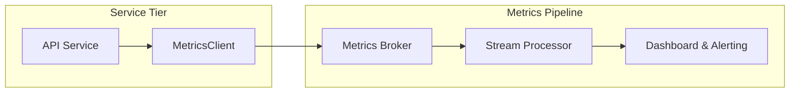

# Chapter 10: Real-Time Metrics & Monitoring

Building on the resource controls and SLAs we set in [Chapter 9: Management Layer](09_management_layer_.md), we now need live visibility into how our system actually behaves. In this chapter we’ll introduce **Real-Time Metrics & Monitoring**, our “control room display” for HMS-DEV, so that both AI agents and human supervisors can watch performance indicators as they happen, spot issues early, and verify that changes deliver the intended benefits—or roll them back if they don’t.

---

## 1. Why Real-Time Metrics & Monitoring?

**Central Use Case:**  
Imagine the U.S. Sentencing Commission’s online policy-lookup API suddenly slows down after a new rule deployment. Without real-time metrics, staff wouldn’t know until dozens of lawyers complain. By streaming response times, error rates, and even user satisfaction scores into a live dashboard, the operations team can:

- Spot the spike in latency immediately  
- Drill into endpoints and regions affected  
- Trigger an alert (e.g., email or Slack)  
- Roll back the latest policy or scale resources  

This chapter shows you how to collect, process, and visualize those metrics in real time—just like air traffic controllers monitor dozens of radar blips.

---

## 2. Key Concepts

We break Real-Time Metrics & Monitoring into four beginner-friendly pieces:

1. **Metric Collection**  
   Lightweight client libraries that let any service record events (response times, override counts).

2. **Streaming & Aggregation**  
   A broker or pipeline that ingests raw metric events, then computes aggregates (averages, percentiles).

3. **Dashboard & Alerts**  
   A web-based UI showing live charts and thresholds; snares your attention when metrics cross warning levels.

4. **Feedback Loop**  
   Connecting alerts back into [Management Layer](09_management_layer_.md) or human workflows (e.g., HITL overrides) so you can act immediately.

Think of it as the dispatch center’s wall of screens—each showing a map, gauges, or alarms.

---

## 3. Recording Metrics in Your Code

Here’s a minimal example in Python that measures API response time and publishes it:

```python
# service_handler.py
from time import time
from hms_mon.client import MetricsClient

metrics = MetricsClient(broker_url="http://metrics-broker")

def handle_request(request):
    start = time()
    # … your existing logic …
    duration = time() - start

    metrics.record(
        name="api.response_time",
        value=duration,
        tags={"endpoint": request.path}
    )
    return {"status": "ok"}
```

Explanation:
- We wrap our request handler to capture `start`/`end` times.
- `MetricsClient.record()` sends the data point to our metrics broker.
- You can add more calls, e.g., `metrics.record("hitl.override_rate", 1, ...)` whenever a human override happens.

---

## 4. Step-by-Step Flow



1. The **Service** calls `MetricsClient.record()`.  
2. **MetricsClient** publishes an event to the **Broker** (e.g., Kafka).  
3. A **Stream Processor** (e.g., Flink or custom) computes aggregates.  
4. The **Dashboard** shows live charts and fires alerts if thresholds are crossed.

---

## 5. Under the Hood: Simple Implementation

### 5.1 MetricsClient (hms_mon/client.py)

```python
# hms_mon/client.py
import requests

class MetricsClient:
    def __init__(self, broker_url):
        self.broker_url = broker_url

    def record(self, name, value, tags=None):
        payload = {"name": name, "value": value, "tags": tags or {}}
        # Send to our broker’s HTTP endpoint
        requests.post(f"{self.broker_url}/ingest", json=payload)
```

Explanation:
- We package metric name, value, and optional tags into JSON.
- We rely on an HTTP endpoint of our Broker for simplicity.

### 5.2 Stream Processor (hms_mon/processor.py)

```python
# hms_mon/processor.py
from collections import defaultdict
import time

class StreamProcessor:
    def __init__(self):
        self.buckets = defaultdict(list)

    def stream(self, event):
        key = (event["name"], tuple(event["tags"].items()))
        self.buckets[key].append(event["value"])
        # Simplified: every 10 sec compute average
        if time.time() % 10 < 0.1:
            avg = sum(self.buckets[key]) / len(self.buckets[key])
            self.push_to_dashboard(event["name"], avg, event["tags"])

    def push_to_dashboard(self, name, avg, tags):
        # Could call a WebSocket or HTTP API
        pass
```

Explanation:
- We collect values per (name+tags) and periodically compute averages.
- Real systems would use a dedicated stream engine and windowed aggregations.

### 5.3 Dashboard & Alerts

A real dashboard might be Grafana or a simple React app. Internally, it:

- Subscribes to updates from `StreamProcessor.push_to_dashboard()`.  
- Renders line charts for each metric.  
- Compares against thresholds (configured via [Management Layer](09_management_layer_.md)).  
- Fires alerts (email, SMS, or Slack) when breached.

---

## 6. Putting It All Together



- Every service in HMS-DEV can embed `MetricsClient`.  
- Our pipeline turns raw events into actionable insights.  
- Dashboards let AI Agents and human supervisors verify changes deliver benefits—if not, they can use the [Management Layer](09_management_layer_.md) to roll back or scale.

---

## 7. Summary & Next Steps

You’ve learned how **Real-Time Metrics & Monitoring** lets us:

- Collect key performance indicators (latency, satisfaction, override rates)  
- Stream and aggregate them for live dashboards  
- Configure alerts to detect issues immediately  
- Close the loop by tying alerts back into automated management workflows  

Up next, we’ll dive into **[Chapter 11: Audit & Compliance Logging](11_audit___compliance_logging_.md)** to see how every action—metrics included—is recorded for full traceability and regulatory compliance.

---

Generated by [AI Codebase Knowledge Builder](https://github.com/The-Pocket/Tutorial-Codebase-Knowledge)