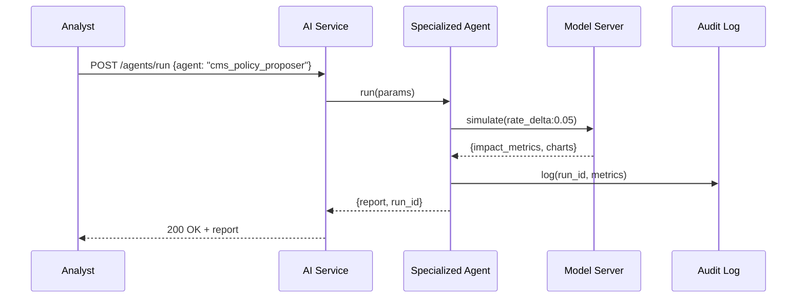

# Chapter 10: Specialized AI Agents

Building on our smart menus from [Intent-Driven Navigation](09_intent_driven_navigation_.md), we now introduce **Specialized AI Agents**—virtual consultants embedded in HMS-DEV that focus on one domain: healthcare policy, financial compliance, budgeting analysis, and more.  

---

## 10.1 Motivation: Virtual Consultants for Government Work

Imagine the Centers for Medicare & Medicaid Services (CMS) wants to **propose updates** to a Medicaid reimbursement rule. Or the Federal Financial Institutions Examination Council (FFIEC) needs a **budget analyzer** to ensure branch budgets meet compliance thresholds.  

A **Specialized AI Agent** can:

- Ingest regulations, past decisions, financial data  
- Run “what-if” simulations (e.g., rate changes)  
- Suggest optimized policy or budget adjustments with clear rationale  

Think of it as having a domain expert on staff 24/7—ready to crunch numbers and draft proposals.

---

## 10.2 Key Concepts

1. **Domain**  
   The specialized subject area (e.g., CMS healthcare rules, FFIEC budgets).

2. **Agent**  
   A self-contained service with the skills needed for that domain (data loader, simulator, optimizer).

3. **Data Ingestion**  
   How the agent pulls in domain data (regulations, budgets, audit logs).

4. **Simulation Engine**  
   Runs scenarios based on input parameters (e.g., budget cuts, policy rate hikes).

5. **Recommendation Output**  
   A structured suggestion: numbers, charts, plain-language explanation.

---

## 10.3 Using a Specialized AI Agent

### 1. Define Your Agent in YAML

```yaml
# policy_proposer.yaml
agents:
  cms_policy_proposer:
    domain: healthcare_regulations
    data_sources: [cms_rules.json, historical_decisions.csv]
    steps:
      - load_data
      - simulate_rate_change
      - optimize_impact
      - generate_report
```

*This tells HMS-DEV: “Here’s a `cms_policy_proposer` that works in healthcare, loads data, simulates changes, and makes a report.”*

### 2. Call the Agent in Code

```python
# use_agent.py
from hms_ai import SpecializedAgent

agent = SpecializedAgent("policy_proposer.yaml", "cms_policy_proposer")
report = agent.run(simulation_params={"rate_delta": 0.05})
print(report.summary)
```

*We load the YAML, pick our `cms_policy_proposer`, supply a 5% rate change, and get back a human-readable summary.*

---

## 10.4 What Happens Under the Hood



1. **Analyst** calls the AI Service to run the agent.  
2. The **Specialized Agent** loads data and calls the **Model Server**.  
3. Model Server returns metrics and visuals.  
4. Agent writes an entry to **Audit Log**.  
5. A structured **report** flows back to the user.

---

## 10.5 Inside a Specialized Agent (Code)

### 1. Agent Class Skeleton

```python
# hms_ai/agent.py
import yaml

class SpecializedAgent:
    def __init__(self, cfg_file, name):
        cfg = yaml.safe_load(open(cfg_file))["agents"][name]
        self.steps = cfg["steps"]
    def run(self, **params):
        ctx = {"params": params}
        for step in self.steps:
            fn = getattr(self, step)
            ctx = fn(ctx)
        return ctx["report"]
```

*We load steps from YAML and run them in order, passing along a context dict.*

### 2. Step Implementations

```python
# hms_ai/agent.py (continued)

    def load_data(self, ctx):
        # pretend to load JSON/CSV
        ctx["data"] = {"rules": "...", "history": "..."}
        return ctx

    def simulate_rate_change(self, ctx):
        # call model server (details omitted)
        ctx["results"] = {"cost": 1.2e7, "access_change": 0.03}
        return ctx

    def optimize_impact(self, ctx):
        # simple adjustment loop...
        ctx["optimized"] = {"rate": ctx["params"]["rate_delta"]}
        return ctx

    def generate_report(self, ctx):
        # assemble summary + charts
        ctx["report"] = {
          "summary": f"Changing rate by {ctx['optimized']['rate']*100}% "
                     f"yields cost {ctx['results']['cost']:,}.",
          "details": ctx["results"]
        }
        return ctx
```

*Each method updates `ctx`. The final `report` has a clear summary and raw details.*

---

## 10.6 Conclusion

In this chapter you learned:

- **Why** Specialized AI Agents are like embedded consultants for CMS rules or FFIEC budgets.  
- **Key concepts**: domain focus, data ingestion, simulation, optimization, reporting.  
- **How to define** an agent in YAML and **invoke** it in code.  
- **What happens** under the hood (sequence diagram) and a peek into a minimal Python implementation.  

Next up, we’ll bring humans back into the loop for oversight in [Human-in-the-Loop (HITL) Oversight](11_human_in_the_loop__hitl__oversight_.md).

---

Generated by [AI Codebase Knowledge Builder](https://github.com/The-Pocket/Tutorial-Codebase-Knowledge)