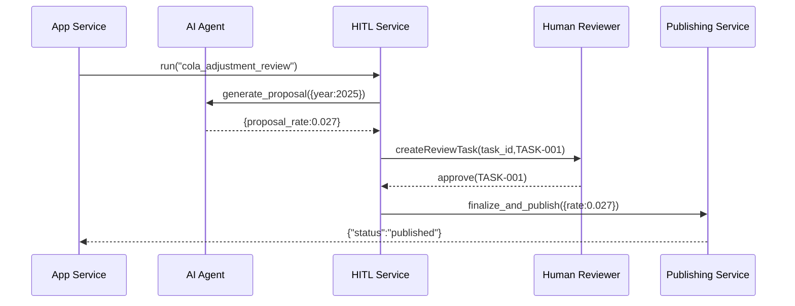

# Chapter 11: Human-in-the-Loop (HITL) Oversight

_In the previous chapter we built [Specialized AI Agents](10_specialized_ai_agents_.md) that draft policy proposals or budget analyses. Now we’ll add a critical safety net: let real experts review, adjust, and sign off those AI-generated suggestions before anything goes live._

---

## 11.1 Why Human-in-the-Loop (HITL) Oversight?

Imagine the Social Security Administration (SSA) uses an AI agent to propose the annual Cost-of-Living Adjustment (COLA) for benefits. The AI crunches CPI data and suggests a 2.7% increase. Before publishing:

- A **senior economist** must verify the data sources.
- A **committee** might adjust the rate based on policy goals.
- We need an **audit trail** so Congress can see who approved what.

That review step—**Human-in-the-Loop Oversight**—is our safety net. It ensures accountability, domain expertise, and public trust before a new policy or process goes live.

---

## 11.2 Key Concepts

1. **AI-Generated Proposal**  
   The draft output from a [Specialized AI Agent](10_specialized_ai_agents_.md).

2. **Human Reviewer**  
   A domain expert (economist, policy analyst, legal counsel) who inspects and approves the draft.

3. **Approval Workflow**  
   A defined process that routes proposals to reviewers and tracks decisions.

4. **Review Task**  
   A “to‐do” item generated by the system, assigned to one or more reviewers.

5. **Audit Record**  
   A permanent log of who saw the proposal, what changes were made, and the final decision.

---

## 11.3 Using HITL Oversight in Your App

### 1. Define an Oversight Pipeline

```yaml
# hitl_pipeline.yaml
pipelines:
  cola_adjustment_review:
    steps:
      - generate_proposal        # AI drafts COLA %
      - request_human_review     # send to economist
      - finalize_and_publish     # after approval, push live
```

*This YAML says: run AI first, then pause for human review, then publish.*

### 2. Invoke the Pipeline

```python
# app.py
from hitl import HITLOversight

oversight = HITLOversight("hitl_pipeline.yaml")

# 1. AI generates its draft
ctx = oversight.run("cola_adjustment_review", {'year':2025})

# 2. The service pauses and returns a review task
print(ctx['task_id'], ctx['proposal'])
# → TASK-001, {'proposal_rate': 0.027}

# 3. Once an economist approves:
approved = oversight.approve(ctx['task_id'], reviewer="econ_lead")
print("Approved:", approved)
```

- `run()` executes up to `request_human_review` and hands you a `task_id`.  
- You present the proposal to a human via a UI.  
- The reviewer calls `approve()` to continue the pipeline.

---

## 11.4 Under the Hood: Sequence Walkthrough



1. The App calls **HITL Service**.  
2. **HITL** invokes the AI Agent to draft a proposal.  
3. A **review task** is created for the Human Reviewer.  
4. Reviewer approves via UI, calling back into **HITL Service**.  
5. The pipeline resumes and the **Publishing Service** makes the rate live.

---

## 11.5 Inside the HITL Oversight Implementation

### 1. Loading the Pipeline

```python
# hitl/oversight.py
import yaml

class HITLOversight:
    def __init__(self, pipeline_file):
        self.pipes = yaml.safe_load(open(pipeline_file))['pipelines']
```

*We read the YAML into a Python dict.*

### 2. Running Up to Human Review

```python
    def run(self, name, params):
        steps = self.pipes[name]['steps']
        ctx = {'params': params}
        for step in steps:
            fn = getattr(self, step)
            ctx = fn(ctx)
            if step == 'request_human_review':
                return ctx  # Pause here and return task info
        return ctx
```

*We loop through steps. On `request_human_review`, we stop and hand back control.*

### 3. Requesting Human Review

```python
    def request_human_review(self, ctx):
        task_id = f"TASK-{int(time.time())}"
        proposal = ctx['proposal']
        # Imagine storing task in DB and notifying reviewer
        ctx.update({'task_id': task_id})
        return ctx
```

*Here we generate a `task_id` and return it along with the draft proposal.*

### 4. Approving the Task

```python
    def approve(self, task_id, reviewer):
        # Load task, mark approved by reviewer
        # Continue remaining steps:
        ctx = load_task(task_id)
        return self.finalize_and_publish(ctx)
```

*When `approve()` is called, we fetch the saved context and resume the pipeline.*

---

## 11.6 Conclusion

You’ve now added a **Human-in-the-Loop Oversight** layer to:

- Pause AI pipelines for expert review  
- Create and track human review tasks  
- Ensure final sign-off before publishing changes  

Next up, we’ll explore how HMS-DEV tracks all of these events and measures performance in [Monitoring and Metrics](12_monitoring_and_metrics_.md).

---

Generated by [AI Codebase Knowledge Builder](https://github.com/The-Pocket/Tutorial-Codebase-Knowledge)