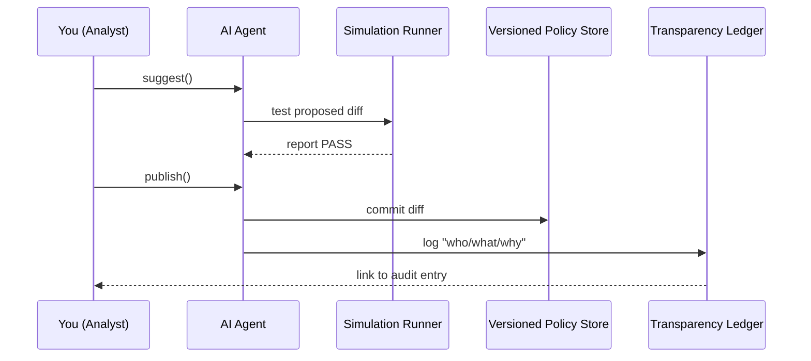

# Chapter 12: AI Representative Agent (HMS-A2A)

*(A friendly sequel to [Domain-Specific Modules](11_domain_specific_modules_.md))*  

---

## 1. Why Do We Need a “Digital Policy Analyst”?

Picture the **National Labor Relations Board (NLRB)**.  
Every month field offices file thousands of *Unfair Labor Practice* forms.  
Analysts notice two problems:

1. 12 % of forms are bounced back because **Section 3b** is often skipped.  
2. A new memo from OMB says the confirmation letter must now cite *Paperwork Reduction Act §3507*.

Normally, fixing this would require:

* Sifting through error logs  
* Re-reading the OMB memo  
* Writing a change request  
* Scheduling human testers  

That’s weeks of work.

**AI Representative Agent (HMS-A2A)** is your **“GS-15 digital analyst”** who:

1. Reads logs, user feedback, and memos.  
2. Suggests (or auto-creates) policy & form tweaks.  
3. Runs safe simulations.  
4. Publishes approved changes through platform APIs.  
5. Records every step for FOIA and IG audits.

Think of A2A as the seasoned staffer who whispers,  
> “The fix is to make Section 3b required and update the confirmation template. Ready for a 5-minute review?”

---

## 2. Key Concepts (Plain-English)

| Term | Beginner Explanation |
|------|----------------------|
| **Digesters** | Little jobs that read sources (logs, memos, user comments) and turn them into structured facts. |
| **Suggestion Engine** | A rules-plus-AI brain that spots patterns and drafts changes. |
| **Policy Diff** | A side-by-side “before vs. after” file showing exactly what would change. |
| **Simulation Runner** | Sandboxes that replay last week’s traffic against the new rules to prove nothing breaks. |
| **Transparency Ledger** | An immutable log (FOIA-ready!) of what A2A saw, suggested, and who approved it. |

---

## 3. A 4-Step Walk-Through: Fixing Section 3b

We’ll ask A2A to solve the skipped-field problem.

### 3.1 Pull Recent Insights (CLI, 1 line)

```bash
hms a2a digests pull --last 7d --sources logs,feedback
```

Output (snippet):

```
✔ 1 423 “missing section 3b” errors detected
```

> *What happened?*  
> A digester scanned log lines like `ValidationError: section_3b required`.

### 3.2 Let A2A Draft a Fix (CLI, 1 line)

```bash
hms a2a suggest --issue "section 3b missing"
```

Returns a **policy diff**:

```diff
# file: nrlb_unfair_practice_form.yaml
-  section_3b:
-    required: false
+  section_3b:
+    required: true
    label: "Describe the unfair labor practice"
```

And a **template diff**:

```diff
-  "Thank you for your submission."
+  "Thank you for your submission.  (PRA §3507 compliant)"
```

### 3.3 Dry-Run the Simulation (CLI, 1 line)

```bash
hms a2a simulate --diff 42 --events last_week
```

Console:

```
✅ 8 214 / 8 214 past submissions still pass
🚫 0 regressions
```

### 3.4 Publish After Human Sign-Off (CLI, 1 line)

```bash
hms a2a publish --diff 42 --approver "alice.ig@nrlb.gov"
```

Result:

```
✔ Diff merged into Versioned Policy Store (hash 9d3c7a)
✔ PPE reloaded rules
✔ Transparency ledger updated
```

Total fix time: **~10 minutes**.

---

## 4. What Actually Happens? (5-Actor Story)



Five players—easy to keep in mind.

---

## 5. Tiny Code Peeks (Each < 20 lines)

### 5.1 Generating a Policy Diff (Python, 18 lines)

```python
# file: a2a/diff.py
import difflib, yaml

def create_diff(old_text: str, new_text: str) -> str:
    old = yaml.safe_dump(yaml.safe_load(old_text)).splitlines()
    new = yaml.safe_dump(yaml.safe_load(new_text)).splitlines()
    diff = difflib.unified_diff(
        old, new, fromfile='before', tofile='after', lineterm='')
    return '\n'.join(diff)
```

**Explanation:**  
Loads the YAMLs, re-dumps them to normalize spacing, then uses Python’s `difflib` to get a Git-style diff.

---

### 5.2 A Super-Small Simulation Stub (Go, 15 lines)

```go
// file: sim/run.go
func Replay(events []Event, rule Rule) (int pass, int fail) {
  for _, e := range events {
     if rule.Apply(e) {
        pass++
     } else { fail++ }
  }
  return
}
```

**Explanation:**  
Loops through past events, applies the new rule, counts passes vs. fails.  
(In production the Rule object comes from the compiled YAML in [Policy & Process Engine](04_policy___process_engine_.md).)

---

## 6. How A2A Connects to Other HMS Layers

| Layer | What A2A Does With It |
|-------|-----------------------|
| [Governance Layer](03_governance_layer__hms_gov__.md) | Checks if auto-publish is allowed or if human sign-off is mandatory. |
| [Policy & Process Engine](04_policy___process_engine_.md) | Receives new/updated rules after publish. |
| [Versioned Policy Store](05_versioned_policy_store_.md) | Stores every diff with author, timestamp, and commit hash. |
| [Human-in-the-Loop Workflow](14_human_in_the_loop__hitl__workflow_.md) | Routes low-confidence suggestions to human reviewers. |
| [Observability & Metrics Pipeline](13_observability___metrics_pipeline_.md) | Emits events like `a2a.suggestions.count` and `a2a.publish.time`. |

---

## 7. Quick-Start Checklist

1. Enable A2A in your project: `hms a2a enable`.  
2. Pull digests: `hms a2a digests pull --last 7d`.  
3. Generate a suggestion: `hms a2a suggest --issue "<desc>"`.  
4. Review the policy diff (always human-readable).  
5. `hms a2a simulate --diff <id>` until you’re happy.  
6. Publish with an approver email to lock the audit trail.

That’s it—your “digital GS-15” is on the job!

---

## 8. Beginner FAQ

**Q: Will A2A ever change production without a human?**  
Only if the Governance Layer marks the scope as *auto-publish=true* **and** the confidence score exceeds a threshold. Otherwise it waits for sign-off.

**Q: Where are the logs stored?**  
In the Transparency Ledger stream inside the [Observability & Metrics Pipeline](13_observability___metrics_pipeline_.md).

**Q: Can A2A read classified memos?**  
No—digester permissions are enforced by [RBAC](08_role_based_access_control__rbac__.md). You choose which inputs it may see.

**Q: What if the simulation fails?**  
A2A marks the diff as **blocked** and opens a ticket in the [Human-in-the-Loop Workflow](14_human_in_the_loop__hitl__workflow_.md).

---

## 9. Summary & What’s Next

In this chapter you:

• Met **HMS-A2A**, the AI agent that watches logs & memos, drafts safe policy diffs, and keeps impeccable audit trails.  
• Fixed a real-world form error in minutes, not weeks.  
• Peeked under the hood at diffing and simulation code.  
• Saw how A2A fits into Governance, Policy Engine, VPS, HITL, and Observability.

Ready to see where all those transparency logs and metrics land?  
Head over to [Observability & Metrics Pipeline](13_observability___metrics_pipeline_.md).

---

Generated by [AI Codebase Knowledge Builder](https://github.com/The-Pocket/Tutorial-Codebase-Knowledge)