# Chapter 12: Micro-Frontend Library (HMS-MFE)

*[← Back to Chapter&nbsp;11: Operational Nerve Center (HMS-OPS)](11_operational_nerve_center__hms_ops__.md)*  

---

## 0. Why Do We Need HMS-MFE? — The “One Form, Fifty Looks” Nightmare  

A citizen wants to see **retirement-benefit status** on the Social Security (SSA) website.  
Minutes later the same person checks an **export-tariff dashboard** run by the U.S. International Trade Commission (USITC).

Both screens must:  
1. Work with screen readers.  
2. Respect the agency brand (blue vs. burgundy).  
3. Re-use the *exact* security checks from HMS back-end.  

Without a shared front-end kit, every agency rebuilds buttons, pagination tables, and auth wrappers—creating 12 different “Submit” buttons that behave slightly differently and fail 508 audits.

**HMS-MFE** is the *LEGO box* that solves this.  
Grab a block, snap it in, ship the page. No CSS wars, no security copy-paste.

---

## 1. Key Concepts — Five Blocks to Remember

| Block | Playground Analogy | One-Line Job |
|-------|--------------------|--------------|
| Widget | LEGO brick | Reusable UI piece (`<HmsButton/>`) |
| Theme Token | Paint pot | Colors & fonts for an agency |
| Guard Wrapper | Safety goggles | Auto checks user auth/role |
| Data Hook | Power plug | Fetches data through [HMS-API](10_backend_service_mesh__hms_svc___hms_api__.md) |
| Accessibility Contract | Rule book | Guarantees WCAG/Section 508 pass |

Keep repeating: **Widget + Theme + Guard + Hook → Accessible UI**.

---

## 2. 3-Step Mental Model

```mermaid
flowchart LR
  A[Widget] --> B[Theme Token]
  A --> C[Guard Wrapper]
  A --> D[Data Hook]
  B & C & D --> E[Citizens See Page 🎉]
```



1. Drop a **Widget** into code.  
2. Widget auto-receives agency **Theme Tokens**.  
3. **Guard Wrapper** hides it unless the user is allowed.  
4. **Data Hook** streams JSON from the service mesh.  
5. The citizen sees a branded, secure, accessible component.

---

## 3. “Hello MFE” — One Button, Two Agencies (20 Lines Total)

### 3.1 Install Once

```bash
npm install @hms-dev/mfe
```

### 3.2 React Code (<=18 lines)

```jsx
// RetirementStatus.jsx  (SSA site)
import { HmsButton, useHmsData } from "@hms-dev/mfe";

export default function RetirementStatus() {
  const { data, loading } = useHmsData("benefits.status.v1");
  if (loading) return "Loading…";
  return (
    <HmsButton variant="primary" onClick={()=>alert(data.amount)}>
      Show Monthly Amount
    </HmsButton>
  );
}
```

Beginner walk-through  
1. `useHmsData("benefits.status.v1")` pulls JSON through the [Service Mesh](10_backend_service_mesh__hms_svc___hms_api__.md).  
2. `<HmsButton/>` already knows SSA’s blue palette from its **Theme Tokens**.  
3. Guard Wrapper checks the citizen’s login before firing the API.

### 3.3 Same Code, Different Brand (USITC)

```jsx
// TariffLookup.jsx  (USITC site)
import { HmsButton, useHmsData } from "@hms-dev/mfe";

export default function TariffLookup() {
  const { data } = useHmsData("tariff.rate.v2", { code: "6403.99" });
  return <HmsButton>{`Rate: ${data.rate}%`}</HmsButton>;
}
```

No CSS edits—the theme auto-switches to USITC burgundy.

---

## 4. What Happens Under the Hood?


5 actors, 5 steps—everything uses MCP envelopes.

---

## 5. Tiny Peek at Widget Source (≤18 Lines)

```tsx
// src/HmsButton.tsx  (simplified)
import { useTheme } from "./theme";
import { withGuard } from "./guard";
export function HmsButton({ children, ...props }) {
  const theme = useTheme();              // 1️⃣ palette & fonts
  const Btn = withGuard("click")(props.onClick); // 2️⃣ auth check
  return (
    <button
      style={{ background: theme.primary, color: theme.onPrimary }}
      onClick={Btn}
    >
      {children}
    </button>
  );
}
```

Line-by-line  
1. `useTheme()` pulls tokens (blue vs. burgundy).  
2. `withGuard("click")` wraps the handler, verifying the user role; denied clicks show a “Please sign in” toast.  
3. Render native `<button>` with guaranteed contrast ratio ≥ 4.5:1 (Accessibility Contract).

---

## 6. Building a Custom Widget in 12 Lines: `<HmsDataTable/>`

```tsx
// MyAgencyTable.jsx
import { createHmsWidget } from "@hms-dev/mfe";

export const HmsDataTable = createHmsWidget({
  name: "myagency.table",
  render: ({ rows }) => (
    <table>
      <thead><tr>{Object.keys(rows[0]).map(k=><th>{k}</th>)}</tr></thead>
      <tbody>
        {rows.map(r=>(
          <tr>{Object.values(r).map(v=><td>{v}</td>)}</tr>
        ))}
      </tbody>
    </table>
  ),
  requires: ["read_only"],      // capability tag checked by Guard
});
```

Drop it into any site; theme & accessibility are injected for free.

---

## 7. Linking Back to Other Layers

Layer | Why It Matters to MFE
------|-----------------------
[HMS-API Mesh](10_backend_service_mesh__hms_svc___hms_api__.md) | **Data Hooks** fetch JSON by tool name. |
[HMS-ESQ](04_compliance___legal_reasoning__hms_esq__.md) | Guard Wrapper calls ESQ when widget may expose sensitive data. |
[Data Spine](09_data_spine__hms_dta__.md) | Widgets can subscribe to live version events (`dataset.version.created`). |
[OPS](11_operational_nerve_center__hms_ops__.md) | Widget performance metrics auto-flow to probes. |

---

## 8. Common Pitfalls (and How MFE Saves the Day)

Problem | Old World | With HMS-MFE
--------|-----------|-------------
Inconsistent branding | 12 shades of blue | Theme Tokens per agency
Copy-pasted auth logic | Hidden XSS risk | Guard Wrapper auto-checks
508 violations | Manual audits | Accessibility Contract baked in
Complex data fetch code | Boilerplate axios | One-line Data Hook
Front-end drift from back-end | Version mismatch | Tool names link to Service Mesh versioning

---

## 9. Recap & What’s Next

You now know that **HMS-MFE**:

• Offers plug-and-play **Widgets** with auto-theming and accessibility.  
• Shields every interaction with a **Guard Wrapper**.  
• Pulls live data through **Data Hooks** that speak in tool names familiar from the back-end.  
• Lets agencies look unique on the outside while sharing 90 % of code underneath.

Ready to see how humans can override, pause, or audit these widgets—and every other HMS layer—in real time?  
Head to [Human-in-the-Loop Oversight Console (HMS-GOV)](13_human_in_the_loop_oversight_console__hms_gov__.md).

---

---

Generated by [AI Codebase Knowledge Builder](https://github.com/The-Pocket/Tutorial-Codebase-Knowledge)