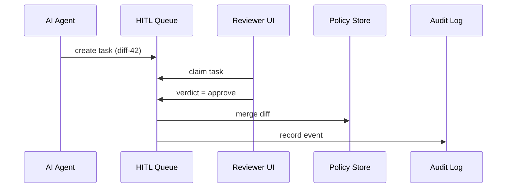

# Chapter 14: Human-in-the-Loop (HITL) Workflow  
*(A friendly sequel to [Observability & Metrics Pipeline](13_observability___metrics_pipeline_.md))*  

---

## 1. Why Do We Need a “Pause Button” for AI?

Picture the **U.S. Department of Homeland Security (DHS)** preparing a new *Real-ID Extension* notice for the *Federal Register*.

1. The **AI Representative Agent** (see [AI Representative Agent](12_ai_representative_agent__hms_a2a__.md)) drafts the notice in 30 seconds.  
2. A tight statute says it must publish **by Friday**—great!  
3. But an Assistant Secretary must still **sign** it, otherwise it’s *null and void*.

We therefore need a **built-in checkpoint** where real officials can:

* **Override** – rewrite anything incorrect.  
* **Edit** – tweak language, add footnotes.  
* **Rubber-stamp** – approve when it’s perfect.  

That checkpoint is the **Human-in-the-Loop (HITL) Workflow**: a structured pause that keeps AI fast **and** decisions accountable.

---

## 2. Key Concepts (Plain-English)

| Term | Beginner Explanation |
|------|----------------------|
| **Task** | One item waiting for human attention (e.g., “Review Federal Register draft”). |
| **Queue** | A first-in-first-out line of tasks. |
| **Reviewer** | A human with an RBAC role (e.g., `ASSISTANT_SECRETARY`). |
| **Verdict** | The reviewer’s action: **approve**, **edit**, **reject**. |
| **Audit Trail** | Automatic log of who did what, when, and why. |

---

## 3. Five-Minute Walk-Through: Publishing the Real-ID Notice

### 3.1 AI Drafts the Notice

```bash
hms a2a suggest --issue "Real-ID extension notice"
# returns diff-42   (see Chapter 12)
```

Behind the scenes the AI sets `confidence = 0.74`, below the auto-publish threshold, so it **pushes a HITL task**:

```bash
hms hitl tasks:list
```

Output:

```
ID   Title                         Status   Assignee
T-17 “Review Real-ID Notice (diff-42)”  OPEN     —
```

### 3.2 A Human Reviews & Approves

```bash
hms hitl claim T-17 --as alice.napolitano@dhs.gov
# RBAC verifies Alice holds ASSISTANT_SECRETARY role
```

Edit & sign in a minimal web UI (5 fields: *diff*, *comment*, *approve*, *save*, *cancel*).

```bash
hms hitl verdict T-17 --action approve --comment "Looks good."
```

### 3.3 Result

* **Policy diff** merges into the [Versioned Policy Store](05_versioned_policy_store_.md).  
* The **AI Agent** receives an *“approved”* event and posts the notice.  
* An immutable record lands in the `hitl.audit` stream inside the [Observability Pipeline](13_observability___metrics_pipeline_.md).

Total human time: **under 3 minutes**; compliance = 100 %.

---

## 4. What Happens Under the Hood?



Five actors—easy to digest!

---

## 5. Minimal Code Tour (All < 20 Lines)

### 5.1 Creating a Task (Python, 12 lines)

```python
# file: hitl/api.py
import uuid, time, json, os

QUEUE = "/var/hitl/tasks/"        # simple file queue

def create_task(title, payload):
    tid = f"T-{uuid.uuid4().hex[:6]}"
    task = {
        "id": tid,
        "title": title,
        "status": "OPEN",
        "payload": payload,
        "created": time.time()
    }
    open(f"{QUEUE}{tid}.json", "w").write(json.dumps(task))
    return tid
```

*Explanation*: a plain JSON file becomes a task—good enough for local dev; production swaps in PostgreSQL or SQS.

### 5.2 Rendering the Review Form (React, 15 lines)

```jsx
// file: ui/TaskReview.jsx
import { useState } from 'react';
export default function TaskReview({ task }) {
  const [comment, setComment] = useState('');
  async function send(action) {
    await fetch(`/api/hitl/${task.id}/verdict`, {
      method: 'POST',
      body: JSON.stringify({ action, comment })
    });
  }
  return (
   <>
     <pre>{task.payload.diff}</pre>
     <textarea value={comment} onChange={e=>setComment(e.target.value)} />
     <button onClick={()=>send('approve')}>Approve</button>
     <button onClick={()=>send('reject')}>Reject</button>
   </>
  );
}
```

*Explanation*: fewer than 20 lines yields a functional review UI.

### 5.3 Applying the Verdict (Go, 18 lines)

```go
// file: hitl/verdict.go
func Verdict(tid, action, comment, user string) error {
  b, _ := os.ReadFile("/var/hitl/tasks/" + tid + ".json")
  var task map[string]interface{}
  json.Unmarshal(b, &task)

  task["status"]  = strings.ToUpper(action)
  task["assignee"] = user
  task["comment"] = comment
  task["closed"] = time.Now().Unix()

  os.WriteFile("/var/hitl/tasks/"+tid+".json",
               mustJSON(task), 0644)

  // emit audit log
  audit := fmt.Sprintf("hitl %s %s by %s", tid, action, user)
  http.Post("http://obs:8200/put", "text/plain",
            bytes.NewBufferString(audit))
  return nil
}
```

*Explanation*: updates the JSON file and pushes a log line to OBS.

---

## 6. How HITL Integrates with Other HMS Layers

| Layer | Interaction |
|-------|-------------|
| [AI Representative Agent](12_ai_representative_agent__hms_a2a__.md) | AI automatically opens tasks when confidence < threshold. |
| [Governance Layer](03_governance_layer__hms_gov__.md) | Defines which roles can **approve** vs. **reject** tasks. |
| [RBAC](08_role_based_access_control__rbac__.md) | Verifies the reviewer’s badge before they can claim a task. |
| [Policy & Process Engine](04_policy___process_engine_.md) | May pause a multi-step process until a HITL task is **approved**. |
| [Observability Pipeline](13_observability___metrics_pipeline_.md) | Stores `hitl.pending`, `hitl.approved`, and full audit logs. |

---

## 7. Quick-Start Checklist

1. `npm install @hms/hitl-sdk` or `pip install hms-hitl`  
2. Call `create_task()` whenever AI confidence is low or policy mandates human review.  
3. Embed `<TaskReview/>` MFE in any staff portal page.  
4. Ensure reviewers hold the right RBAC role.  
5. Watch `hitl.*` streams in the OBS dashboard for backlog or latency.

You now have an “AI safety brake” baked into every workflow!

---

## 8. Beginner FAQ

**Q: Can multiple reviewers see the same task?**  
Yes—tasks are visible until one person **claims** them. Claiming locks the file/row.

**Q: What if a reviewer edits the AI draft?**  
The UI uploads the edited diff; the HITL service merges it into the final payload before calling the Policy Store.

**Q: How long are tasks kept?**  
Defaults to 7 years to match federal record retention; configurable via Governance policy.

**Q: Does HITL slow everything down?**  
Only the items that need human eyes. Parallel jobs continue; PPE simply waits for the verdict event.

---

## 9. Summary & Next Steps

In this chapter you learned:

• Why government systems need a *pause button* for AI.  
• The anatomy of a HITL task, queue, reviewer, verdict, and audit trail.  
• How to create, review, and approve tasks with a few lines of code.  
• How HITL plugs into Governance, RBAC, Policy Engine, AI Agent, and Observability.

Ready to connect HMS-DEV with the **legacy systems** still running COBOL or external partner APIs?  
Proceed to [External System Sync Connector](15_external_system_sync_connector_.md).

---

Generated by [AI Codebase Knowledge Builder](https://github.com/The-Pocket/Tutorial-Codebase-Knowledge)