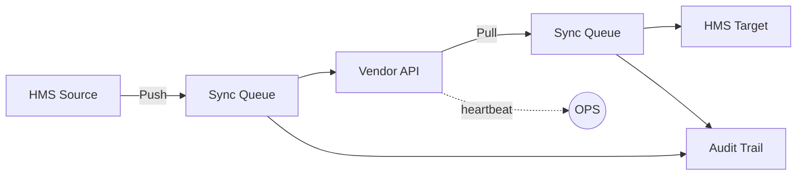
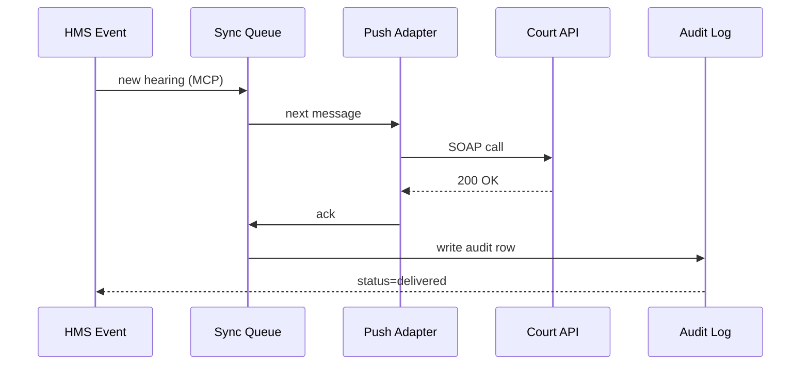

# Chapter 15: External System Synchronizer  
*(“One plug to rule all legacy plugs.”)*  

[← Back to Chapter&nbsp;14: Simulation & Training Sandbox (HMS-ESR)](14_simulation___training_sandbox__hms_esr__.md)

---

## 0. Why Do We Need a Synchronizer? — The Court-Calendar Chaos  

The **Department of Housing and Urban Development (HUD)** must evict a landlord who ignored safety orders.  
A paralegal types the case number into HMS and expects:

1. **Court Calendar** (a 1998 Oracle DB) to show the new hearing date.  
2. **Payment Gateway** (outsourced to a state vendor) to freeze subsidy payments.  
3. **Health-Record System** (hospital partner) to tag the property as unsafe.  

Today, each of those integrations is a one-off script that breaks whenever someone updates a password.

The **External System Synchronizer (HMS-SYN)** is our universal, plug-and-play adaptor that:

* PUSHES new HMS data to any legacy or 3rd-party API.  
* PULLS status from those systems in real time.  
* Guarantees nothing is lost—even if a vendor goes offline—thanks to fail-safe queues and audit trails.

No more midnight cron jobs or “Did the spreadsheet update?” phone calls.

---

## 1. Key Concepts — Five Words, One Sentence  

| Term | Everyday Analogy | One-Line Job |
|------|------------------|--------------|
| Push Adapter | Outgoing mail slot | Sends HMS updates to vendor |
| Pull Adapter | Incoming PO box | Polls vendor for status |
| Sync Queue | Conveyor belt | Stores messages until delivered |
| Audit Trail | CCTV camera | Records every hand-off |
| Heartbeat | “Are you alive?” ping | Detects offline vendors |

Remember: **Push → Queue → Vendor**, then **Vendor → Pull → Queue → HMS**, all watched by **Audit** and **Heartbeat**.

---

## 2. 3-Step Mental Model  



1. HMS pushes changes into the **Queue**.  
2. Adapter sends them to the **Vendor API**.  
3. Separate Pull Adapter brings back statuses.  
4. **Audit Trail** logs every hop; **OPS** watches heartbeats.

---

## 3. “Hello Synchronizer” — Updating a Legacy Court Calendar in 18 Lines  

### 3.1 Declare the Sync Job (YAML, 8 lines)

```yaml
# court_calendar_sync.yaml
job:
  name: "HUD → CountyCourtCalendar"
  push_adapter: "oracle.soap.v1"
  pull_adapter: "oracle.soap.v1"
  source_topic: "hud.hearing.created"
  target_endpoint: "https://court.example.gov/soap"
```

### 3.2 Publish an Event (HMS code, 6 lines)

```python
from hms_a2a import Bus
Bus("hud").publish_topic(
    "hud.hearing.created",
    {"case_id": "HUD-22-109", "date": "2024-09-02"}
)
```

### 3.3 Start the Synchronizer (CLI, 4 lines)

```bash
$ hms-syn start court_calendar_sync.yaml
⏳  Listening for hud.hearing.created …
```

When the event fires, HMS-SYN:

1. Adds it to the **Sync Queue**.  
2. Calls the Oracle SOAP endpoint.  
3. Marks “delivered” or retries with back-off.  
4. Logs the round-trip in the Audit Trail.

---

## 4. What Happens Under the Hood? (5 Actors, 7 Steps)



If `CT` is offline, `AD` retries; the message never disappears until acked.

---

## 5. Tiny Peek at Core Code (≤18 Lines)

```python
# hms_syn/core.py  (simplified)
def worker():
    while True:
        msg = queue.pop(block=True)
        try:
            adapter = load_adapter(msg.meta["push_adapter"])
            adapter.send(msg.payload)
            queue.ack(msg)
        except Exception as err:
            queue.retry(msg)            # exponential back-off
        finally:
            audit.write(msg)
```

Explanation:  
1. `queue.pop` blocks until work arrives.  
2. `adapter.send` knows SOAP/REST/etc.  
3. On error, `queue.retry` re-queues with a delay.  
4. Every path writes to **audit.write** so [HMS-OPS](11_operational_nerve_center__hms_ops__.md) can graph success rates.

---

## 6. Health Monitoring — The Heartbeat  

Add one line to YAML:

```yaml
heartbeat_interval: "30s"
```

HMS-SYN pings `https://court.example.gov/health`.  
If 3 heartbeats fail, it emits `syn.vendor.offline` on the [A2A Bus](07_hms_a2a_inter_agency_messaging_bus_.md).  
[OPS](11_operational_nerve_center__hms_ops__.md) raises an alert; [GOV Console](13_human_in_the_loop_oversight_console__hms_gov__.md) shows a red badge.

---

## 7. Linking to Other HMS Layers  

Layer | How It Connects
------|-----------------
[A2A Bus](07_hms_a2a_inter_agency_messaging_bus_.md) | Source & status topics travel on the bus.  
[Data Spine](09_data_spine__hms_dta__.md) | Audit Trail stored as dataset `sync/audit`.  
[OPS](11_operational_nerve_center__hms_ops__.md) | Heartbeat failures → alert rules.  
[ACT Workflows](08_hms_act_workflow_orchestrator_.md) | Steps can **wait** for `syn.*.delivered` before continuing.  
[GOV Console](13_human_in_the_loop_oversight_console__hms_gov__.md) | Officers can pause or resume a sync job.

---

## 8. Common Pitfalls (and How HMS-SYN Fixes Them)

Problem | Legacy Scripts | With HMS-SYN
--------|----------------|-------------
Vendor goes offline | Data silently lost | Queue retries + heartbeat alert
One-off auth bugs | 10 different token hacks | Adapter centralizes auth flow
No audit trail | “Trust me, it ran” | Immutable logs in Data Spine
Tight coupling | Code knows vendor schema | Adapter isolates schema changes
Race conditions | Two scripts write at once | Queue serializes pushes

---

## 9. Recap  

In this final chapter you learned how the **External System Synchronizer**:

• Pushes and pulls data across agency boundaries with **Adapters**.  
• Uses a **Sync Queue** to guarantee delivery even during outages.  
• Writes every handshake to an **Audit Trail** watched by HMS-OPS.  
• Integrates smoothly with earlier layers like the A2A Bus, Data Spine, and GOV Console.

HMS now speaks fluently with the messy world outside its walls—without you writing another brittle cron job.

**Congratulations, you have reached the end of the HMS-DEV beginner tutorial!** 🚀  
Feel free to revisit any chapter whenever you need a refresher, and happy shipping!

---

Generated by [AI Codebase Knowledge Builder](https://github.com/The-Pocket/Tutorial-Codebase-Knowledge)