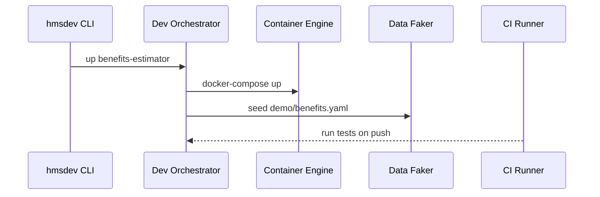

# Chapter 23: Development & Testing Toolkit (HMS-DEV)

*(coming from [Low-Level System Infrastructure (HMS-SYS)](22_low_level_system_infrastructure__hms_sys__.md))*  

---

## 1 · Why Does HMS-DEV Exist?

Picture **Maya**, a brand-new intern at the **Social Security Advisory Board (SSAB)**.  
She has 10 weeks to fix a tiny bug in the **Benefits Estimator** form:

1. The form sits on top of **ten** HMS micro-services, an AI agent, and a payment sandbox.  
2. Production traffic *must* keep flowing while she codes.  
3. Every pull-request needs:  
   • accessibility scan (**Section 508**),  
   • static-analysis for secrets,  
   • contract tests against [HMS-SVC](09_core_backend_service_layer__hms_svc__.md).

Without help Maya would spend her whole internship chasing VPNs and mock servers.  
**HMS-DEV** solves that in **one command**:  

```
$ hmsdev up benefits-estimator
```

– a full, containerized **agency stack** appears on her laptop in 90 seconds, seeded with synthetic data and wired to an on-push CI pipeline.  
She codes → commits → sees green checks → ships the fix before lunch.

---

## 2 · Key Concepts (Plain English)

| Thing | Beginner Analogy | Why It Matters |
|-------|------------------|----------------|
| Dev Profile | Your Netflix profile | Pre-loads the exact services you need |
| Mock Stack | Movie set with cardboard buildings | Looks real, costs nothing if it collapses |
| Synthetic Data Generator | Fake citizens in a test town | No PII, but behaviour feels real |
| Contract Test | Twist-tie on a bread bag | Proves new code still fits the published API |
| CI/CD Pipeline | Airport conveyor belt | Code moves automatically from laptop → test → review |

---

## 3 · Five-Minute Quick-Start

### 3.1 Spin Up the Stack

```bash
# Terminal  (6 lines)
curl -sSL https://get.hms.gov/dev.sh | bash
hmsdev up benefits-estimator \
        --services hms-svc,hms-agt,hms-mfe \
        --data    demo/benefits.yaml
```

**What happens?**

1. Downloads lightweight Docker images of the requested HMS services.  
2. Generates **1 000** fake citizens (names, SSNs, wages).  
3. Launches a browser at `http://localhost:8080` with the Benefits Estimator pre-filled.

---

### 3.2 Run All Checks Before Commit

```bash
# Still in project root  (≤ 8 lines)
hmsdev test
```

Console:

```
☑ Section 508 scan .................. PASS
☑ Static-analysis (secrets) .......... PASS
☑ Contract tests (10) ............... 9/10   ❌  /api/benefits POST schema mismatch
```

A failing contract test hints your change broke the request schema—fix it *before* reviewers ever see the PR.

---

### 3.3 Push & Watch CI

```yaml
# .github/workflows/ci.yml  (15 lines)
name: HMS CI
on:  [push, pull_request]
jobs:
  build-test:
    runs-on: ubuntu-latest
    steps:
      - uses: actions/checkout@v4
      - uses: hms-dev/setup@v3
      - run: hmsdev test --report junit.xml
      - uses: actions/upload-artifact@v4
        with: {name: junit, path: junit.xml}
```

Every PR now shows a tidy green (or red) checkmark with accessibility and security scores.

---

## 4 · What Happens Behind the Curtain?



Only **five** participants—the same flow works on a laptop **or** in GitHub Actions.

---

## 5 · Peek Inside HMS-DEV (Tiny Code!)

### 5.1 CLI Stub (10 lines)

```python
# hmsdev/cli.py
import click, subprocess, yaml
@click.group()
def main(): pass

@main.command()
@click.argument("stack")
@click.option("--services")
@click.option("--data")
def up(stack, services, data):
    subprocess.run(["docker-compose","-f",
                    f"{stack}.yaml","up","-d"])
    seed(data)

def seed(path):
    fake = yaml.safe_load(open(path))
    # POST to mock APIs ...
```

A wrapper around `docker compose`; complexity lives in YAML templates, not code.

### 5.2 Contract Test Skeleton (12 lines)

```python
# tests/contract_benefits.py
from schemathesis import load_case

CASE = load_case("/api/benefits.yaml")

def test_any():
    for response in CASE.call():
        assert response.status_code == 200
        response.validate()
```

Change the spec? Tests fail instantly—zero manual assertions.

---

## 6 · Built-In Tools You’ll Use Every Day

| Command | What It Does (≤ 1 sentence) |
|---------|-----------------------------|
| `hmsdev up` | Start a full mocked stack from template YAML |
| `hmsdev down` | Stop & remove containers + network |
| `hmsdev test` | Run 508, security, contract, and unit tests |
| `hmsdev data gen` | Produce synthetic CSV/JSON based on a schema |
| `hmsdev scan` | Ad-hoc static-analysis on **any** source dir |
| `hmsdev ci init github` | Writes ready-to-go workflow YAML |

---

## 7 · How HMS-DEV Talks to Other HMS Layers

| Need | HMS Layer Used | Example |
|------|---------------|---------|
| Pull Docker images | [HMS-SYS](22_low_level_system_infrastructure__hms_sys__.md) | Same hardened base images |
| Load fake citizens | [HMS-DTA](19_central_data_repository__hms_dta__.md) | Seeds an isolated test schema |
| Run contract tests | [HMS-SVC](09_core_backend_service_layer__hms_svc__.md) | Ensures `/benefits` API unchanged |
| Section 508 rules | [HMS-MFE](04_micro_frontend_interface_layer__hms_mfe__.md) | Scans rendered HTML components |
| Static policy checks | [AI Value Guardrails](21_ai_governance_value_guardrails_.md) | Lint prompt templates for red-flag words |

---

## 8 · Frequently Asked Beginner Questions

**Q: Do I need Docker installed?**  
A: Yes, but HMS-DEV ships a minimal “desktop” installer that bundles Docker Engine + sane defaults.

**Q: Can two stacks run side-by-side?**  
A: Absolutely—`hmsdev up benefits-estimator --port 9000` starts an isolated network.

**Q: Where do synthetic citizens come from?**  
A: A Faker-powered generator that follows Census statistics—*no real PII* leaves your machine.

**Q: I’m on Windows. Will 508 scans work?**  
A: Yep—scanner runs in a container; any OS with Docker works.

---

## 9 · Hands-On Micro Exercise (3 minutes)

```bash
git clone https://github.com/hms-samples/benefits-bugfix
cd benefits-bugfix
hmsdev up .
poetry run pytest            # or `npm test` for JS
hmsdev scan                  # security & license scan
```

You’ll see accessible, green checks. Break the API schema in `svc.py` and re-run `pytest`—contract test fails, showing the exact diff.

---

## 10 · What You Learned

1. HMS-DEV spins up *production-like* stacks with **one command**.  
2. Built-in synthetic data, 508 scans, static-analysis, and contract tests catch issues early.  
3. CI workflows need **< 15 lines** of YAML.  
4. Under the hood it’s just Docker + small Python helpers—easy to debug, hard to misuse.

---

> **Congrats — you’ve reached the end of the HMS-NFO crash-course!**  
> You can now build, test, and deploy government-grade services *confidently* and *quickly*.  

Happy shipping!

---

Generated by [AI Codebase Knowledge Builder](https://github.com/The-Pocket/Tutorial-Codebase-Knowledge)