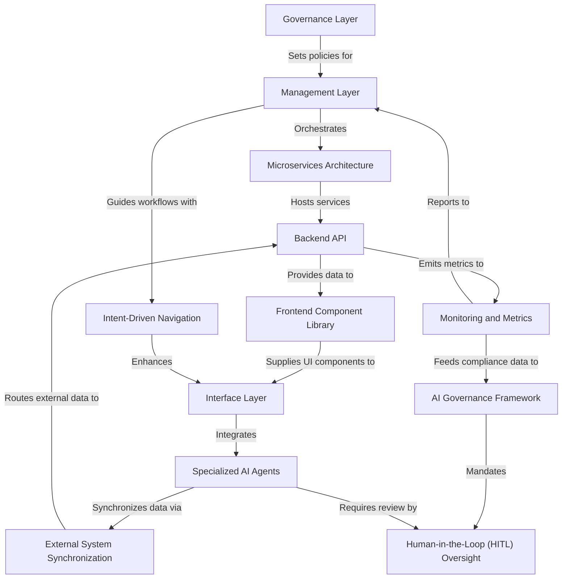

# Tutorial: HMS-DEV

HMS is an **AI-powered**, *multi-tiered* platform designed to streamline government and public-sector workflows.  
It combines a **robust governance layer** with a **microservices architecture** and **human-in-the-loop oversight** to ensure compliance, transparency, and efficiency.  
Citizens engage via intuitive frontends for services while administrators manage policies and programs through dedicated interfaces.

**Source Repository:** [None](None)

## Chapters

1. [Governance Layer
](01_governance_layer_.md)
2. [AI Governance Framework
](02_ai_governance_framework_.md)
3. [Management Layer
](03_management_layer_.md)
4. [Microservices Architecture
](04_microservices_architecture_.md)
5. [Backend API
](05_backend_api_.md)
6. [External System Synchronization
](06_external_system_synchronization_.md)
7. [Frontend Component Library
](07_frontend_component_library_.md)
8. [Interface Layer
](08_interface_layer_.md)
9. [Intent-Driven Navigation
](09_intent_driven_navigation_.md)
10. [Specialized AI Agents
](10_specialized_ai_agents_.md)
11. [Human-in-the-Loop (HITL) Oversight
](11_human_in_the_loop__hitl__oversight_.md)
12. [Monitoring and Metrics
](12_monitoring_and_metrics_.md)

---

Generated by [AI Codebase Knowledge Builder](https://github.com/The-Pocket/Tutorial-Codebase-Knowledge)