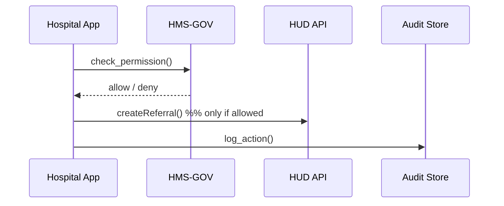

# Chapter 1: Governance Layer (HMS-GOV)

Welcome to your first step in the **HMS-EHR** journey!  
Before we wire up micro-services, spin dashboards, or unleash helpful AI agents, we need one rock-solid thing:

> A **common rulebook** that every person, process, and piece of code must follow.

That rulebook lives in the **Governance Layer (HMS-GOV)**.

---

## 1. Why Governance? ‑ A Mini Story

Imagine a local hospital wants to send a veteran’s housing referral to the U.S. Department of Housing and Urban Development (HUD).  

1. The hospital system collects medical data (HIPAA-sensitive).  
2. HUD receives housing-application data (PII-sensitive).  
3. A Court of Appeals for Veterans Claims may later need an audit trail to verify fairness.

Without a single set of **privacy, transparency, and traceability** rules, each agency would reinvent the wheel—and citizens could be harmed.

**HMS-GOV** is our city hall:  
• It publishes the rules (policies).  
• It enforces them (controls).  
• It keeps the receipts (audit logs).

---

## 2. Key Concepts in Plain English

| Term | What it really means | Friendly analogy |
|------|----------------------|------------------|
| Policy | A machine-readable rule (e.g., “Only doctors can see diagnosis codes.”) | A city ordinance |
| Control | Automated check that blocks or allows an action | Traffic light |
| Audit Log | Tamper-proof record of who did what | Security camera footage |
| Ethical Guardrail | Extra check to avoid bias or unfairness | Fair-housing watchdog |
| Traceability ID | Unique tag added to every action | USPS tracking number |

---

## 3. Your First Governance Use Case

Goal: **Submit a housing referral from a hospital app while automatically logging consent and verifying role permissions.**

### Step 1 — Create a Policy

```jsonc
// file: policies/hud_housing_referral.json
{
  "id": "POLICY-HUD-001",
  "description": "Only Licensed Clinical Social Workers (LCSW) may create HUD housing referrals.",
  "resource": "housing_referral",
  "action":   "create",
  "role":     "LCSW",
  "log":      true
}
```

Explanation  
1. `resource` and `action` define *what* is being done.  
2. `role` tells us *who* may do it.  
3. `log = true` switches on full audit logging.

### Step 2 — Ask HMS-GOV to Enforce the Policy

```python
# app/housing_referral.py
from hms_gov import check_permission, log_action

user_role = "LCSW"          # comes from authentication layer
action    = "create"
resource  = "housing_referral"

if check_permission(role=user_role,
                    action=action,
                    resource=resource):
    # business logic here…
    log_action(user="alice@hospital.org",
               action=action,
               resource=resource)
    print("Referral sent 🚀")
else:
    print("Access denied 🚫")
```

What will happen?  
• If Alice is a Licensed Clinical Social Worker, the referral is allowed and logged.  
• Otherwise, HMS-GOV blocks the call before any data leaves the hospital.

---

## 4. Behind the Curtain (High-Level Flow)



1. App asks HMS-GOV.  
2. HMS-GOV replies quickly (millisecs).  
3. If “allow,” the App talks to HUD and writes an audit event.

---

## 5. A Peek at the Internal Code

### 5.1 Policy Lookup (simplified)

```python
# hms_gov/policy_engine.py
POLICY_CACHE = load_all_policies()

def find_policy(role, action, resource):
    for p in POLICY_CACHE:
        if (p["role"] == role and
            p["action"] == action and
            p["resource"] == resource):
            return p
    return None
```

### 5.2 Permission Check

```python
# hms_gov/__init__.py
from .policy_engine import find_policy

def check_permission(role, action, resource):
    policy = find_policy(role, action, resource)
    return bool(policy)  # True if a matching policy exists
```

### 5.3 Audit Log Writer

```python
# hms_gov/audit.py
import uuid, datetime, json

def log_action(user, action, resource):
    event = {
        "id": str(uuid.uuid4()),
        "timestamp": datetime.datetime.utcnow().isoformat(),
        "user": user,
        "action": action,
        "resource": resource
    }
    # pretend we append to a secure ledger
    open("audit.log", "a").write(json.dumps(event) + "\n")
```

All snippets are tiny but highlight real moving parts:  
• Fast in-memory policy cache.  
• Simple boolean permission decision.  
• Flat-file audit (swap for fancy ledger later).

---

## 6. When Things Go Wrong

| Scenario | What HMS-GOV does |
|----------|-------------------|
| No policy found | Returns `deny`; nothing proceeds |
| User role mismatch | `deny` |
| Policy exists but `log=true` fails (disk full) | Blocks the original action—no lost audits allowed |
| Suspicious pattern detected | Triggers an alert to [Observability & Continuous Monitoring](14_observability___continuous_monitoring_.md) |

---

## 7. How HMS-GOV Fits with the Whole Platform

• It receives data from the **Interface Layer** (see [Interface Layer (HMS-MFE / Portals)](05_interface_layer__hms_mfe___portals__.md)).  
• It collaborates with the **Security & Compliance Framework** (coming in [Chapter 3](03_security___compliance_framework_.md)).  
• It logs events consumed later by the **Data Lake & Analytics Hub** (see [Data Lake & Analytics Hub](13_data_lake___analytics_hub_.md)).

Think of it as the *traffic cop* that all other layers must obey.

---

## 8. Try It Yourself

1. Clone the repo and copy the example policy into `policies/`.  
2. Run the `housing_referral.py` example.  
3. Inspect `audit.log`. Notice the autogenerated UUID and timestamp.

Feeling adventurous? Change `user_role` to `"Doctor"` and watch HMS-GOV slam the brakes.

---

## 9. Summary & What’s Next

In this chapter you learned:

✓ The **purpose** of the Governance Layer (set rules, enforce, audit).  
✓ How to **define policies** and **check permissions** in code.  
✓ What happens under the hood (policy cache, audit writer).  

Next, we’ll explore how the **Management Layer** orchestrates services and keeps the whole platform humming.

➡️ Continue to [Management Layer (HMS-SYS / HMS-SVC)](02_management_layer__hms_sys___hms_svc__.md)

---

Generated by [AI Codebase Knowledge Builder](https://github.com/The-Pocket/Tutorial-Codebase-Knowledge)