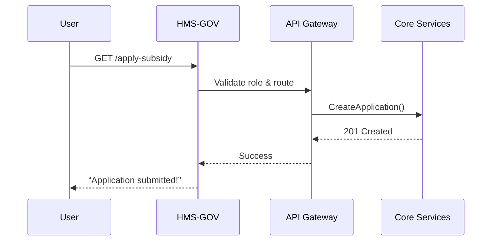

# Chapter 1: HMS-GOV (Government Interface Layer)


*“Your friendly City-Hall counter for everything HMS-EHR.”*

---

## 1. Why do we need HMS-GOV?

Imagine the U.S. Department of Agriculture (USDA) wants to launch an online **Farm-Subsidy Portal** so farmers can apply for aid without driving to a county office.  
Inside HMS-EHR we already have dozens of micro-services, data lakes, and AI agents, but USDA staff only care about:

1. A clean web form for farmers.  
2. A place to review and approve applications.  
3. Zero worries about the deep technical plumbing.

HMS-GOV solves this by playing translator between:

* **Outside world** → plain screens, buttons, and REST/GraphQL endpoints.  
* **Inside world** → complex cores like [HMS-SVC](04_hms_svc__core_backend_services__.md) or [HMS-DTA](06_hms_dta__data_lake___governance__.md).

Think of it as **“middleware with manners.”**

---

## 2. Key Concepts (in Plain English)

| Concept | Friendly Analogy | One-Sentence Definition |
|---------|------------------|-------------------------|
| Service Catalogue | Bulletin board in the lobby | List of things an agency can turn on/off (e.g., “Farm Subsidy”, “Voter Registration”). |
| Facet | Service window | Each catalogue item can expose **multiple faces**: a human web form, an API, or a mobile view. |
| Role & Permission | Security badge | Decides who can click what. |
| API Gateway | Mail room | Routes all outside requests to the right internal service. |
| Template Kit | Rubber stamp set | Pre-built pages and flows to speed up common government tasks (forms, signatures, status tracking). |

---

## 3. A 5-Minute “Hello-GOV” Example

Goal: Register a **“Farm Subsidy”** service and publish its public API.

```python
# file: examples/hello_gov.py
from hms_gov import GovApp, Service, Facet, Role

app = GovApp(name="USDA-Services")

# 1) Define a role
farmer_role = Role(id="farmer", readable_name="Farmer")

# 2) Define a service
farm_subsidy = Service(
    id="farm_subsidy",
    title="Apply for Farm Subsidy",
    description="Online form to request USDA aid",
)

# 3) Add a web facet and restrict to 'farmer' role
farm_subsidy.add_facet(
    Facet.web_form(
        path="/apply-subsidy",
        allowed_roles=[farmer_role]
    )
)

# 4) Publish!
app.register_service(farm_subsidy).run()
```

**What will happen?**

1. A minimal web page appears at `https://localhost/apply-subsidy`.  
2. Only users with the “farmer” role can open it.  
3. Internally, form submissions are queued to [HMS-SVC](04_hms_svc__core_backend_services__.md).  

> That’s it—no database config, no routers, no CSS. HMS-GOV scaffolded the boring parts.

---

## 4. How the Magic Works (High-Level)



Steps:

1. HMS-GOV authenticates the user and checks the “farmer” badge.  
2. The **Facet** translates the form into an API call.  
3. The **API Gateway** forwards it to **HMS-SVC**.  
4. Response bubbles back and HMS-GOV renders a friendly confirmation page.

---

## 5. Peek Under the Hood

Even though you rarely touch these files, knowing them helps debugging:

* `hms_gov/app.py` – boots the FastAPI (or Express) server.  
* `hms_gov/catalogue.py` – keeps the Service & Facet registry.  
* `hms_gov/security.py` – tiny wrapper around OAuth 2.0 / JWT.  

Example internal code (trimmed):

```python
# file: hms_gov/catalogue.py
class Service:
    def __init__(self, id, title, description=""):
        self.id = id
        self.title = title
        self.description = description
        self._facets = []

    def add_facet(self, facet):
        self._facets.append(facet)
        # Auto-register route
        Router.mount(facet.path, facet.to_fastapi())
        return self
```

**Explanation:** When you call `add_facet`, HMS-GOV immediately mounts a route on the shared router—no extra config needed.

---

## 6. Worked Example: Voter Registration Flow

The Election Assistance Commission wants an embeddable API so states can integrate voter sign-up. Re-using HMS-GOV:

```python
# file: examples/voter_registration.py
from hms_gov import GovApp, Service, Facet

app = GovApp(name="EAC-Services")

voter_service = (
    Service(id="voter_reg", title="Voter Registration")
    .add_facet( Facet.api(
        path="/v1/voters",
        methods=["POST"],
        schema="VoterApplicationSchema.json"
    ))
    .add_facet( Facet.web_form(
        path="/register-to-vote",
        allowed_roles="public"
    ))
)

app.register_service(voter_service).run()
```

Results:

* States can `POST` JSON to `/v1/voters` to bulk-register citizens.  
* Citizens can open `/register-to-vote` for a friendly wizard.  
* All submissions flow to [HMS-CDF](03_hms_cdf__codified_democracy_foundation_engine__.md) for civic record keeping.

---

## 7. FAQ & Troubleshooting

| Symptom | Likely Cause | Quick Fix |
|---------|--------------|-----------|
| 404 on your facet path | Facet not registered | Call `service.add_facet(...)` before `register_service`. |
| Users see “Access Denied” | Role mismatch | Check `allowed_roles` list. |
| CORS errors | API facet omitted CORS headers | `Facet.api(cors=True)` adds them automatically. |

---

## 8. What’s Next?

You now know how HMS-GOV turns raw platform power into citizen-friendly services with just a few lines of code.

In the next chapter we’ll move one layer closer to the screen and learn how to craft rich, React-based front-ends with micro-frontend magic.

→ Continue to [HMS-MFE (Micro-Frontend Experience)](02_hms_mfe__micro_frontend_experience__.md)

---

Generated by [AI Codebase Knowledge Builder](https://github.com/The-Pocket/Tutorial-Codebase-Knowledge)