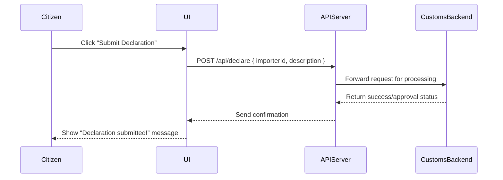

# Chapter 1: Interface Layer

Welcome to the first chapter of HMS-EHR! In this chapter, we’ll learn about the **Interface Layer**—the “public service counter” of our system—where citizens and officials fill out forms, track status, and view updates.

## Why an Interface Layer?

Imagine you’re an importer dealing with a customs agency. You need to:
- Submit shipment declarations  
- Check approval status  
- See the latest tariff rules  

All of this happens through web pages or mobile screens. That’s exactly what the Interface Layer provides—a friendly way to talk to the system without knowing all the technical details behind the scenes.

## Key Concepts

1. **Web Portal**  
   A browser-based site where users log in, fill forms, and see dashboards.

2. **Dashboard & Reports**  
   Visual summaries (charts, tables) that show real‐time data—like “approved shipments this week.”

3. **Mobile UI**  
   A responsive interface or app for users on smartphones.

4. **Notifications**  
   Email, SMS, or in-app alerts when something changes (e.g., your declaration is approved).

---

## Building a Simple Declaration Form

Let’s see a minimal HTML form for submitting a customs declaration.  
This lives in something like `src/interface/DeclarationForm.html`:

```html
<form id="declaration-form" action="/api/declare" method="post">
  <label>Importer ID:
    <input name="importerId" required />
  </label>
  <label>Goods Description:
    <input name="description" required />
  </label>
  <button type="submit">Submit Declaration</button>
</form>
```

This form:
- Collects importer ID and description  
- Sends a POST request to our API endpoint  

> Next, we’ll connect this to our backend and show users a confirmation message.

---

## Sequence of a Declaration Submission

Here’s what happens step-by-step when a user submits that form:



---

## Inside the Interface Layer

Under the hood, our Interface Layer typically has:
1. **Static Assets** (HTML/CSS/JS)  
2. **Client‐Side Logic** (e.g., React/Vue components)  
3. **API Client** to call backend services  
4. **Routing & State Management** (e.g., React Router, Vuex)

### Example: Handling Form Submission in Express

File: `src/interface/formHandler.js`

```js
const express = require('express');
const router = express.Router();

router.post('/api/declare', (req, res) => {
  // 1. Validate input
  const { importerId, description } = req.body;
  if (!importerId || !description) {
    return res.status(400).send('Missing fields');
  }
  // 2. Forward to the customs backend (pseudo)
  // forwardToCustoms(importerId, description);
  // 3. Respond to the UI
  res.json({ success: true, message: 'Declaration received' });
});

module.exports = router;
```

This code:
- Checks the form data  
- (Pretends to) send it to the customs system  
- Replies with a JSON confirmation  

---

## What We’ve Learned

- The **Interface Layer** is your system’s “front desk” for citizens and officials  
- It includes web portals, dashboards, mobile UIs, and notifications  
- We saw a simple form and how it goes from browser → API → backend → confirmation  

Up next, we’ll dive deeper into building actual user pages in the [User Portal](02_user_portal_.md).

---

Generated by [AI Codebase Knowledge Builder](https://github.com/The-Pocket/Tutorial-Codebase-Knowledge)