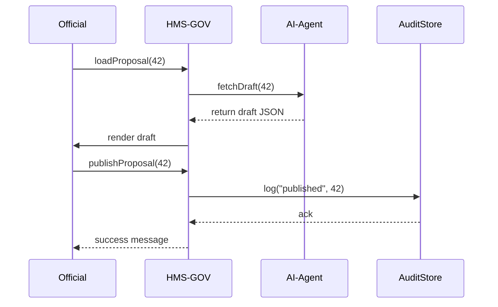
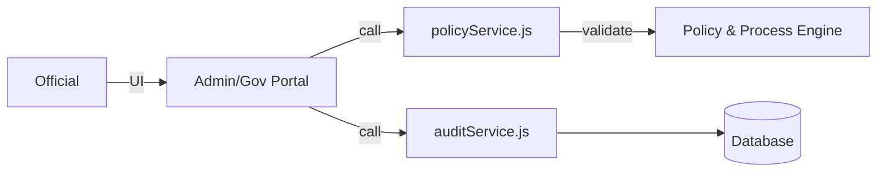

# Chapter 2: Admin/Gov Portal (HMS-GOV)

In the last chapter, we saw how users interact with the micro-frontends in the [Frontend Interface (HMS-MFE)](01_frontend_interface__hms_mfe__.md). Now it’s time for decision-makers to take the wheel.

---

## 1. Why an Admin/Gov Portal?

Imagine the **Susquehanna River Basin Commission** (SRBC) wants to update flood-control guidelines. An AI agent suggests a new policy draft based on recent rainfall data. Before that policy goes live, officials need a **control tower** to:

- See current stats and charts  
- Review or tweak AI proposals  
- Track every action for accountability  
- If needed, override or hold changes (Human-in-the-Loop)

That’s exactly what **HMS-GOV** provides—a secure, transparent decision hub.

---

## 2. Key Concepts

1. **Dashboard**  
   A bird’s-eye view: charts, active proposals, system health.

2. **Policy Proposals**  
   Drafts generated by AI agents (covered later in [Chapter 4](04_ai_representative_agent__hms_a2a__.md)). Officials can accept, reject, or edit.

3. **Audit Logs**  
   Every click, decision, and change is recorded. Essential for compliance and traceability.

4. **Override Controls (HITL)**  
   If automation goes awry, humans can pause or reroute. See [Human-in-the-Loop (HITL) Mechanism](05_human_in_the_loop__hitl__mechanism_.md) for details.

---

## 3. Solving the Use Case

### 3.1 Loading the Dashboard

```js
// file: portal.js (simplified)
async function loadDashboard() {
  const stats = await fetch('/api/gov/dashboard');
  renderStats(stats); 
}

loadDashboard(); 
```
This fetches key metrics (e.g., flood warnings, proposal counts) and renders charts on the page.

### 3.2 Reviewing a Policy Proposal

```js
// file: portal.js
async function loadProposal(id) {
  const proposal = await fetch(`/api/gov/proposals/${id}`).then(r => r.json());
  showEditor(proposal); 
}
// Later, when an official clicks “Approve”:
async function publishProposal(id) {
  await fetch(`/api/gov/proposals/${id}/publish`, { method: 'POST' });
  alert('Policy published!');
}
```
- **loadProposal(42)** displays the draft.  
- **publishProposal(42)** sends the “go-live” command, triggering audit logging.

---

## 4. What Happens Step-by-Step?



1. Official requests a proposal.  
2. Portal gets draft from AI-Agent.  
3. Official publishes.  
4. Portal logs action in AuditStore.

---

## 5. Under the Hood: Core Files

### 5.1 portal.js

```js
// Simplified portal controller
export async function initGovPortal(rootId) {
  document.querySelector(rootId).innerHTML = '<h1>Gov Portal</h1>';
  await loadDashboard();
}

async function loadDashboard() {
  // Fetch summary stats
  const stats = await fetch('/api/gov/dashboard').then(r => r.json());
  // Render charts (details omitted)
}
```

> Here `initGovPortal('#app')` sets up the page and kicks off the dashboard fetch.

### 5.2 policyService.js

```js
export async function fetchProposal(id) {
  return fetch(`/api/gov/proposals/${id}`).then(r => r.json());
}

export async function sendDecision(id, action) {
  return fetch(`/api/gov/proposals/${id}/${action}`, { method: 'POST' });
}
```

> `action` is `"publish"` or `"reject"`. Every call goes through the **Policy and Process Engine** ([Chapter 6](06_policy_and_process_engine_.md)) for validation.

### 5.3 auditService.js

```js
export async function logEvent(type, details) {
  await fetch('/api/gov/audit', {
    method: 'POST',
    body: JSON.stringify({ type, ...details })
  });
}
```

> All decisions are fed into this AuditStore for full traceability.

---

## 6. Architecture Overview



- **HMS-GOV** sits between the user and core engines.  
- It calls **PolicyEngine** for checks and **AuditStore** for logging.

---

## Conclusion

You’ve learned how **HMS-GOV**:

- Provides a dashboard and proposal editor  
- Interacts with AI agents and the policy engine  
- Logs every action for accountability  
- Gives officials override power (HITL)

In the next chapter, we’ll explore how users move between these features seamlessly with **[Intent-Driven Navigation](03_intent_driven_navigation_.md)**.

---

Generated by [AI Codebase Knowledge Builder](https://github.com/The-Pocket/Tutorial-Codebase-Knowledge)