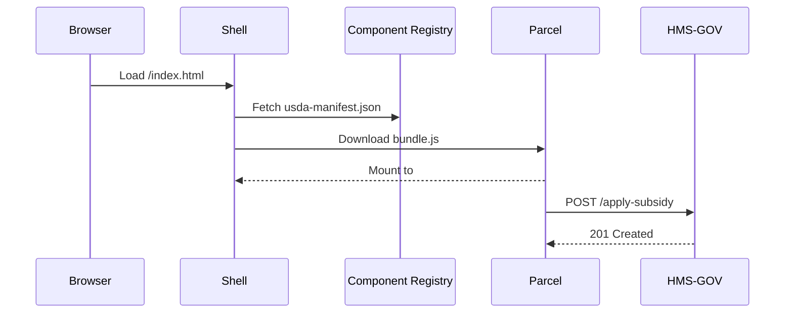

# Chapter 2: HMS-MFE (Micro-Frontend Experience)

*[← Back to Chapter 1: HMS-GOV](01_hms_gov__government_interface_layer__.md)*  

---

## 1. Why do we need HMS-MFE?

Picture the **U.S. Department of Agriculture (USDA)** rolling out three on-line tools:

1. “Apply for Farm Subsidy”  
2. “Check Application Status”  
3. “Soil-Health Dashboard”

Different internal teams—and even contractors—own each tool, yet citizens should feel they are using **one** consistent USDA site that:

* Looks and behaves the same on every page  
* Follows Section 508 accessibility rules  
* Can be re-skinned if branding changes next year

HMS-MFE solves this by acting like a **Lego® kit of UI blocks** that every agency can snap together.  
Developers reuse **the same audited components** (buttons, forms, charts) instead of rebuilding them, while end-users see a single polished site.

---

## 2. Key Concepts (Plain English)

| Term | Analogy | One-Sentence Meaning |
|------|---------|----------------------|
| Shell | Empty Lego baseplate | The host page that loads individual micro-frontends. |
| Parcel | Little bag of Lego bricks | A self-contained UI feature (e.g., “SubsidyForm”). |
| Component Library | Official brick factory | Pre-audited React/Vue components (Button, Modal, etc.). |
| Theme Tokens | Paint colors | Variables like `--color-primary` that enforce brand & WCAG contrast. |
| Manifest | Instruction sheet | JSON file that tells the shell where to download each parcel. |
| Bridge API | Snap connector | Small JS helper so parcels can talk to [HMS-GOV](01_hms_gov__government_interface_layer__.md). |

---

## 3. The 5-Minute “Hello-MFE”

Goal: Render a “Apply for Farm Subsidy” parcel inside the USDA shell.

### 3.1 Create a Shell

```tsx
// file: shells/usda-shell.tsx
import { createShell } from "@hms-mfe/shell";

createShell({
  target: "#root",
  manifestUrl: "/usda-manifest.json"
});
```

**What it does**  
1. Finds `<div id="root">` in `index.html`.  
2. Downloads `usda-manifest.json`.  
3. Dynamically loads each parcel listed there.

### 3.2 Publish the Parcel

```tsx
// file: parcels/FarmSubsidyForm/index.tsx
import { Button, TextField } from "@hms-mfe/components";
import { useBridge } from "@hms-mfe/bridge";

export default function SubsidyForm() {
  const bridge = useBridge();          // talk to HMS-GOV
  return (
    <form onSubmit={e => {
        e.preventDefault();
        bridge.post("/apply-subsidy", {/* form data */});
    }}>
      <TextField label="Farm ID" name="farmId" required />
      <Button type="submit">Submit</Button>
    </form>
  );
}
```

**Why it’s safe & consistent**  
• Button and TextField already pass accessibility tests.  
• Colors come from theme tokens, so a global rebrand needs **zero** code changes.

### 3.3 Declare the Manifest (the “instruction sheet”)

```json
// file: public/usda-manifest.json
{
  "parcels": [
    {
      "name": "subsidy-form",
      "url": "/parcels/FarmSubsidyForm/bundle.js",
      "slot": "main"           // tells the shell where to mount it
    }
  ]
}
```

Result: Navigating to `https://usda.gov/aid` shows the Subsidy form embedded in the official USDA look-and-feel.

---

## 4. How HMS-MFE & HMS-GOV Work Together

HMS-MFE handles **what the citizen sees**, while [HMS-GOV](01_hms_gov__government_interface_layer__.md) handles **what the servers receive**.

```tsx
// inside SubsidyForm (added comment only)
bridge.post("/apply-subsidy", data); // <-- HMS-GOV facet from Chapter 1
```

The same bridge lets you fetch data:

```tsx
const status = await bridge.get("/subsidy-status?id=123");
```

---

## 5. Behind the Curtain (step-by-step)



---

## 6. A Peek at the Source

### 6.1 Tiny Shell Loader

```ts
// file: hms_mfe/shell.ts
export function createShell({ target, manifestUrl }) {
  const el = document.querySelector(target);

  fetch(manifestUrl)
    .then(r => r.json())
    .then(manifest => manifest.parcels.forEach(loadParcel));

  function loadParcel(p) {
    import(p.url).then(mod => {
      const slot = p.slot || "main";
      const mountPoint = document.querySelector(`[data-slot="${slot}"]`);
      mod.default().then(app => app.mount(mountPoint));
    });
}
```

Less than 20 lines, yet it:

1. Fetches the manifest  
2. Dynamically `import()`s each parcel (so teams can deploy independently)  
3. Mounts them in the right DOM slot

### 6.2 Bridge Internals (simplified)

```ts
// file: hms_mfe/bridge.ts
export function useBridge() {
  const token = sessionStorage.getItem("jwt");
  return {
    get: (url)  => fetch(url, { headers: {Authorization: token}}).then(r => r.json()),
    post: (url, body) => fetch(url, {
        method: "POST",
        headers: {
          "Content-Type": "application/json",
          Authorization: token
        },
        body: JSON.stringify(body)
    })
  };
}
```

---

## 7. Worked Example: **Multi-Agency Dashboard**

The **Export-Import Bank (EXIM)** wants a dashboard that mixes its own loan stats with a **Southern Command** disaster-relief map.

```json
// exim-manifest.json  (only the parcels section shown)
[
  { "name": "loan-chart",  "url": "/parcels/LoanChart.js", "slot": "left" },
  { "name": "relief-map",  "url": "https://southcom.mil/map.js", "slot": "right" }
]
```

Because each parcel ships its own JS bundle, EXIM and Southern Command can deploy on different schedules without stepping on each other. Branding and keyboard-navigation rules still match because both depend on the shared `@hms-mfe/components` package.

---

## 8. FAQ & Troubleshooting

| Symptom | Likely Cause | Quick Fix |
|---------|--------------|-----------|
| Parcel blank/no errors | Wrong `slot` name | Ensure `<div data-slot="main">` matches manifest. |
| Styles look off-brand | Theme tokens missing | Import `@hms-mfe/theme/default.css` in your shell. |
| CORS error on API call | HMS-GOV facet not whitelisted | Add the origin to `allowed_origins` in HMS-GOV config. |

---

## 9. What’s Next?

You now know how to:

1. Spin up a shell  
2. Publish self-contained micro-frontends (“parcels”)  
3. Speak to backend services through HMS-GOV

Next we’ll see how citizen data is immutably recorded in civic ledgers via the **Codified Democracy Foundation Engine**.  

→ *Continue to* [HMS-CDF (Codified Democracy Foundation Engine)](03_hms_cdf__codified_democracy_foundation_engine__.md)

---

Generated by [AI Codebase Knowledge Builder](https://github.com/The-Pocket/Tutorial-Codebase-Knowledge)