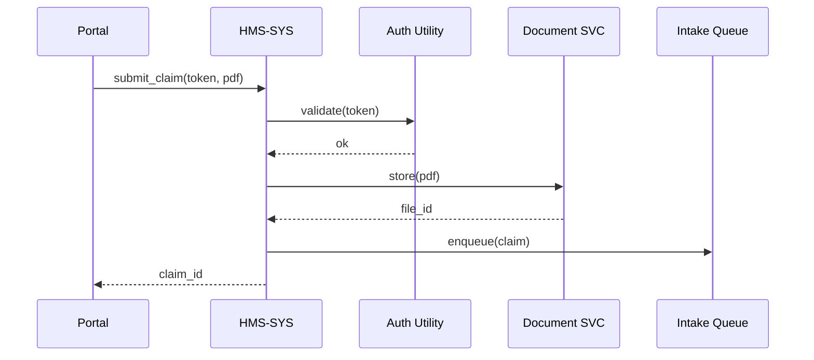

# Chapter 2: Management Layer (HMS-SYS / HMS-SVC)

> “If HMS-GOV is the rulebook, the **Management Layer** is the air-traffic control tower that makes sure every plane obeys it—and never bumps into another.”  

[← Back to Governance Layer](01_governance_layer__hms_gov__.md)

---

## 1. Why Do We Need a Management Layer?

Picture a veteran logging in to submit a disability claim:  

1. The portal must verify the veteran’s identity.  
2. A document-storage service must accept PDFs.  
3. A billing service might tally copays.  
4. An audit trail must be written for future appeals.

Without a single coordinator, each microservice would ask  
“Who are you?” “Are you allowed?” “Where is the log?”—over and over.  

The **Management Layer (HMS-SYS / HMS-SVC)** centralises those **shared concerns** so feature teams can focus on domain logic instead of plumbing.

---

## 2. Meet the Cast

| Acronym | Role | Friendly Analogy |
|---------|------|------------------|
| HMS-SYS | “Control Tower” | Tells each plane (service) when and where to fly |
| HMS-SVC | “Utility Closet” | Houses common tools: auth, logging, rate-limit |

---

## 3. Core Problems It Solves

1. **Service Discovery** – “Where is the document service today?”  
2. **Cross-Cutting Utilities** – Auth, logging, rate-limit, tracing.  
3. **Workload Balancing** – Evenly spreads jobs across replicas.  
4. **Health Checks & Circuit Breaking** – Detects sick services and reroutes traffic.  
5. **Tenant Isolation** – Keeps Agency-A data apart from Agency-B.

---

## 4. A Concrete Use Case: VA Disability Claim Intake

Goal: accept a PDF claim, verify identity, store file, and enqueue a review task.

### 4.1 One-Stop API Call

```python
# client/submit_claim.py
from hms_sys import submit_claim

claim_id = submit_claim(
    user_token="eyJhbGciOi...",   # JWT from login
    pdf_bytes=open("claim.pdf","rb").read()
)
print(f"🎉 Claim queued with ID {claim_id}")
```

What happens:

1. `submit_claim` talks to HMS-SYS.  
2. HMS-SYS verifies the JWT via its Auth utility (HMS-SVC).  
3. File is stored by the Document Service.  
4. A “claim-review” message is pushed to the Intake Queue.  
5. HMS-SYS returns the `claim_id` to the caller.

You wrote **4 lines**; the tower handled the rest.

---

## 5. High-Level Flow



---

## 6. Public API Cheat-Sheet

| Action | Endpoint | Notes |
|--------|----------|-------|
| Submit Claim | `POST /claims` | Handles auth, storage, queue |
| Get Service List | `GET  /services` | Returns alive microservices |
| Health Status | `GET  /health` | Green/Yellow/Red per service |

### Example Request / Response

```http
POST /claims  HTTP/1.1
Authorization: Bearer eyJhbGciOi...
Content-Type: application/pdf
```

```json
{
  "claim_id": "CLM-4521",
  "status":   "QUEUED"
}
```

---

## 7. Peeking Under the Hood

### 7.1 Step-by-Step (No Code)

1. **Ingress** – HMS-SYS receives the HTTP call via [Backend API Gateway](09_backend_api_gateway__hms_api__.md).  
2. **Auth Plug-in** – Delegates JWT validation to HMS-SVC/Auth.  
3. **Routing** – Uses service-registry to find Document-Service.  
4. **Circuit Check** – If Document-Service is unhealthy, falls back to a secondary region.  
5. **Logging** – Emits a trace picked up later by [Observability & Continuous Monitoring](14_observability___continuous_monitoring_.md).  
6. **Policy Check** – Calls [Governance Layer](01_governance_layer__hms_gov__.md) if action needs permission.  

### 7.2 Minimal Implementation Sketch

#### Service Registry (`hms_sys/registry.py`)

```python
SERVICES = {"doc": "http://doc_svc:7000"}

def lookup(name):
    return SERVICES.get(name)
```

Beginners’ takeaway: a simple dictionary maps names to URLs.

#### Circuit Breaker (`hms_sys/circuit.py`)

```python
def call(url, payload):
    try:
        resp = requests.post(url, data=payload, timeout=2)
        resp.raise_for_status()
        return resp.json()
    except Exception:
        # mark service unhealthy (details skipped)
        raise RuntimeError("Service unavailable")
```

It tries the call, flags unhealthy if it fails.

#### Public Facade (`hms_sys/__init__.py`)

```python
from .registry import lookup
from .circuit  import call

def submit_claim(user_token, pdf_bytes):
    # 1. JWT check (delegated)
    _check_jwt(user_token)        # <- HMS-SVC helper
    # 2. Store file
    doc_url = lookup("doc") + "/files"
    file_id = call(doc_url, pdf_bytes)["id"]
    # 3. Enqueue review
    q_url = lookup("queue") + "/tasks"
    claim = {"file_id": file_id, "type": "CLAIM"}
    claim_id = call(q_url, claim)["task_id"]
    return claim_id
```

Even stripped to essentials, the pattern is visible: **lookup → call → move on**.

---

## 8. Adding Your Own Microservice in 3 Steps

1. Register it:  
   ```yaml
   # file: registry.yml
   doc_review: http://doc_review_svc:7100
   ```
2. Implement a `/health` endpoint returning `200 OK`.  
3. Optionally plug into HMS-SVC utilities by importing `hms_svc.logger`.

That’s it—the tower now knows you exist.

---

## 9. Common Pitfalls

| Mistake | Quick Fix |
|---------|-----------|
| Skipping `/health` | HMS-SYS will mark you “Red” and drop traffic |
| Long-running work inside endpoint | Offload to a queue; HMS-SYS can produce one for you |
| Reinventing auth logs | Use HMS-SVC/Logging—5 lines save 5 headaches |

---

## 10. Summary & What’s Next

You learned:

✓ Why centralised management keeps microservices sane.  
✓ How HMS-SYS (control tower) and HMS-SVC (utility closet) cooperate.  
✓ The flow for a real claim-intake scenario.  
✓ How to peek under the hood or add your own service.

In the next chapter we will zoom into the guardrails that keep our platform legally safe: encryption, HIPAA controls, and more.

[Continue to Security & Compliance Framework](03_security___compliance_framework_.md)

---

Generated by [AI Codebase Knowledge Builder](https://github.com/The-Pocket/Tutorial-Codebase-Knowledge)