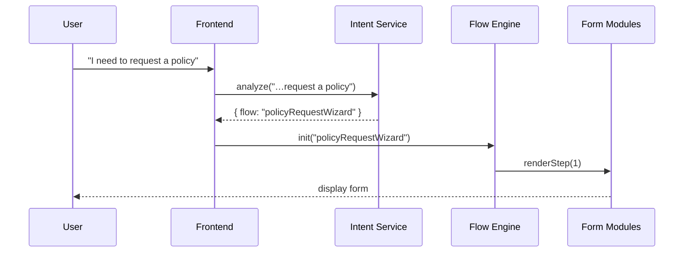

# Chapter 3: Intent-Driven Navigation

In the previous chapter, we explored the [Admin/Gov Portal (HMS-GOV)](02_admin_gov_portal__hms_gov__.md), where officials review and publish policies. Now let’s make the **citizen experience** smoother by letting users **say what they want to do**, and having the system automatically guide them—no more hunting through menus!

---

## 1. Why Intent-Driven Navigation?

Imagine you’re a small‐business owner trying to file a new grant application on a federal portal:

- You don’t know which menu path to click.  
- Filling out forms out of order leads to errors.  
- You waste time clicking around.

With **Intent-Driven Navigation**, you simply type or speak:

> “I want to apply for a small business energy grant.”

The system acts like a GPS: it recognizes your goal and takes you step-by-step through the right forms, wizards, and even offers AI tips if you get stuck. No more guessing where to click!

---

## 2. Key Concepts

1. **Intent Recognition**  
   Captures the user’s goal in natural language (e.g., “request a policy”).  

2. **Intent Mapping**  
   Matches recognized intents to **flows** (predefined wizards or forms).  

3. **Flow Engine**  
   Dynamically builds a sequence of screens or steps to fulfill the intent.  

4. **AI Assistance Hooks**  
   Injects smart suggestions (e.g., “Here’s a sample policy text”) at each step.  

5. **Fallback Handling**  
   If the system can’t match an intent, it asks clarifying questions.

---

## 3. Solving the Use Case

### 3.1 Registering Intents

In a simple file `intentConfig.js`, we define which phrases map to which flow.

```js
// intentConfig.js
export const intents = [
  {
    name: 'requestPolicy',
    keywords: ['request policy', 'new policy', 'apply policy'],
    flow: 'policyRequestWizard'
  },
  {
    name: 'checkStatus',
    keywords: ['status of application', 'check status'],
    flow: 'statusCheckFlow'
  }
];
```
_Each entry says: when a user mentions any of these keywords, launch that flow._

### 3.2 Handling User Input

```js
// intentRouter.js
import { intents } from './intentConfig.js';

export function handleInput(text) {
  const match = intents.find(i =>
    i.keywords.some(kw => text.includes(kw))
  );
  if (match) return startFlow(match.flow);
  return askClarification();
}
```
- `handleInput("I need a new policy")` finds `requestPolicy`  
- `startFlow('policyRequestWizard')` kicks off the wizard  

---

## 4. What Happens Step-by-Step?



1. **User** types their goal.  
2. **Intent Service** picks the matching flow.  
3. **Flow Engine** builds and shows step 1 of the wizard.  
4. **Form Module** renders the needed fields.

---

## 5. Under the Hood: A Closer Look

### 5.1 Flow Engine (`flowEngine.js`)

```js
// Simplified flowEngine.js
const flows = {
  policyRequestWizard: [
    { component: 'AgencySelector' },
    { component: 'PolicyDetailsForm' },
    { component: 'ReviewAndSubmit' }
  ]
};

export function startFlow(name) {
  const steps = flows[name] || [];
  renderStep(steps, 0);
}

function renderStep(steps, index) {
  const Step = steps[index].component;
  // Imagine each component knows how to render itself
  document.querySelector('#app').innerHTML = `<${Step} />`;
}
```
_This code picks the array of steps and renders them one by one._

### 5.2 AI Assistance Hook

```js
// aiHelper.js
export async function suggestExample(flow, step) {
  // Call HMS-A2A agent for suggestions
  const res = await fetch(`/api/ai/suggest?flow=${flow}&step=${step}`);
  return res.json(); // e.g., { text: "Use federal grant number ..." }
}
```
_At each step, the UI can call `suggestExample` to show tips._

---

## 6. Architecture Overview

```mermaid
flowchart LR
  User --> Frontend[HMS-MFE]
  Frontend --> IntentSvc[Intent Service]
  IntentSvc --> FlowEng[Flow Engine]
  FlowEng --> Forms[Form Modules]
  FlowEng --> AI[HMS-A2A (AI Agent)]
```

- **Frontend** captures user text.  
- **Intent Service** recognizes the goal.  
- **Flow Engine** orchestrates forms and AI tips.  
- **Form Modules** actually render inputs.

---

## Conclusion

You’ve learned how **Intent-Driven Navigation** turns user goals into guided workflows—just like a GPS for digital government services. No more hunting through menus; users say what they want, and the system leads them step-by-step.

Up next, we’ll dive into the brains behind those AI tips in [AI Representative Agent (HMS-A2A)](04_ai_representative_agent__hms_a2a__.md).

---

Generated by [AI Codebase Knowledge Builder](https://github.com/The-Pocket/Tutorial-Codebase-Knowledge)